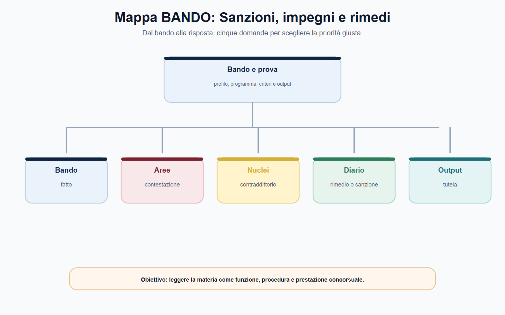
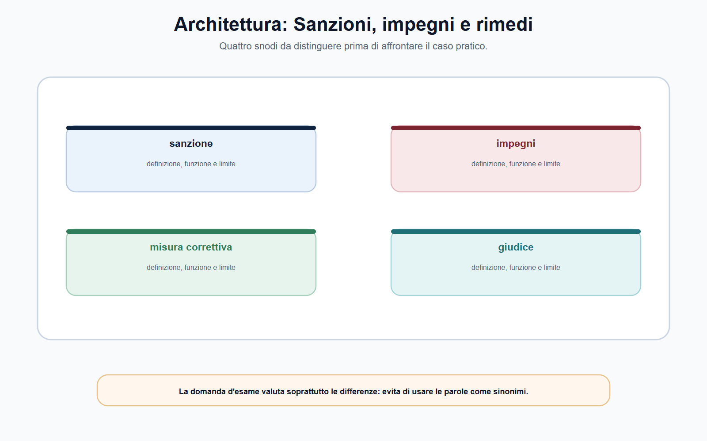
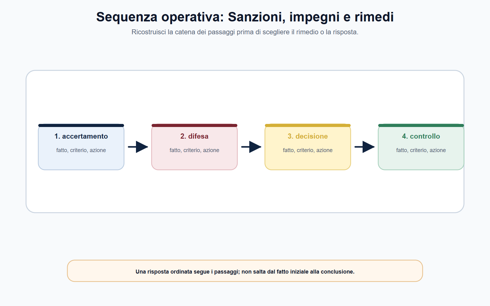
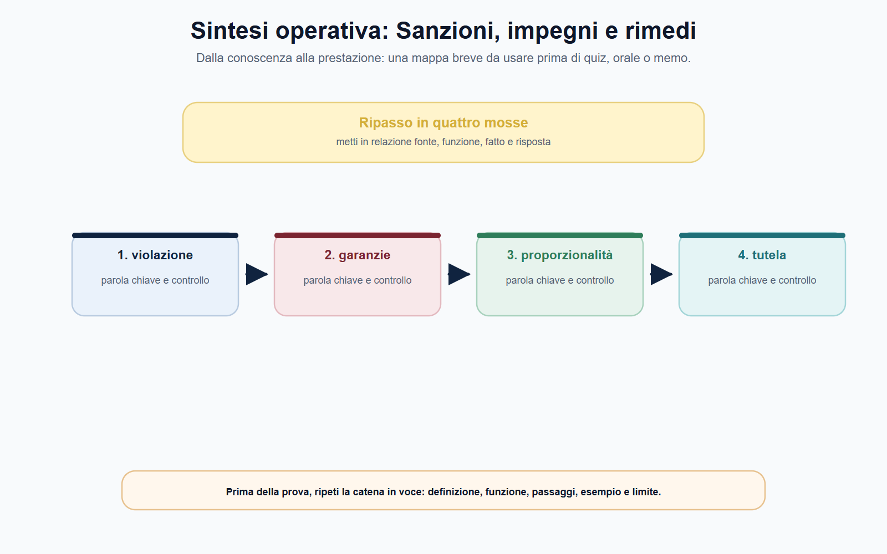

# Sanzioni, impegni, rimedi e controllo giurisdizionale

## N-MF05-06-01 · Quadro e criterio di lettura

**Obiettivo.** Riconoscere garanzie, strumenti alternativi alla sanzione, rimedi correttivi e controllo della decisione, evitando di sovrapporre regimi settoriali diversi.

**Domanda guida.** Dopo un'istruttoria, quale risposta può adottare l'Autorità e con quali garanzie per il destinatario, il mercato e gli utenti?

**Output operativo.** Schema di decisione, tabella «garanzia–fase», caso sugli impegni e mappa della tutela contro un provvedimento.

> **Regola di metodo.** Non partire dall'etichetta della misura. Parti da norma violata, fatto accertato, finalità del potere e disciplina dell'Autorità: soltanto allora puoi stabilire se si tratta di sanzione, impegno, misura correttiva o altro rimedio.

### Apertura editoriale

La fase finale di un procedimento di vigilanza non coincide sempre con una sanzione. A seconda del settore, l'Autorità può accertare una violazione e applicare una misura afflittiva; può ordinare una conformazione, una cessazione o una correzione; può valutare impegni proposti dal destinatario; può adottare, quando la legge lo consente, misure provvisorie o altri rimedi funzionali alla tutela dell'interesse regolato. Ogni strumento ha presupposti, finalità e conseguenze proprie.

Il candidato deve quindi abbandonare l'idea di una sequenza automatica «controllo → multa». La scelta della risposta amministrativa è il punto di arrivo di una catena: competenza, norma applicabile, istruttoria, difesa, valutazione dei fatti, misura proporzionata, motivazione, comunicazione e controllo. Se un solo anello è ignorato, il provvedimento rischia di essere incompleto o di non rispondere efficacemente al problema che lo ha generato.

La materia richiede prudenza terminologica. Un impegno non è una sanzione ridotta; una misura correttiva non coincide necessariamente con una sanzione pecuniaria; l'impugnazione non è una nuova fase istruttoria interna; il controllo del giudice non autorizza l'Autorità a trascurare motivazione e garanzie. La parola corretta dipende dalla fonte, dal settore e dall'atto effettivamente adottato.

### Obiettivo operativo del capitolo

Al termine del capitolo il lettore deve saper:

1. ricostruire i passaggi che rendono legittima e motivata una misura sanzionatoria o correttiva;
2. distinguere sanzione, impegno, rimedio correttivo e misura cautelare;
3. spiegare la funzione delle garanzie difensive e della proporzionalità;
4. impostare una verifica preliminare della tutela giurisdizionale senza presumere giudice, rito o termini;
5. leggere un caso settoriale senza esportarne automaticamente gli istituti ad altre Autorità.

*Figura 6.1 — La tavola orienta la lettura di accertamento e separa il perimetro dalle eccezioni.*

### Dall'accertamento alla decisione: la catena delle garanzie

Una misura sanzionatoria o correttiva deve poggiare su un percorso leggibile. Il primo elemento è la **base legale**: occorre individuare il potere attribuito all'Autorità e la disposizione che definisce la condotta, l'obbligo o la situazione rilevante. Il secondo è l'**accertamento del fatto**: la decisione non può limitarsi a richiamare un sospetto, una segnalazione o un dato isolato. Il terzo è l'**imputazione**: va individuato il destinatario della misura e verificato il collegamento richiesto dalla disciplina tra soggetto, condotta e conseguenza.

Seguono le garanzie del procedimento: conoscenza dell'addebito o dell'oggetto dell'istruttoria nelle forme previste, possibilità di presentare elementi e deduzioni, valutazione delle osservazioni rilevanti, accesso o conoscibilità degli atti nei limiti applicabili, decisione dell'organo competente e motivazione. La struttura concreta cambia tra i settori, ma la funzione resta la stessa: impedire che una conseguenza afflittiva o incisiva derivi da un procedimento opaco o da un ragionamento non verificabile.

La legge n. 689/1981 offre il quadro generale delle sanzioni amministrative, ma la sua disciplina non sostituisce le norme speciali delle Autorità. In un concorso è corretto dire che legalità, garanzie procedimentali, difesa e motivazione orientano il potere sanzionatorio; è improprio applicare automaticamente a ogni Autorità le stesse fasi, gli stessi importi o gli stessi rimedi previsti in altri ordinamenti. Prima si legge la disciplina settoriale, poi si usa il quadro generale per interpretare la funzione delle garanzie.

| Passaggio | Domanda da porre | Documento o controllo utile |
| --- | --- | --- |
| Base del potere | Quale norma attribuisce la competenza e prevede la risposta possibile? | Nota sulla fonte attributiva |
| Fattispecie | Quale obbligo o divieto è stato violato? | Ricostruzione norma–condotta |
| Istruttoria | Quali fatti sono provati e con quali elementi? | Fascicolo e nota di valutazione |
| Difesa | Quali forme di contraddittorio sono previste? | Comunicazioni, deduzioni, audizioni |
| Scelta della misura | Perché questa risposta è adeguata al caso? | Analisi di finalità e proporzionalità |
| Motivazione | Il percorso dai fatti alla misura è comprensibile? | Schema logico del provvedimento |
| Attuazione e controllo | Come si verifica il rispetto della decisione? | Monitoraggio, comunicazioni, eventuali attività successive |

## N-MF05-06-02 · Istituti e distinzioni

La **proporzionalità** non è una formula decorativa. Chiede di collegare la misura al problema accertato e agli obiettivi della disciplina, evitando sia risposte inadeguate sia conseguenze eccessive rispetto al caso. Non significa che l'Autorità debba scegliere sempre l'opzione meno onerosa; significa che deve poter spiegare perché la misura scelta è idonea, necessaria nel contesto considerato e non sproporzionata rispetto agli effetti e alla finalità pubblica perseguita.

*Figura 6.2 — La tavola mette a confronto sanzione e impegni senza sovrapporli.*

### Sanzioni: funzione afflittiva e decisione motivata

La **sanzione amministrativa** è la conseguenza prevista dalla legge per una violazione accertata. La sua funzione non è soltanto patrimoniale: può prevenire la reiterazione, rafforzare la credibilità della disciplina, riequilibrare gli incentivi e segnalare al mercato o agli utenti che un obbligo è effettivamente presidiato. Tuttavia la finalità preventiva non permette scorciatoie nell'accertamento. Quanto più incisiva è la misura, tanto più importante è che il provvedimento renda intelligibili condotta, norma, prove, difese, criteri di scelta e dispositivo.

Il candidato deve distinguere almeno quattro elementi:

- **violazione:** quale fatto integra la fattispecie prevista dalla fonte;
- **destinatario:** a chi è riferita la responsabilità secondo la disciplina applicabile;
- **misura:** quale conseguenza, pecuniaria o di altra natura, la legge consente;
- **motivazione:** perché il fatto e la misura sono correttamente collegati nel caso concreto.

Non è corretto aggiungere a memoria soglie, percentuali, minimi o termini se non sono richiesti dalla traccia e verificati sul testo vigente. In un bando sulle Autorità, una risposta che ricostruisce correttamente struttura e garanzie vale più di una lista di importi estratta da una disciplina diversa.

La sanzione va inoltre distinta dai provvedimenti diretti a far cessare o correggere una situazione. Nel settore privacy, ad esempio, il GDPR attribuisce alle autorità di controllo poteri correttivi che includono, nei casi previsti, ingiunzioni di conformare il trattamento, rettificare o cancellare dati, limitarne il trattamento e infliggere sanzioni pecuniarie. Il modello mostra che una misura di conformazione e una sanzione possono avere finalità complementari: la prima mira a rendere lecito il comportamento futuro o a rimuovere l'effetto non conforme; la seconda reagisce alla violazione accertata secondo la disciplina applicabile. Non è un modello da trasferire automaticamente ad AGCM, ARERA, CONSOB, IVASS o ANAC.

*Figura 6.3 — La tavola ricostruisce il passaggio dai fatti alla competenza e alla decisione.*

### Impegni e rimedi: non tutte le risposte accertano un'infrazione

Gli **impegni** sono un istituto settoriale. Devono essere riconosciuti dalla fonte e non possono essere inventati come soluzione negoziale generica. Nel procedimento antitrust AGCM, l'articolo 14-ter della legge n. 287/1990 consente alle imprese, entro il termine previsto dopo l'apertura dell'istruttoria, di presentare impegni idonei a far venir meno i profili anticoncorrenziali oggetto del procedimento. L'Autorità ne valuta l'idoneità, consulta gli operatori del mercato nei casi stabiliti e può renderli obbligatori. La decisione chiude il procedimento senza accertare l'infrazione.

Questa ultima precisazione è essenziale. L'impegno antitrust non equivale a una dichiarazione di colpevolezza, né a una sanzione semplicemente ridotta. È uno strumento volto a rimuovere criticità concorrenziali senza arrivare a una decisione di accertamento dell'infrazione, quando ricorrano i presupposti della norma. La disciplina prevede poi monitoraggio dell'attuazione e casi di riapertura, ad esempio se mutano in modo determinante le circostanze di fatto, se gli impegni non sono rispettati o se la decisione si fonda su informazioni incomplete, inesatte o fuorvianti.

Il candidato deve usare questa distinzione per ordinare gli istituti:

| Strumento | Funzione | Presupposto da verificare | Esito da non confondere |
| --- | --- | --- | --- |
| Sanzione | Reagire a una violazione accertata | Fattispecie, responsabilità, procedimento e misura | Non è automaticamente un rimedio conformativo |
| Impegno | Rimuovere criticità nel settore che lo prevede | Norma speciale, idoneità, valutazione dell'Autorità | Non equivale a un accertamento dell'infrazione nel modello AGCM art. 14-ter |
| Rimedio correttivo | Conformare, cessare o correggere una situazione | Potere correttivo e obiettivo di tutela | Può coesistere con una sanzione, se la fonte lo consente |
| Misura cautelare o provvisoria | Prevenire un pregiudizio nella fase prevista dalla legge | Urgenza e altri presupposti settoriali | Non anticipa automaticamente la decisione finale |

## N-MF05-06-03 · Poteri, procedura e conseguenze

La tabella non afferma che ogni Autorità dispone di tutti questi strumenti. Serve proprio a evitare quell'errore. Prima di scegliere la colonna, il funzionario deve trovare la norma che la rende applicabile.

*Figura 6.4 — La tavola evidenzia le distinzioni da controllare prima di rispondere.*

### Misure correttive, monitoraggio e ottemperanza amministrativa

Una decisione efficace non termina con il dispositivo. Se l'atto impone una conformazione, un divieto, un obbligo informativo, un comportamento correttivo o il rispetto di impegni, l'Autorità deve poter verificare nei modi stabiliti che l'effetto richiesto sia realmente prodotto. Monitoraggio e vigilanza successiva non sono accessori: collegano la misura al risultato pubblico che giustifica il potere esercitato.

Il funzionario deve distinguere tre domande. La prima è **che cosa** deve fare o cessare di fare il destinatario. La seconda è **entro quali modalità e indicatori**, se previsti, si controlla l'adempimento. La terza è **quale conseguenza** deriva dall'eventuale inottemperanza secondo la fonte. Senza questa distinzione, la decisione correttiva rischia di essere indeterminata e il controllo successivo di trasformarsi in un nuovo procedimento privo di perimetro.

In materia di protezione dei dati, l'articolo 58 del GDPR, nella lettura applicata dal Garante, esemplifica la pluralità di strumenti: l'autorità può ingiungere di conformare il trattamento e, nei casi previsti, infliggere una sanzione amministrativa pecuniaria. Il punto metodologico è la complementarità, non la sovrapposizione: l'ufficio deve individuare finalità, base legale, destinatario e criteri di verifica della misura concretamente adottata.

### Il controllo giurisdizionale: una tutela da mappare

Il controllo giurisdizionale non è una prosecuzione dell'istruttoria all'interno dell'Autorità. È la tutela prevista dall'ordinamento contro l'atto o l'inerzia, esercitata davanti al giudice competente con domanda, rito, termini ed eventuale tutela cautelare definiti dalla legge. Il Codice del processo amministrativo costituisce il quadro generale della giustizia amministrativa, ma il candidato non deve dedurne che ogni provvedimento di ogni Autorità segua lo stesso percorso processuale.

Per orientarsi, è utile usare una mappa in sei passaggi:

1. **Atto o inerzia:** qual è il provvedimento, la misura o il comportamento da contestare?
2. **Posizione lesa:** quale interesse o diritto il ricorrente afferma di vedere pregiudicato?
3. **Disciplina speciale:** la legge dell'Autorità indica giudice, rito o regole particolari?
4. **Domanda e giudice:** quale azione e quale organo giurisdizionale sono previsti?
5. **Tutela durante il giudizio:** esiste una domanda cautelare o altra tutela interinale applicabile?
6. **Esito ed esecuzione:** quale effetto produce la decisione e quale rimedio è previsto per l'eventuale mancata esecuzione?

Il controllo può riguardare, secondo la domanda e il quadro applicabile, competenza, procedimento, istruttoria, uso dei dati, motivazione, qualificazione dei fatti, proporzionalità e conformità dell'atto alla fonte. Non basta però elencare questi possibili profili: in un caso concreto occorre collegare il vizio dedotto all'atto e alla tutela invocata.

Il Codice del processo amministrativo disciplina, fra l'altro, azioni, tutela cautelare, impugnazioni e ottemperanza. Per il manuale specialistico questa è la regola operativa: **non memorizzare un rito come formula universale; ricostruisci atto, giudice, domanda, termini ed esecuzione dalla disciplina applicabile**. I termini e la sede non sono riportati in questo capitolo proprio perché possono variare e richiedono verifica puntuale.

*Figura 6.5 — La tavola chiude il percorso collegando ottemperanza a controllo giurisdizionale.*

### Mappa BANDO

Le espressioni «poteri sanzionatori», «impegni», «rimedi», «tutela», «giurisdizione» e «contenzioso» richiedono una risposta strutturata, non un elenco di sanzioni.

| Voce del bando | Nucleo da padroneggiare | Output da allenare |
| --- | --- | --- |
| Procedimento sanzionatorio | Base legale, fatto, difesa, motivazione e misura | Schema in sette passaggi |
| Impegni | Fonte speciale, idoneità, monitoraggio e assenza/presenza di accertamento | Tabella impegno–sanzione |
| Rimedi correttivi | Finalità conformativa, destinatario e verifica | Mini-dispositivo motivato |
| Controllo giurisdizionale | Atto, giudice, rito, cautela ed esecuzione | Mappa della tutela senza termini non verificati |
| Settore dell'Autorità | Norme e regolamenti effettivamente applicabili | Checklist delle fonti del bando target |

> **Da sapere in cinque righe.** La sanzione richiede norma, fatto accertato, destinatario, garanzie e motivazione. Impegno, rimedio correttivo e misura cautelare non sono sinonimi e non sono disponibili in ogni settore. Nell'antitrust AGCM, gli impegni ex art. 14-ter possono chiudere il procedimento senza accertare l'infrazione. Nel privacy, poteri correttivi e sanzione pecuniaria possono essere strumenti complementari. Contro l'atto occorre verificare disciplina speciale, giudice, rito, termini e tutela cautelare: non esiste una formula processuale unica per tutte le Authority.

## N-MF05-06-04 · Applicazione alla prova

### Caso guidato: gli impegni nel procedimento antitrust

L'AGCM avvia un'istruttoria per verificare possibili criticità concorrenziali in un mercato di servizi digitali. L'impresa interessata presenta un piano con modifiche contrattuali, obblighi di trasparenza e una procedura di monitoraggio. Un candidato sostiene che, poiché l'impresa ha presentato gli impegni, l'Autorità deve applicare una sanzione più bassa.

La conclusione è errata. Il primo passaggio è verificare se il caso rientri nel perimetro dell'articolo 14-ter della legge n. 287/1990. Se gli impegni sono presentati nei termini e sono idonei a far venir meno i profili anticoncorrenziali oggetto dell'istruttoria, l'Autorità può valutarli, svolgere la consultazione prevista e, nei limiti della norma, renderli obbligatori. La decisione chiude il procedimento senza accertare l'infrazione.

L'ufficio non deve quindi trattare gli impegni come una confessione o come una richiesta di sconto sulla sanzione. Deve verificare contenuto, idoneità rispetto alle criticità, misurabilità, tempi di attuazione, modalità di monitoraggio e osservazioni che emergano nella procedura. Se l'Autorità li rende obbligatori, la fase successiva riguarda il loro rispetto; la legge prevede conseguenze e possibilità di riapertura nei casi stabiliti.

Il caso insegna a distinguere finalità e forma della decisione. Un provvedimento di impegni non risponde alla domanda «quanto sanzionare?», ma alla domanda «le misure proposte rimuovono efficacemente i profili anticoncorrenziali secondo la disciplina applicabile?». Confondere le due domande significa perdere il nucleo dell'istituto.

### Domanda da commissario

**Distingua sanzioni, impegni e rimedi correttivi nel procedimento di un'Autorità indipendente e illustri il ruolo del controllo giurisdizionale.**

### Risposta orale modello

«La sanzione è la conseguenza prevista dalla legge per una violazione accertata e richiede base legale, istruttoria, garanzie difensive, motivazione e proporzionalità. Gli impegni sono invece un istituto settoriale: nell'antitrust AGCM l'articolo 14-ter della legge n. 287/1990 consente, se ricorrono i presupposti, di renderli obbligatori e chiudere il procedimento senza accertare l'infrazione. I rimedi correttivi mirano a conformare o cessare una situazione non conforme e possono avere una funzione diversa o complementare rispetto alla sanzione, come mostra il GDPR. Il controllo giurisdizionale tutela contro l'atto o l'inerzia secondo giudice, rito, termini e rimedi previsti dalla disciplina applicabile; il Codice del processo amministrativo è il quadro generale ma non sostituisce le regole speciali.»

### Domanda-trappola

**Un impegno accettato dall'Autorità dimostra che il destinatario ha commesso l'infrazione?**

Non necessariamente. Nel modello antitrust dell'articolo 14-ter della legge n. 287/1990, gli impegni idonei possono rendere obbligatorie misure che rimuovono i profili anticoncorrenziali e chiudere il procedimento senza accertare l'infrazione. Occorre sempre verificare l'istituto previsto dalla fonte di settore.

### Errore tipico

**Errore:** «Dopo una sanzione dell'Autorità il ricorso segue sempre lo stesso giudice, lo stesso rito e gli stessi termini.»

**Correzione:** la tutela dipende da atto, fonte istitutiva, disciplina speciale e regole processuali applicabili. Il CPA offre il quadro generale della giustizia amministrativa, ma non autorizza a presumere una soluzione processuale uniforme.

### Mini-esercizio di consolidamento

Leggi questa situazione: «Un soggetto regolato non rispetta un obbligo previsto da un provvedimento dell'Autorità». Prima di proporre una risposta, completa la matrice.

| Campo | Appunto da completare |
| --- | --- |
| Fonte dell'obbligo e del potere |  |
| Fatto da accertare e prove necessarie |  |
| Garanzie di partecipazione/difesa da verificare |  |
| Strumenti astrattamente previsti dalla fonte |  |
| Criteri di scelta e proporzionalità |  |
| Contenuto della motivazione |  |
| Modalità di monitoraggio dell'adempimento |  |
| Atto potenzialmente impugnabile e tutela da verificare |  |

L'esercizio è svolto correttamente se non scegli la sanzione prima di aver individuato obbligo, fatto, potere e garanzie. Se la fonte prevede un rimedio diverso, la scelta deve cambiare con la fonte, non con l'intuizione del compilatore.

### Checklist per una nota d'ufficio

Una nota professionale su accertamento deve consentire al decisore di capire che cosa è noto, quale regola si applica e che cosa resta da verificare. L'apertura contiene il quesito in una frase; il quadro distingue sanzione da impegni; l'analisi collega ogni fatto a un documento. Le citazioni normative sostengono il ragionamento, ma non lo sostituiscono. Se due fonti sembrano divergere, controlla data, rango, ambito e disciplina transitoria prima di parlare di conflitto.

## N-MF05-06-05 · Consolidamento e verifica

La sezione operativa descrive rimedi correttivi in ordine cronologico e assegna ogni attività al soggetto competente. La parte su ottemperanza espone rischio e alternativa, evitando verbi assoluti quando l'istruttoria è incompleta. La conclusione su controllo giurisdizionale propone il passo successivo, il controllo da svolgere e, se utile, un termine interno di riesame che non venga confuso con un termine legale. Riletta da sola, la nota deve mostrare perché l'opzione scelta è preferibile e quali nuovi elementi potrebbero modificarla.

### Controllo incrociato

Rileggi ora il risultato da tre prospettive. Come candidato, verifica di avere definito accertamento senza dilungarti su nozioni estranee. Come istruttore, controlla che la distinzione fra sanzione e impegni poggi su documenti e non su supposizioni. Come decisore, chiediti se il passaggio dedicato a rimedi correttivi giustifichi davvero l'esito proposto. Se una prospettiva non trova risposta, riapri l'analisi nel punto preciso invece di aggiungere una conclusione generica.

Completa il controllo con una riga dedicata alle alternative. Spiega quale diversa qualificazione sarebbe possibile se cambiasse un fatto decisivo, quale fonte farebbe mutare il perimetro di ottemperanza e quale conseguenza produrrebbe su controllo giurisdizionale. L'esercizio allena a riconoscere le opzioni quasi corrette: nei concorsi l'errore più insidioso non è sempre una regola falsa, ma una regola vera applicata al soggetto, al tempo o al procedimento sbagliato. La risposta finale deve perciò contenere anche il proprio limite di validità.

### ▣ Verifica ragionata

**Quesito 1.** Qual è il primo controllo quando la traccia richiama accertamento?

**Risposta corretta:** individuare il fatto rilevante, la fonte e il perimetro della competenza prima di scegliere l'istituto. La parola usata nella traccia può orientare, ma non dimostra da sola quale autorità o quale potere siano applicabili. Una risposta efficace espone il criterio e poi lo applica ai dati disponibili.

**Quesito 2.** sanzione e impegni possono essere trattati come espressioni equivalenti?

**Risposta corretta:** no. Devono essere distinti per funzione, presupposti, soggetti ed effetti. Dopo la distinzione si può spiegare il loro coordinamento. Nei quiz, l'opzione errata spesso contiene una definizione plausibile ma trasferisce a un istituto la funzione dell'altro.

**Quesito 3.** Un dato tratto da un bando storico o da una pagina operativa vale per ogni procedura successiva?

**Risposta corretta:** no. Il dato è utile come esempio datato; requisiti, termini, soglie, composizione delle prove e modalità di ricorso devono essere ricontrollati nella fonte vigente e nel bando applicabile. La regola stabile va separata dal dato mobile.

**Quesito 4.** Come va usato rimedi correttivi nel caso proposto?

**Risposta corretta:** va collegato a fatti, competenza, sequenza procedurale e conseguenza. Limitarsi a una definizione non dimostra capacità applicativa; anticipare l'esito senza istruttoria produce invece una conclusione non sostenuta. La motivazione deve rendere visibile il passaggio compiuto.

**Quesito 5.** La finalità generale di tutela attribuisce automaticamente qualsiasi potere in materia di ottemperanza?

**Risposta corretta:** no. Ogni potere richiede una fonte attributiva, un oggetto e un procedimento. La missione istituzionale aiuta a interpretare il sistema, ma non sostituisce la verifica della competenza concreta né consente di confondere vigilanza, rimedio individuale e sanzione.

**Quesito 6.** Quale controllo conclusivo riduce gli errori su controllo giurisdizionale?

**Risposta corretta:** confrontare la conclusione con la domanda, la fonte e i fatti effettivamente disponibili. Se manca un elemento, la risposta deve indicare quale documento o accertamento serve. Dichiarare il limite informativo è più professionale che colmarlo con un automatismo.

### Caso ragionato di chiusura

Un ufficio riceve una segnalazione che usa formule generiche, richiama accertamento e chiede un intervento immediato su controllo giurisdizionale. Il fascicolo contiene una schermata, una comunicazione non datata e il riferimento a un bando precedente. La soluzione non consiste nello scegliere subito una sanzione. Occorre qualificare il fatto, verificare autenticità e data dei documenti, individuare la fonte vigente, distinguere sanzione da impegni e stabilire quale amministrazione possa acquisire gli elementi mancanti. Solo allora si valuta rimedi correttivi, si collega ottemperanza al potere pertinente e si motiva il passo successivo. Il caso è risolto correttamente quando la conclusione resta proporzionata alle prove e separa la regola stabile dai dati da aggiornare.
