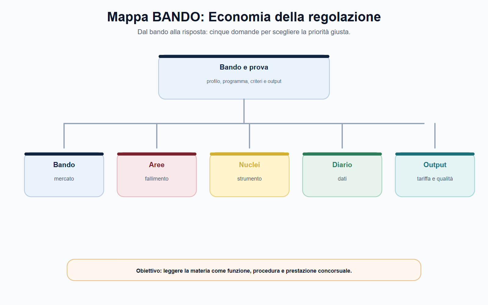
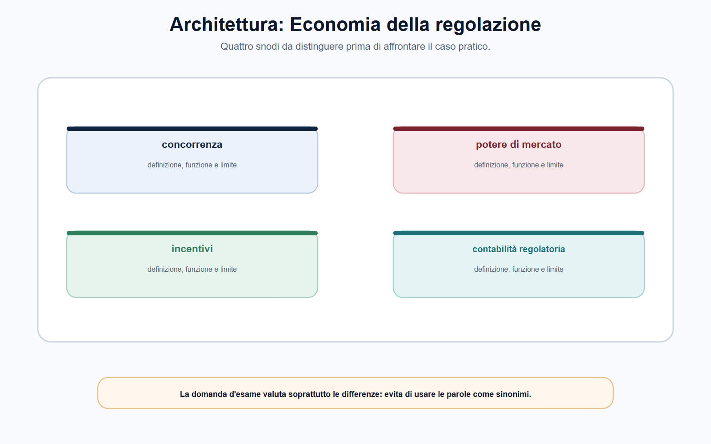
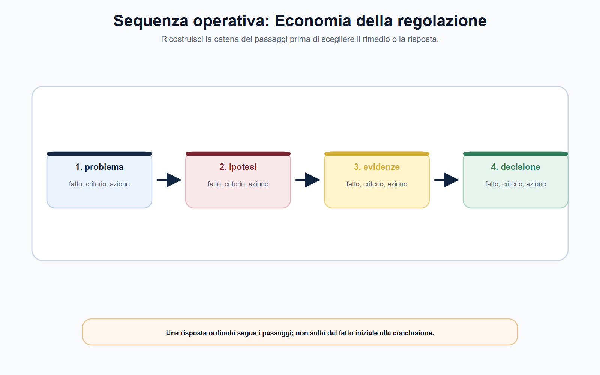
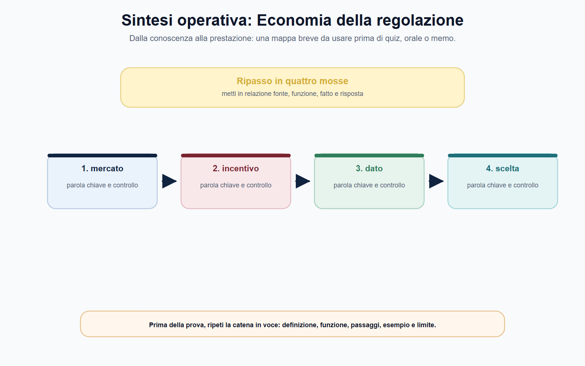

# Economia industriale, regolazione, econometria e contabilità regolatoria

## N-MF05-07-01 · Quadro e criterio di lettura

**Obiettivo.** Usare i concetti economici come strumenti per leggere e motivare una decisione regolatoria, senza ridurli a formule isolate dal mercato, dalla fonte e dall'interesse pubblico tutelato.

**Domanda guida.** Quale problema di mercato o di servizio giustifica l'intervento, quali dati lo rendono verificabile e come si controllano effetti, costi e incentivi della misura?

**Output operativo.** Mappa mercato–problema–strumento, checklist per una nota economica, lettura di un indicatore e caso sulla contabilità regolatoria.

> **Regola di metodo.** Non partire da un indice, da un prezzo o da una formula. Parti dal potere attribuito all'Autorità e dal problema da risolvere; poi verifica mercato, dati, assunzioni, effetti e limiti del metodo usato.

### Apertura editoriale

L'economia della regolazione non è una materia separata dal diritto amministrativo. È il linguaggio che consente di spiegare perché, in un determinato mercato o servizio, una misura possa essere necessaria, adeguata e controllabile nei suoi effetti. Un'Autorità che analizza un prezzo di accesso, una qualità del servizio, una barriera all'entrata o una struttura dei costi non sostituisce la legge con l'economia: usa evidenze economiche per esercitare un potere che deve restare fondato, istruito e motivato.

Per il candidato, il punto decisivo è evitare due errori opposti. Il primo è trattare la regolazione come un elenco di formule: price cap, benchmark, costo medio, elasticità, indice di concentrazione. Il secondo è trattarla come un atto puramente formale, privo di effetti su incentivi, investimenti, utenti e concorrenti. La risposta efficace tiene insieme le due dimensioni: fonte e procedimento da un lato; struttura del mercato, dati e conseguenze dall'altro.

Economia industriale, econometria e contabilità regolatoria servono dunque a rendere il ragionamento dell'Autorità leggibile. L'economia industriale chiarisce come è organizzato il mercato; l'econometria aiuta a misurare e, quando possibile, a valutare relazioni causali; la contabilità regolatoria rende confrontabili costi, ricavi e trasferimenti rilevanti nei settori in cui la disciplina la prevede. Nessuno di questi strumenti decide da sé: tutti devono essere rapportati al caso e alla norma applicabile.

### Obiettivo operativo del capitolo

Al termine del capitolo il lettore deve saper:

1. ricostruire il passaggio da struttura del mercato o del servizio a domanda regolatoria;
2. distinguere concentrazione, potere di mercato, fallimento del mercato e interesse pubblico tutelato;
3. leggere un indicatore senza trasformare una correlazione in una prova causale;
4. spiegare la funzione della contabilità regolatoria e distinguerla dal bilancio civilistico;
5. esaminare una nota economica attraverso dati, assunzioni, metodo, limiti ed effetti attesi della decisione.

*Figura 7.1 — La tavola orienta la lettura di struttura del mercato e separa il perimetro dalle eccezioni.*

### Dalla struttura del mercato alla domanda regolatoria

Il primo compito dell'analisi economica è delimitare il problema. Non basta dire che un settore è «concentrato» o che un'impresa è «grande». Occorre capire quali beni o servizi sono in gioco, quali alternative sono realisticamente disponibili per utenti e operatori, qual è la dimensione geografica pertinente e quali condizioni limitano o rafforzano il comportamento dell'impresa esaminata. La definizione del mercato rilevante è precisamente un esercizio di questo tipo: individua i vincoli concorrenziali da valutare, non una casella amministrativa da compilare.

Anche una quota elevata, da sola, non conclude ogni ragionamento. Può essere un indizio da approfondire insieme a barriere all'entrata, controllo di infrastrutture essenziali, potere contrattuale della domanda, capacità dei concorrenti, innovazione, sostituibilità e dinamica temporale. Allo stesso modo, un mercato poco concentrato può presentare problemi di trasparenza, qualità o accesso che richiedono un'azione pubblica fondata su presupposti diversi dal potere di mercato.

Nei servizi a rete, ad esempio, le economie di scala e la rilevanza dell'infrastruttura possono rendere inefficiente duplicare integralmente gli impianti. In altri contesti l'intervento può rispondere ad asimmetrie informative, esternalità, continuità del servizio, tutela di utenti vulnerabili o interoperabilità. Il funzionario deve quindi separare sempre tre domande: **qual è il mercato o servizio osservato; qual è il problema da dimostrare; quale potere e quale obiettivo permettono di intervenire**.

| Concetto | Domanda utile | Rischio da evitare |
| --- | --- | --- |
| Mercato rilevante | Quali prodotti, servizi e aree esprimono i vincoli concorrenziali pertinenti? | Farlo coincidere automaticamente con il settore amministrativo |
| Concentrazione | Quanti operatori incidono in modo significativo e con quali posizioni? | Trattarla come prova definitiva di potere di mercato |
| Potere di mercato | L'impresa può agire in modo apprezzabilmente indipendente da vincoli competitivi effettivi? | Dedurlo da un solo dato o da una sola quota |
| Fallimento del mercato | Quale meccanismo non produce un esito soddisfacente per concorrenza, utenti o servizio? | Invocarlo senza descrivere il difetto concreto |
| Interesse regolato | Quale risultato pubblico deve essere protetto? | Confondere obiettivo pubblico e vantaggio di un operatore |

La qualità del ragionamento dipende da questa catena. Una misura che incide sui prezzi all'ingrosso, per esempio, deve spiegare quale problema di accesso o di incentivo intende affrontare e perché il mercato non lo corregga in modo sufficiente. Una decisione sulla qualità deve chiarire quale livello o quale modalità di servizio è rilevante per utenti e concorrenza. Il criterio non è trovare il termine economico più tecnico, ma rendere verificabile il nesso tra problema, intervento ed effetto atteso.

## N-MF05-07-02 · Istituti e distinzioni

*Figura 7.2 — La tavola mette a confronto potere di mercato e incentivi e tariffe senza sovrapporli.*

### Regolare incentivi, costi, prezzi e qualità

La regolazione economica agisce spesso su variabili che si condizionano reciprocamente. Un prezzo più basso può migliorare l'accessibilità nel breve periodo, ma una disciplina mal costruita può anche ridurre risorse o incentivi per manutenzione e investimenti; una remunerazione eccessiva può trasferire costi non giustificati a utenti o concorrenti; un obiettivo di efficienza privo di indicatori di qualità può premiare il risparmio a scapito del servizio. Non esiste, perciò, un parametro astrattamente «giusto» senza contesto.

Gli strumenti di regolazione incentivante cercano di ordinare tali tensioni. Il **price cap** indica, in generale, un meccanismo in cui l'evoluzione dei prezzi o dei ricavi è soggetta a un vincolo; il **benchmark** confronta prestazioni o costi con riferimenti omogenei; gli obiettivi di qualità legano la valutazione non soltanto alla spesa ma anche al risultato ottenuto. Sono categorie utili per il colloquio, ma coefficienti, formule, basi di costo, periodi regolatori e premi o penalità devono essere sempre ricavati dall'atto settoriale vigente.

L'esempio ARERA mostra bene questo limite metodologico. Il TIROSS 2024-2031 collega, nel proprio ambito, regolazione della spesa e obiettivi di servizio per infrastrutture regolate. Non ne deriva che ogni Autorità debba usare lo stesso schema, né che il candidato possa trasferirne parametri in materia di comunicazioni, concorrenza o finanza. L'esempio serve a comprendere che la tariffa può essere parte di un disegno più ampio: costi riconoscibili, qualità, investimenti, controllo e trasparenza.

In una nota istruttoria è utile rendere esplicito il compromesso considerato:

| Variabile | Interesse da verificare | Domanda di controllo |
| --- | --- | --- |
| Prezzo o corrispettivo | Accessibilità e correttezza del trasferimento di costi | Il dato è comparabile e collegato al perimetro regolato? |
| Costi | Efficienza e recupero di costi pertinenti | Quali costi sono inclusi, con quale criterio e con quali evidenze? |
| Qualità | Tutela di utenti e concorrenza sul servizio | L'indicatore misura realmente l'esito promesso? |
| Investimenti | Sostenibilità e sviluppo dell'infrastruttura | La misura modifica incentivi o tempi di investimento? |
| Concorrenza | Accesso, non discriminazione e innovazione | La soluzione riduce una barriera o crea una nuova distorsione? |

La proporzionalità economica non coincide con il minor costo immediato. Richiede di confrontare opzioni, di motivare le assunzioni e di non attribuire a un indicatore un significato che non può sostenere. È qui che il capitolo sul ciclo regolatorio si collega a questo: dati e analisi entrano nella decisione, nel monitoraggio e nella verifica degli effetti, non soltanto nell'allegato tecnico.

*Figura 7.3 — La tavola ricostruisce il passaggio dai fatti alla competenza e alla decisione.*

### Econometria: descrivere, stimare, attribuire

L'econometria consente di organizzare dati e valutare relazioni tra fenomeni. Nel lavoro regolatorio, però, la prima distinzione da fare è tra **descrizione** e **causalità**. Dire che, dopo una misura, i reclami sono diminuiti descrive un andamento; non dimostra automaticamente che la misura sia stata la causa della diminuzione. Nello stesso periodo possono essere cambiati domanda, tecnologie, condizioni macroeconomiche, comportamenti delle imprese, criteri di rilevazione o composizione degli utenti.

Una valutazione causale pone una domanda più esigente: che cosa sarebbe ragionevolmente accaduto senza l'intervento? Questa situazione alternativa è il **controfattuale**. Non è sempre osservabile direttamente; per questo metodo e dati devono essere scelti in modo coerente con il disegno dell'intervento e con le informazioni disponibili. Il JRC della Commissione europea richiama proprio l'importanza di analisi data-driven e di confronti credibili nelle valutazioni microeconomiche ex post.

Non occorre trasformare il candidato in un econometrista per rispondere bene. Occorre mostrare disciplina nel ragionamento: definire la variabile, controllare il perimetro, distinguere un cambiamento nel dato da un effetto dimostrato, dichiarare limiti e assunzioni. Anche un modello sofisticato resta debole se parte da dati incompleti, da un campione selezionato senza giustificazione o da una domanda mal formulata.

| Domanda | Risposta metodologicamente debole | Controllo minimo necessario |
| --- | --- | --- |
| Il servizio è migliorato? | «L'indice è salito» | Definizione dell'indice, periodo, popolazione osservata e fonte |
| La misura ha prodotto il miglioramento? | «È avvenuto dopo la misura» | Confronto, fattori alternativi e limite dell'attribuzione causale |
| I costi sono aumentati? | «Il totale è maggiore» | Perimetro, quantità servite, classificazione dei costi e comparabilità |
| Un operatore discrimina? | «Il prezzo appare diverso» | Termini di confronto, condizioni equivalenti e disciplina applicabile |

Un indicatore affidabile richiede almeno sei informazioni: oggetto misurato, unità di misura, numeratore e denominatore quando pertinenti, periodo, fonte dei dati e criteri di raccolta. Se una di queste informazioni manca, il dato può ancora essere un segnale per approfondire, ma difficilmente è sufficiente per fondare una conclusione incisiva. La prudenza non paralizza l'azione: consente di calibrare la decisione e di motivare perché, nonostante i limiti, l'evidenza disponibile sia o non sia adeguata al passo successivo.

*Figura 7.4 — La tavola evidenzia le distinzioni da controllare prima di rispondere.*

### Contabilità regolatoria: rendere leggibili costi e trasferimenti

## N-MF05-07-03 · Poteri, procedura e conseguenze

La contabilità regolatoria va distinta dalla contabilità civilistica. Il bilancio rappresenta la situazione economica, patrimoniale e finanziaria dell'impresa secondo la disciplina applicabile; la contabilità regolatoria, quando è prevista, organizza informazioni utili a un preciso controllo di settore. Può rendere comparabili costi, ricavi, attività e trasferimenti interni riferiti a servizi, segmenti o componenti sottoposti a regolazione.

La sua funzione non è produrre una contabilità «parallela» per ragioni formali. In mercati nei quali un'impresa integrata opera a livelli diversi della filiera, informazioni aggregate possono rendere opachi prezzi interni, imputazioni di costo o rapporti tra attività regolate e non regolate. La separazione contabile e la contabilità dei costi possono allora sostenere trasparenza, non discriminazione e verifica dell'assenza di sussidi incrociati, nei limiti e per i soggetti indicati dalla fonte.

AGCOM offre un esempio circoscritto ma istruttivo: per le reti fisse e mobili, la disciplina richiamata riguarda obblighi di separazione contabile e di contabilità dei costi per operatori designati con significativo potere di mercato; sono previste finalità di trasparenza e controlli di conformità esterna. Il dato essenziale è proprio la delimitazione: non è un obbligo automatico per ogni impresa né una metodologia da applicare fuori dal mercato e dall'atto che la prevedono. Anche la raccolta ARERA dei conti annuali separati deve essere letta nel proprio quadro regolatorio.

Per leggere correttamente un documento contabile-regolatorio, il funzionario deve verificare:

1. **perimetro soggettivo:** quale operatore o attività è assoggettato all'obbligo;
2. **perimetro oggettivo:** quali servizi, reti o componenti sono inclusi;
3. **criteri di attribuzione:** come sono imputati costi e ricavi diretti e come sono ripartiti quelli comuni;
4. **coerenza e riconciliazione:** se i dati possono essere ricondotti alle fonti contabili e ai prospetti richiesti;
5. **verifica:** quali controlli, attestazioni o revisioni indipendenti impone la disciplina;
6. **uso decisionale:** quale conclusione regolatoria può essere tratta e quale, invece, richiede ulteriori elementi.

L'ultimo punto evita un equivoco frequente: un costo imputato non dimostra automaticamente che sia recuperabile in tariffa, efficiente o non discriminatorio. Occorre ancora applicare il criterio previsto, confrontarlo con altri dati disponibili e motivare la conseguenza. La contabilità regolatoria rende l'analisi possibile; non dispensa l'Autorità dall'analisi.

### Come leggere una nota economica prima della decisione

Una buona nota economica deve poter essere ricostruita da chi non ha prodotto il calcolo. Il lettore non deve limitarsi al risultato finale, ma controllare il percorso che lo sostiene. Questa checklist è utile in istruttoria, in una prova scritta e nella preparazione di una risposta orale.

| Verifica | Domanda da porre |
| --- | --- |
| Quesito | Quale scelta dell'Autorità deve essere informata dall'analisi? |
| Fonte | Da dove provengono i dati e quali controlli di qualità sono stati svolti? |
| Perimetro | Quali soggetti, servizi, territori e periodi sono inclusi o esclusi? |
| Misura | Come è definito l'indicatore o la variabile usata? |
| Metodo | Il metodo risponde a una descrizione, a una previsione o a una domanda causale? |
| Assunzioni | Quali ipotesi incidono sul risultato e come sono motivate? |
| Robustezza | Il risultato cambia se si modificano ipotesi ragionevoli o si usano confronti alternativi? |
| Decisione | Quale conseguenza è giustificata dai dati e quale resta solo possibile? |

La trasparenza metodologica protegge sia l'interesse pubblico sia il destinatario della decisione. Permette di discutere dati e criteri nel contraddittorio, riduce il rischio di motivazioni apparenti e rende monitorabile l'effetto della misura. In termini concorsuali, la formula da ricordare è semplice: **dato non significa prova conclusiva; modello non significa decisione; contabilità non significa tariffa**.

*Figura 7.5 — La tavola chiude il percorso collegando contabilità regolatoria a controfattuale.*

### Strumenti quantitativi: leggere il numero senza subirlo

La quota di mercato è un indizio, non una conclusione autosufficiente. Un indice di concentrazione come l'HHI, ottenuto sommando i quadrati delle quote degli operatori, rende confrontabili strutture diverse e segnala dove approfondire; non dimostra da solo potere di mercato né effetti anticoncorrenziali. La lettura richiede almeno definizione del mercato, barriere all'entrata, sostituibilità, potere degli acquirenti e dinamica temporale. Anche l'elasticità va interpretata: misura quanto una quantità reagisce alla variazione di un prezzo o di un'altra variabile, ma la stima dipende da dati, periodo, modello e comportamento osservato.

Un'analisi econometrica credibile separa correlazione e attribuzione causale. La specificazione esplicita variabile dipendente, regressori, unità di osservazione e periodo; l'omissione di una variabile rilevante può trasferire sul coefficiente stimato un effetto che appartiene ad altro fattore. Per esempio, se dopo un aumento tariffario cresce la morosità, non basta correlare le due serie: reddito, stagione, inflazione, composizione dell'utenza e modifiche del servizio possono influenzare entrambe. Robustezza, intervalli di confidenza e analisi di sensibilità rendono visibile l'incertezza invece di nasconderla dietro una cifra decimale.

Il controfattuale risponde alla domanda decisiva: che cosa sarebbe accaduto senza la misura o la condotta osservata? Può essere costruito con un gruppo di confronto, una serie storica coerente o un modello, purché le assunzioni siano dichiarate. In un esercizio didattico, un mercato passa da quattro operatori con quote 40, 30, 20 e 10 a tre operatori con quote 50, 30 e 20. L'HHI sale da 3.000 a 3.800 punti: il dato indica un aumento della concentrazione, ma la valutazione richiede ancora di sapere perché le quote sono cambiate, quali barriere esistono e se i clienti dispongono di alternative effettive.

## N-MF05-07-04 · Applicazione alla prova

La contabilità regolatoria aggiunge un altro livello di cautela. Costi comuni, costi direttamente attribuibili e trasferimenti infragruppo devono essere separati con criteri coerenti e verificabili. Una base di costo gonfiata può trasferire inefficienze sugli utenti; una base troppo stretta può compromettere qualità e investimenti. Il funzionario ricostruisce perimetro, metodo di allocazione, driver, riconciliazione con la contabilità generale e controlli. Solo dopo collega i numeri alla decisione, motivando benefici, oneri distributivi e margine di incertezza.
### Mappa BANDO

Le espressioni «economia industriale», «regolazione tariffaria», «analisi dei dati», «contabilità regolatoria» o «valutazione d'impatto» richiedono un collegamento tra concetto, fonte e decisione.

| Voce del bando | Nucleo da padroneggiare | Output da allenare |
| --- | --- | --- |
| Mercato e concorrenza | Mercato rilevante, vincoli competitivi, barriere e potere | Mappa problema–evidenza–intervento |
| Regolazione economica | Prezzi, costi, qualità, investimenti e incentivi | Tabella dei compromessi regolatori |
| Econometria | Indicatore, correlazione, causalità e controfattuale | Nota metodologica di cinque righe |
| Contabilità regolatoria | Separazione, costi, trasferimenti, trasparenza e verifica | Checklist del perimetro contabile |
| Decisione dell'Autorità | Fonte, dati, motivazione, proporzionalità e monitoraggio | Schema di provvedimento economicamente motivato |

> **Da sapere in cinque righe.** Il mercato rilevante individua i vincoli concorrenziali e non coincide automaticamente con un settore amministrativo. Concentrazione e quota di mercato sono elementi istruttori, non prove autosufficienti. La regolazione deve leggere insieme prezzi, costi, qualità e investimenti, secondo la fonte settoriale. Un dato che cambia dopo una misura non dimostra da solo un rapporto causale: occorre valutare confronto e controfattuale. La contabilità regolatoria, ove prevista, rende più trasparenti costi e trasferimenti ma non sostituisce il giudizio dell'Autorità su efficienza, non discriminazione o tariffa.

### Caso guidato: costo di accesso e operatore integrato

Un operatore che gestisce una rete essenziale fornisce anche servizi al dettaglio in concorrenza con altre imprese. Dopo la presentazione dei prospetti contabili regolatori, l'ufficio rileva un aumento dei costi attribuiti al servizio di accesso all'ingrosso e una differenza tra il corrispettivo interno applicato alla divisione commerciale del gruppo e le condizioni offerte ai concorrenti. Un candidato propone di ridurre immediatamente il prezzo di accesso perché «i costi sono sicuramente gonfiati».

La conclusione è prematura. Il primo passaggio consiste nel verificare se l'operatore, il servizio e il periodo rientrino nell'obbligo contabile e nella disciplina di accesso applicabili. Occorre poi ricostruire criteri di imputazione dei costi, separazione delle attività, perimetro dei dati, eventuale verifica di conformità e comparabilità delle condizioni interne ed esterne. Il dato contabile può essere un elemento rilevante, ma non dice ancora se un costo sia inefficiente, se una differenza sia discriminatoria o quale rimedio sia consentito.

L'istruttoria deve quindi collegare contabilità, analisi del mercato e finalità della misura. Se il problema è la non discriminazione, il confronto deve riguardare servizi e condizioni equivalenti; se il problema è il recupero dei costi, deve essere applicato il criterio previsto dalla regolazione; se la misura incide sul prezzo, vanno considerati anche qualità e incentivi agli investimenti. Solo alla fine l'Autorità potrà motivare una scelta proporzionata e definire come monitorarne l'effetto.

Il caso non richiede di inventare un coefficiente o una tariffa. Chiede di dimostrare il metodo: **fonte dell'obbligo → affidabilità e perimetro del dato → confronto pertinente → criterio settoriale → decisione motivata → verifica successiva**.

### Domanda da commissario

**Spieghi il ruolo dell'economia industriale, dell'econometria e della contabilità regolatoria nell'attività di un'Autorità indipendente.**

### Risposta orale modello

«L'economia industriale consente di leggere struttura del mercato, vincoli concorrenziali, potere di mercato, barriere e possibili fallimenti, così da collegare il problema allo strumento regolatorio previsto dalla legge. L'econometria organizza e valuta i dati: occorre distinguere un indicatore descrittivo da un giudizio causale, che richiede una domanda esplicita e un confronto o controfattuale credibile. La contabilità regolatoria, nei settori e per i soggetti previsti, rende leggibili costi, ricavi e trasferimenti interni, favorendo trasparenza, non discriminazione e controllo di eventuali sussidi incrociati. Questi strumenti non sostituiscono la fonte né la motivazione: servono a rendere la decisione istruita, proporzionata e verificabile nei suoi effetti.»

### Domanda-trappola

**Se un indicatore di qualità migliora dopo l'entrata in vigore di una misura, è dimostrato che la misura ha prodotto il miglioramento?**

No. L'andamento temporale prova una successione, non necessariamente un nesso causale. Occorre verificare definizione dell'indicatore, dati, fattori alternativi e, se la domanda è causale, un confronto o controfattuale adeguato alla situazione osservata.

### Errore tipico

**Errore:** «La contabilità regolatoria dimostra automaticamente quale tariffa l'Autorità deve approvare.»

**Correzione:** i prospetti contabili sono una base informativa prevista dalla disciplina di settore. Prima della decisione occorre verificarne perimetro, criteri di imputazione, attendibilità e rapporto con il criterio tariffario o di non discriminazione applicabile.

### Mini-esercizio di consolidamento

Un regolatore osserva che, dopo una nuova misura, il costo totale dichiarato per un servizio passa da 100 a 108 e l'indice di qualità passa da 80 a 78. Completa la lettura preliminare senza attribuire cause non dimostrate.

## N-MF05-07-05 · Consolidamento e verifica

| Campo | Risposta da impostare |
| --- | --- |
| Variazione del costo totale | Aumento di 8 unità, pari all'8% rispetto alla base 100 |
| Variazione dell'indice di qualità | Riduzione di 2 punti; verificare scala e significato dell'indice |
| Informazioni mancanti | Volumi serviti, perimetro dei costi, periodo, metodo di rilevazione, eventi intervenuti |
| Conclusione non consentita | Che la misura abbia causato l'aumento dei costi o il calo della qualità |
| Passo successivo | Verificare dati e comparabilità, formulare l'ipotesi e scegliere il confronto pertinente |

L'esercizio è corretto se distingue calcolo, descrizione e interpretazione. La variazione percentuale è un'informazione; la decisione richiede ancora fonte, dati affidabili, criterio settoriale e motivazione.

### Laboratorio di qualificazione

Per allenare struttura del mercato, parti da un fascicolo minimo: una richiesta, due documenti non perfettamente coerenti e una fonte che attribuisce il potere. Scrivi in colonne separate i fatti provati, le allegazioni e gli elementi ancora da acquisire. Poi confronta potere di mercato con incentivi e tariffe: annota soggetto, presupposto, funzione ed effetto di ciascun istituto. Il confronto impedisce di scegliere la soluzione soltanto perché una parola della traccia ricorda una definizione studiata.

Passa quindi a econometria. Indica chi avvia l'attività, quali garanzie devono essere rispettate e quale atto può chiuderla. Se la fonte lascia un margine di valutazione, rendi espliciti i criteri: gravità, durata, diffusione, rischio, collaborazione e proporzionalità, secondo il settore applicabile. Collega contabilità regolatoria al documento che ne permette la verifica e tratta controfattuale come una conclusione da motivare, non come un'etichetta. La scheda è completa quando un secondo lettore può ricostruire il percorso senza conoscere l'intenzione di chi l'ha compilata.

### Controllo incrociato

Rileggi ora il risultato da tre prospettive. Come candidato, verifica di avere definito struttura del mercato senza dilungarti su nozioni estranee. Come istruttore, controlla che la distinzione fra potere di mercato e incentivi e tariffe poggi su documenti e non su supposizioni. Come decisore, chiediti se il passaggio dedicato a econometria giustifichi davvero l'esito proposto. Se una prospettiva non trova risposta, riapri l'analisi nel punto preciso invece di aggiungere una conclusione generica.

Completa il controllo con una riga dedicata alle alternative. Spiega quale diversa qualificazione sarebbe possibile se cambiasse un fatto decisivo, quale fonte farebbe mutare il perimetro di contabilità regolatoria e quale conseguenza produrrebbe su controfattuale. L'esercizio allena a riconoscere le opzioni quasi corrette: nei concorsi l'errore più insidioso non è sempre una regola falsa, ma una regola vera applicata al soggetto, al tempo o al procedimento sbagliato. La risposta finale deve perciò contenere anche il proprio limite di validità.

### ▣ Verifica ragionata

**Quesito 1.** Qual è il primo controllo quando la traccia richiama struttura del mercato?

**Risposta corretta:** individuare il fatto rilevante, la fonte e il perimetro della competenza prima di scegliere l'istituto. La parola usata nella traccia può orientare, ma non dimostra da sola quale autorità o quale potere siano applicabili. Una risposta efficace espone il criterio e poi lo applica ai dati disponibili.

**Quesito 2.** potere di mercato e incentivi e tariffe possono essere trattati come espressioni equivalenti?

**Risposta corretta:** no. Devono essere distinti per funzione, presupposti, soggetti ed effetti. Dopo la distinzione si può spiegare il loro coordinamento. Nei quiz, l'opzione errata spesso contiene una definizione plausibile ma trasferisce a un istituto la funzione dell'altro.

**Quesito 3.** Un dato tratto da un bando storico o da una pagina operativa vale per ogni procedura successiva?

**Risposta corretta:** no. Il dato è utile come esempio datato; requisiti, termini, soglie, composizione delle prove e modalità di ricorso devono essere ricontrollati nella fonte vigente e nel bando applicabile. La regola stabile va separata dal dato mobile.

**Quesito 4.** Come va usato econometria nel caso proposto?

**Risposta corretta:** va collegato a fatti, competenza, sequenza procedurale e conseguenza. Limitarsi a una definizione non dimostra capacità applicativa; anticipare l'esito senza istruttoria produce invece una conclusione non sostenuta. La motivazione deve rendere visibile il passaggio compiuto.

**Quesito 5.** La finalità generale di tutela attribuisce automaticamente qualsiasi potere in materia di contabilità regolatoria?

**Risposta corretta:** no. Ogni potere richiede una fonte attributiva, un oggetto e un procedimento. La missione istituzionale aiuta a interpretare il sistema, ma non sostituisce la verifica della competenza concreta né consente di confondere vigilanza, rimedio individuale e sanzione.

**Quesito 6.** Quale controllo conclusivo riduce gli errori su controfattuale?

**Risposta corretta:** confrontare la conclusione con la domanda, la fonte e i fatti effettivamente disponibili. Se manca un elemento, la risposta deve indicare quale documento o accertamento serve. Dichiarare il limite informativo è più professionale che colmarlo con un automatismo.

### Caso ragionato di chiusura

Un ufficio riceve una segnalazione che usa formule generiche, richiama struttura del mercato e chiede un intervento immediato su controfattuale. Il fascicolo contiene una schermata, una comunicazione non datata e il riferimento a un bando precedente. La soluzione non consiste nello scegliere subito una sanzione. Occorre qualificare il fatto, verificare autenticità e data dei documenti, individuare la fonte vigente, distinguere potere di mercato da incentivi e tariffe e stabilire quale amministrazione possa acquisire gli elementi mancanti. Solo allora si valuta econometria, si collega contabilità regolatoria al potere pertinente e si motiva il passo successivo. Il caso è risolto correttamente quando la conclusione resta proporzionata alle prove e separa la regola stabile dai dati da aggiornare.
