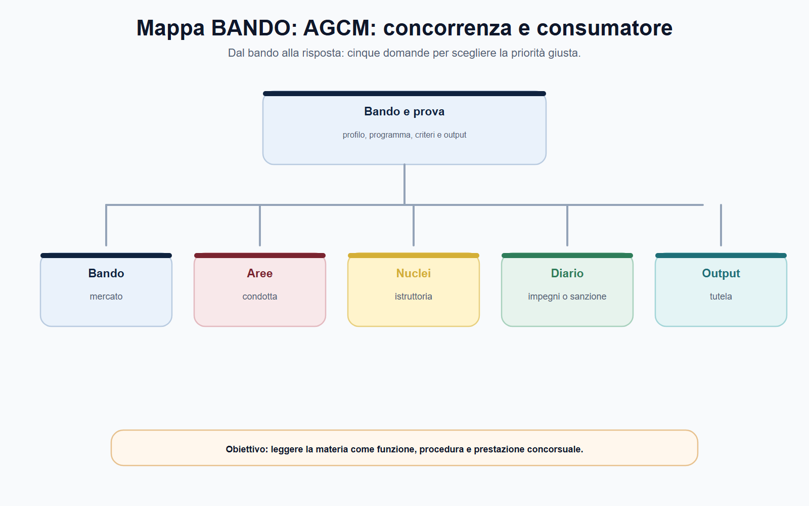
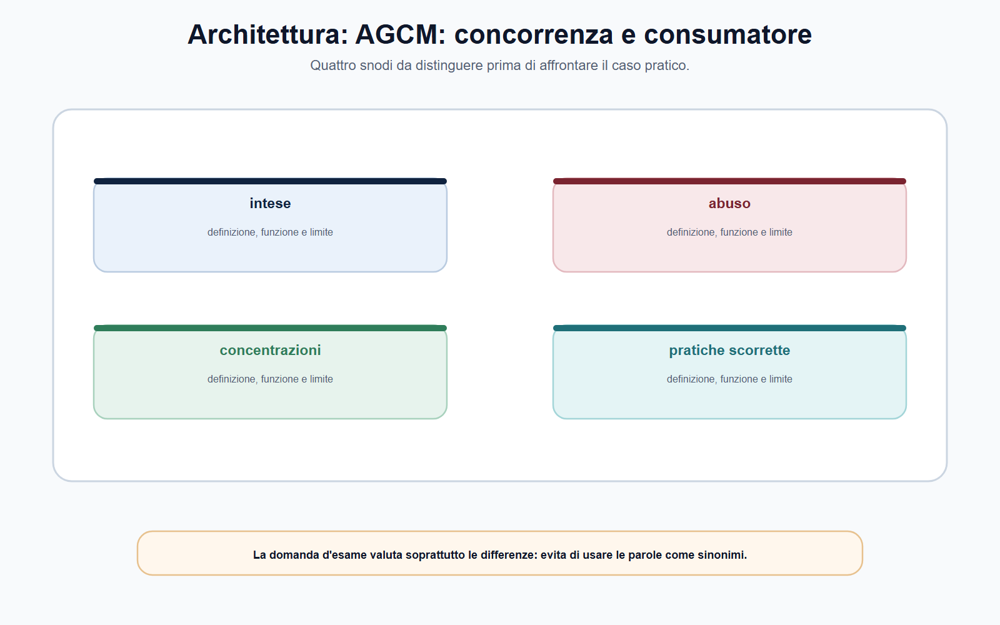
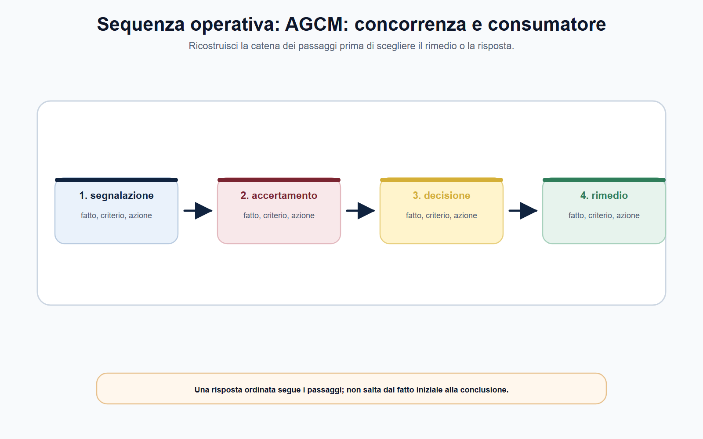
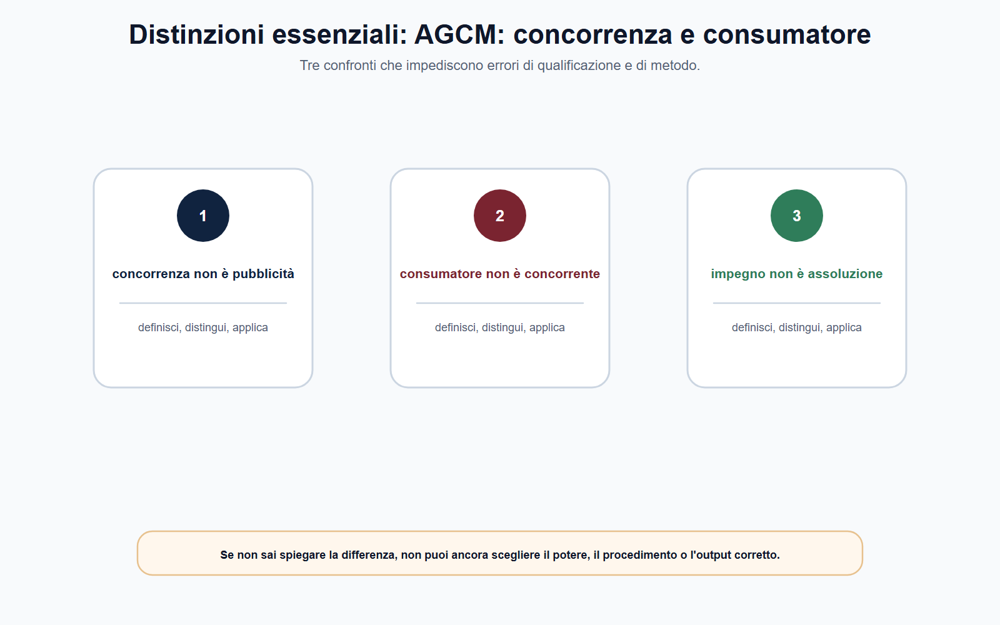
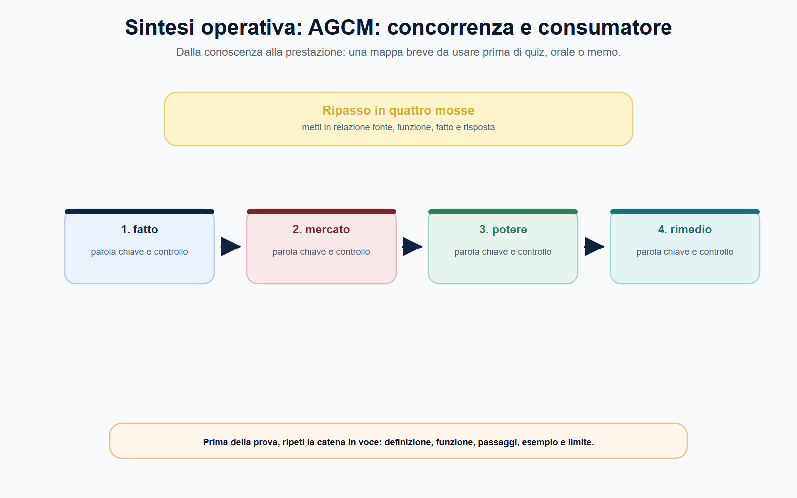

# AGCM: concorrenza, consumatore e pratiche scorrette

## Scheda di lavoro

**Obiettivo.** Ricostruire le competenze dell'AGCM distinguendo tutela del processo concorrenziale, tutela del consumatore e strumenti procedimentali applicabili ai diversi casi.

**Domanda guida.** Il fatto riguarda un coordinamento o un potere di mercato tra imprese, oppure una condotta del professionista capace di orientare scorrettamente la scelta del consumatore?

**Output operativo.** Griglia di qualificazione, caso antitrust, caso consumer, schema di provvedimento e risposta orale.

> **Regola di metodo.** Non scegliere il rimedio prima della fattispecie. Identifica rapporto, soggetti, fonte e fatto rilevante; soltanto dopo puoi valutare istruttoria, poteri e decisione dell'AGCM.

## Testo editoriale

### Apertura editoriale

L'Autorità Garante della Concorrenza e del Mercato è spesso ricordata con un'unica formula: «l'Autorità antitrust». La formula è utile, ma incompleta. L'AGCM applica la disciplina della concorrenza e svolge, al tempo stesso, rilevanti competenze di tutela del consumatore. Le due aree condividono l'esigenza di un mercato corretto e trasparente, ma non coincidono per presupposti, soggetti, prova, procedimento o risultato della decisione.

Un'intesa restrittiva, ad esempio, riguarda il coordinamento tra imprese e può compromettere il libero gioco concorrenziale. Una pratica commerciale scorretta riguarda invece la condotta di un professionista nella promozione, vendita o fornitura di beni e servizi verso i consumatori e può alterarne la scelta economica. Il medesimo operatore, lo stesso prodotto e perfino la stessa campagna commerciale possono far emergere profili diversi; questo non autorizza però a sovrapporre automaticamente le discipline.

Per il candidato, la competenza da allenare è una competenza di qualificazione. Occorre saper dire: quale interesse è protetto; quale norma può essere applicata; quali fatti vanno provati; chi partecipa al procedimento; quale esito è possibile. Una risposta che parte da questa mappa è più solida di un elenco di sanzioni o di casi di cronaca.

### Obiettivo operativo del capitolo

Al termine del capitolo il lettore deve saper:

1. distinguere intese, abuso di posizione dominante e concentrazioni;
2. distinguere tutela del processo concorrenziale e tutela della decisione economica del consumatore;
3. qualificare una pratica commerciale come possibile ingannevole o aggressiva senza anticipare l'accertamento;
4. ricostruire in modo essenziale segnalazione, istruttoria, garanzie, decisione e controllo;
5. riconoscere i limiti dei poteri AGCM rispetto al risarcimento individuale e agli strumenti attribuiti ad altre autorità o al giudice.

*Figura 8.1 — Schema di ripasso: usa la mappa per collegare regola, funzione e output di prova.*

### La doppia prospettiva: concorrenza nel mercato e correttezza verso il consumatore

La tutela antitrust protegge il processo concorrenziale. L'attenzione è rivolta al modo in cui le imprese competono, ai vincoli che ne limitano l'autonomia, all'eventuale uso illecito del potere di mercato e agli effetti delle operazioni di crescita esterna. La legge n. 287/1990 attribuisce all'AGCM competenze su intese restrittive, abusi di posizione dominante e concentrazioni; nei casi che incidono sul commercio tra Stati membri entra in gioco anche il diritto dell'Unione e il raccordo nella rete ECN.

La tutela del consumatore guarda invece alla relazione tra professionista e destinatario dell'offerta. Il Codice del consumo attribuisce rilievo alla correttezza delle pratiche commerciali, ai diritti nei contratti, alle clausole vessatorie e ad altri ambiti stabiliti dalla legge. In questa sede il punto non è dimostrare che un mercato sia concentrato o che un'impresa sia dominante: è valutare una condotta, un'omissione o una comunicazione in rapporto alla diligenza professionale e alla sua idoneità a condizionare la scelta economica del consumatore medio.

| Profilo | Tutela della concorrenza | Tutela del consumatore |
| --- | --- | --- |
| Domanda iniziale | Il comportamento altera il processo competitivo? | Il professionista informa o agisce in modo scorretto verso il consumatore? |
| Relazione osservata | Tra imprese, mercato e struttura competitiva | Tra professionista e consumatore; nei casi previsti, anche microimpresa |
| Nuclei tipici | Intese, abuso, concentrazioni | Pratiche scorrette, diritti contrattuali, clausole vessatorie, pubblicità |
| Fatti da accertare | Coordinamento, potere, mercato, effetti o rischio concorrenziale | Condotta, messaggio, omissione, destinatario, diligenza e incidenza sulla scelta |
| Esito da non confondere | Decisione antitrust o controllo di una concentrazione | Accertamento consumer, diffida, sanzione o altro esito previsto |

La tabella non crea compartimenti stagni. La tutela del consumatore può rafforzare la qualità complessiva del mercato; un illecito antitrust può avere conseguenze anche per gli utenti finali. Tuttavia l'ufficio deve evitare salti logici: il danno al consumatore non dimostra da solo un'intesa, così come una posizione di mercato elevata non dimostra da sola una pratica commerciale scorretta. Ogni conclusione richiede la fattispecie e la prova proprie del procedimento applicato.

*Figura 8.2 — Schema di ripasso: usa la mappa per collegare regola, funzione e output di prova.*

### Intese, abuso di posizione dominante e concentrazioni

Le **intese restrittive** sono forme di coordinamento tra imprese che possono impedire, restringere o falsare in misura consistente la concorrenza. Possono riguardare, per esempio, prezzi, sconti, quantità, ripartizione dei mercati, accesso o altre condizioni commerciali. Il candidato non deve cercare soltanto un contratto scritto: il punto è verificare, secondo la disciplina applicabile, se esista un coordinamento che sostituisca o limiti l'autonomia competitiva delle imprese e se ricorrano i presupposti della norma.

L'**abuso di posizione dominante** richiede una distinzione ancora più netta. La posizione dominante non è illecita in quanto tale: un'impresa può raggiungere grandi dimensioni o quote rilevanti anche grazie a efficienza, innovazione, qualità o preferenza degli utenti. L'analisi deve prima verificare mercato e potere dell'impresa; soltanto dopo valuta se quel potere sia stato esercitato in modo abusivo, a danno della concorrenza, dei concorrenti o dei consumatori nel senso rilevante per la norma. Trasformare «grande impresa» in «impresa illecita» è un errore concettuale.

Le **concentrazioni** riguardano un'operazione di crescita esterna, come una fusione o l'acquisizione del controllo, cioè della possibilità di esercitare un'influenza determinante su un'altra impresa. Il controllo è diverso dall'accertamento di una condotta già tenuta: è orientato a valutare, nel perimetro e secondo le soglie previste dalla legge vigente, se l'operazione incida sulla struttura concorrenziale. Per questo non vanno mai riportate a memoria soglie di fatturato o termini senza aver controllato l'aggiornamento applicabile.

| Istituto | Che cosa va provato o verificato | Errore da evitare |
| --- | --- | --- |
| Intesa | Coordinamento tra imprese e presupposti della restrizione rilevante | Cercare solo un accordo formalizzato |
| Abuso | Posizione dominante, condotta e carattere abusivo | Confondere dominanza e abuso |
| Concentrazione | Operazione, controllo, mercato e impatto concorrenziale nel quadro legale | Trattarla come sanzione per un illecito pregresso |

In tutti e tre i casi, il mercato rilevante è una chiave analitica e non una formula. Aiuta a individuare prodotti, servizi, aree geografiche e vincoli concorrenziali pertinenti. Quote, barriere all'entrata, sostituibilità, integrazione verticale, capacità dei concorrenti e comportamento della domanda sono elementi che acquistano senso soltanto nel loro insieme. Il Capitolo 7 offre qui il metodo economico di base: l'AGCM lo applica entro la fattispecie e il potere definiti dalla fonte.

*Figura 8.3 — Schema di ripasso: usa la mappa per collegare regola, funzione e output di prova.*

### Pratiche commerciali scorrette: ingannevoli, aggressive, verificabili

Per pratica commerciale si intende un insieme molto ampio di comportamenti del professionista: azioni, omissioni, dichiarazioni, comunicazioni e pubblicità, inclusi mezzi e modalità con cui un bene o servizio viene promosso, venduto o fornito. L'ampiezza della nozione evita che una condotta possa sottrarsi alla disciplina soltanto perché realizzata online, in un messaggio, in una pagina informativa o in una fase precedente alla conclusione del contratto.

Il criterio generale non è la semplice insoddisfazione dell'acquirente. Una pratica è scorretta quando contrasta con la diligenza professionale e falsa, o è idonea a falsare in misura apprezzabile, il comportamento economico del consumatore medio che raggiunge o al quale è diretta. La verifica richiede quindi di ricostruire chi è il destinatario, quale messaggio o omissione è contestato, quale scelta può esserne influenzata e perché la condotta si discosti dallo standard richiesto.

Le pratiche **ingannevoli** possono veicolare informazioni non veritiere, parziali o presentate in modo tale da indurre in errore. Prezzo, caratteristiche, disponibilità, rischi, condizioni contrattuali e modalità dell'offerta sono esempi di elementi che devono essere esaminati nel loro contesto. Le pratiche **aggressive** si caratterizzano invece per molestie, coercizione o indebito condizionamento capaci di comprimere la libertà di scelta o di comportamento del consumatore. La classificazione aiuta l'istruttoria, ma non sostituisce il confronto puntuale con la fonte e con le prove disponibili.

| Domanda di istruttoria | Verifica concreta |
| --- | --- |
| Chi è il soggetto attivo? | Il professionista rientra nel perimetro della disciplina? |
| Qual è la pratica? | Conservare messaggi, schermate, condizioni, flussi di acquisto e data di diffusione |
| A chi è diretta? | Individuare consumatore medio, gruppo vulnerabile o altra categoria rilevante |
| Quale informazione manca o è fuorviante? | Confrontare promessa, prezzo, condizioni, limiti e informazioni effettivamente rese |
| Quale scelta può essere alterata? | Acquisto, adesione, rinnovo, recesso o altra decisione economica pertinente |
| Qual è l'esito possibile? | Applicare solo il potere consentito da Codice, regolamento e caso concreto |

In alcuni ambiti, la disciplina estende la tutela delle pratiche commerciali anche alle microimprese nei termini previsti dalla legge. Non è però corretto generalizzare l'estensione a ogni regola consumeristica o a ogni operatore economico. Nella risposta concorsuale è sufficiente dichiarare la regola metodologica: verificare destinatario e specifica disposizione, senza trasformare la categoria «microimpresa» in un sinonimo universale di consumatore.

*Figura 8.4 — Schema di ripasso: usa la mappa per collegare regola, funzione e output di prova.*

### Dalla segnalazione alla decisione: procedimento, garanzie e limiti

Una segnalazione a un'Autorità è un elemento di attivazione o conoscenza, non la prova di un illecito. L'AGCM può avviare un procedimento d'ufficio o a seguito di segnalazione; se procede, deve applicare il quadro normativo e regolamentare pertinente. Nei procedimenti consumeristici il regolamento AGCM del 2024 disciplina, tra l'altro, ambito, avvio, partecipazione, accesso e decisione. Anche in questo settore valgono un'istruttoria leggibile, il contraddittorio nei limiti applicabili, la valutazione degli elementi raccolti e la motivazione dell'esito.

La decisione finale può avere contenuti diversi secondo la fonte e i fatti: non illiceità o chiusura per insufficienza degli elementi, accertamento con diffida e sanzione, accoglimento di impegni nei casi previsti senza accertare l'infrazione contestata, oppure non luogo a provvedere per venir meno dei presupposti. In situazioni di particolare urgenza, il quadro normativo può consentire misure provvisorie: anche queste richiedono i presupposti specifici e non anticipano automaticamente la decisione finale.

Il capitolo sui poteri sanzionatori offre il criterio generale: sanzione, impegno, misura correttiva e misura cautelare non sono sinonimi. Nel consumer, come nell'antitrust, è indispensabile individuare la norma che abilita lo strumento, il suo scopo e le garanzie che ne accompagnano l'uso. La presenza di impegni, per esempio, non trasforma il procedimento in una trattativa libera né costituisce automaticamente riconoscimento della violazione.

È altrettanto essenziale distinguere l'enforcement amministrativo dalla tutela individuale. L'AGCM può intervenire sui comportamenti e applicare i poteri attribuiti, ma non liquidare al singolo consumatore il risarcimento del danno. Chi studia il caso deve quindi separare la domanda «l'Autorità può accertare e vietare o sanzionare?» dalla domanda «quale rimedio individuale può essere richiesto davanti al giudice competente?». Sono domande compatibili, ma non intercambiabili.

### Competenze vicine: pubblicità, clausole e rating di legalità

Il perimetro AGCM comprende anche competenze che non devono essere assorbite impropriamente nella sola nozione di pratica scorretta. La pubblicità ingannevole e comparativa illecita, disciplinata anche dal d.lgs. n. 145/2007, può riguardare i rapporti tra professionisti. Le clausole vessatorie sono valutate nel perimetro dell'articolo 37-bis del Codice del consumo: l'Autorità può accertare la vessatorietà di clausole inserite in condizioni generali, moduli o formulari e il relativo procedimento prevede regole proprie, inclusa la consultazione nel caso stabilito.

Il **rating di legalità** è ancora diverso. È un indicatore attribuito alle imprese che ne possiedono i requisiti secondo la relativa disciplina; non equivale né a una patente generale di correttezza né a una sanzione. Nel bando può comparire come competenza AGCM, ma deve essere trattato con la sua fonte specifica, senza confonderlo con l'accertamento di intese, abusi o pratiche commerciali scorrette.

Queste distinzioni consentono una risposta precisa: non «l'AGCM tutela sempre il consumatore», bensì «l'AGCM esercita poteri diversi in materie diverse, e l'istituto va ricostruito dalla relativa base legale e dal suo regolamento procedimentale».

*Figura 8.5 — Schema di ripasso: usa la mappa per collegare regola, funzione e output di prova.*

### Mappa BANDO

Le parole «AGCM», «antitrust», «consumatore», «pratica scorretta», «pubblicità» e «concentrazione» richiedono prima una corretta classificazione del caso.

| Voce del bando | Nucleo da padroneggiare | Output da allenare |
| --- | --- | --- |
| Intese e abusi | Coordinamento, mercato, potere e condotta abusiva | Schema di qualificazione antitrust |
| Concentrazioni | Crescita esterna, controllo e verifica preventiva | Mappa operazione–mercato–effetto |
| Pratiche scorrette | Diligenza professionale, consumatore medio, ingannevolezza o aggressività | Analisi di un messaggio commerciale |
| Procedimento AGCM | Segnalazione, istruttoria, garanzie, esito e controllo | Sequenza fonte–fatto–prova–decisione |
| Competenze consumeristiche vicine | Pubblicità, clausole vessatorie, diritti contrattuali e rating | Tabella «istituto–fonte–potere» |

> **Da sapere in cinque righe.** AGCM tutela concorrenza e consumatori con procedimenti e fattispecie distinti. Nell'antitrust bisogna distinguere intesa, abuso e concentrazione: la posizione dominante non è vietata in sé. Nelle pratiche commerciali scorrette occorre verificare diligenza professionale e idoneità a condizionare in misura apprezzabile il consumatore medio; le pratiche possono essere ingannevoli o aggressive. Una segnalazione non prova l'illecito: servono istruttoria, contraddittorio, evidenze e motivazione. L'AGCM non liquida il risarcimento individuale del danno, che segue le vie competenti.

### Caso guidato: l'offerta «senza costi»

Una piattaforma pubblicizza un abbonamento con la formula «senza costi» in una comunicazione rivolta ai consumatori. Solo nelle schermate successive, con testo poco visibile, compaiono il prezzo mensile, il rinnovo automatico e le modalità per disdire. Un concorrente sostiene che la piattaforma è dominante e chiede all'AGCM di sanzionarla per abuso di posizione dominante; numerosi utenti segnalano di avere aderito senza comprendere le condizioni economiche.

La prima operazione non è scegliere subito l'etichetta più grave. La condotta descritta presenta, anzitutto, un possibile profilo di pratica commerciale ingannevole: occorre acquisire i messaggi, il percorso di acquisto, le condizioni contrattuali, le schermate e le informazioni rese al destinatario, valutando chiarezza, completezza, collocazione e idoneità a influenzare la decisione economica del consumatore medio. Se le clausole generali generano anche uno squilibrio significativo, può rendersi necessario verificare separatamente il perimetro della disciplina sulle clausole vessatorie.

L'abuso di posizione dominante non può invece essere dedotto dal solo fatto che l'offerta sia poco trasparente. Richiederebbe un'autonoma istruttoria su mercato rilevante, posizione dominante e condotta abusiva nel senso antitrust. I due profili possono, in astratto, coesistere ma richiedono norme, prove e motivazioni proprie. L'ufficio deve quindi evitare sia l'omissione del possibile illecito consumeristico sia l'accusa antitrust costruita senza i suoi presupposti.

La conclusione operativa è una nota in tre colonne: **fatti documentati; qualificazione da verificare; poteri e procedimento applicabili**. Soltanto dopo l'istruttoria l'Autorità potrà scegliere l'esito consentito dalla disciplina, senza promettere al segnalante un risarcimento che non rientra nei suoi poteri.

### Domanda da commissario

**Illustri le principali competenze dell'AGCM in materia di concorrenza e tutela del consumatore, spiegando come si qualificano le pratiche commerciali scorrette.**

### Risposta orale modello

«L'AGCM esercita, ai sensi della legge n. 287/1990, poteri in materia di intese restrittive, abusi di posizione dominante e concentrazioni. In questi casi tutela il processo concorrenziale e l'istruttoria deve ricostruire mercato, comportamento e presupposti della fattispecie; la posizione dominante, da sola, non è vietata. In base al Codice del consumo esercita inoltre competenze di tutela consumeristica. Una pratica commerciale è scorretta quando contrasta con la diligenza professionale e falsa, o è idonea a falsare apprezzabilmente, la decisione economica del consumatore medio; può essere ingannevole o aggressiva. Una segnalazione può avviare l'attenzione dell'Autorità, ma la decisione richiede istruttoria, contraddittorio, prove e motivazione. I poteri amministrativi dell'AGCM restano distinti dal risarcimento individuale, che va chiesto nelle sedi competenti.»

### Domanda-trappola

**Un'impresa che detiene una quota molto elevata del mercato commette automaticamente un abuso di posizione dominante?**

No. La quota può essere un elemento dell'analisi, ma occorre prima verificare la posizione dominante nel mercato rilevante e poi una condotta abusiva. La legge vieta l'abuso, non la posizione dominante in quanto tale.

### Errore tipico

**Errore:** «Ogni pubblicità poco chiara prova anche un illecito antitrust.»

**Correzione:** una comunicazione poco trasparente può integrare un profilo consumeristico o pubblicitario, ma intesa e abuso richiedono presupposti propri relativi a imprese, mercato e processo concorrenziale. Le qualificazioni possono convivere solo se ciascuna è istruita e motivata autonomamente.

### Mini-esercizio di consolidamento

Classifica le tre situazioni, indicando l'ipotesi da verificare e la prima prova utile. Non decidere ancora la sanzione.

| Situazione | Ipotesi da verificare | Prima prova o dato utile |
| --- | --- | --- |
| Tre imprese concorrenti annunciano contemporaneamente le stesse condizioni di vendita | Possibile intesa o coordinamento restrittivo | Comunicazioni, contatti, documenti commerciali e struttura del mercato |
| Un operatore impone a un concorrente condizioni di accesso che appaiono discriminatorie | Possibile abuso, previa verifica della dominanza | Mercato rilevante, potere dell'operatore, condizioni applicate a soggetti equivalenti |
| Un sito omette nel primo messaggio costi essenziali di un abbonamento | Possibile pratica ingannevole | Screenshot datati, flusso di acquisto, condizioni e destinatari del messaggio |

L'esercizio è svolto correttamente se ogni riga indica una fattispecie **possibile** e una prova da acquisire. La sicurezza della risposta non dipende dall'anticipare la decisione, ma dal selezionare la disciplina e l'istruttoria corrette.

### Riferimenti consolidati

[[sources/agcm-concorrenza-consumatori-pratiche-scorrette-2026-07-24]], [[sources/authority-indipendenti-leggi-istitutive]], [[sources/sanzioni-impegni-rimedi-giurisdizione-authority-2026-07-24]], [[entities/agcm]], [[topics/agcm-concorrenza-consumatori-pratiche-scorrette]].

### Note di review editoriale

Prima della chiusura del volume, verificare su testo vigente e provvedimenti ufficiali: soglie e moduli delle concentrazioni, criteri sanzionatori, programma di clemenza, disciplina e limiti degli impegni, regolamento istruttorio consumer applicabile, poteri cautelari, forme di pubblicazione, eventuale coordinamento con Commissione europea o autorità settoriale. Per casi digitali, controllare anche la disciplina UE e nazionale effettivamente applicabile, evitando sovrapposizioni automatiche tra tutela antitrust, consumeristica, privacy e regolazione di piattaforma.
