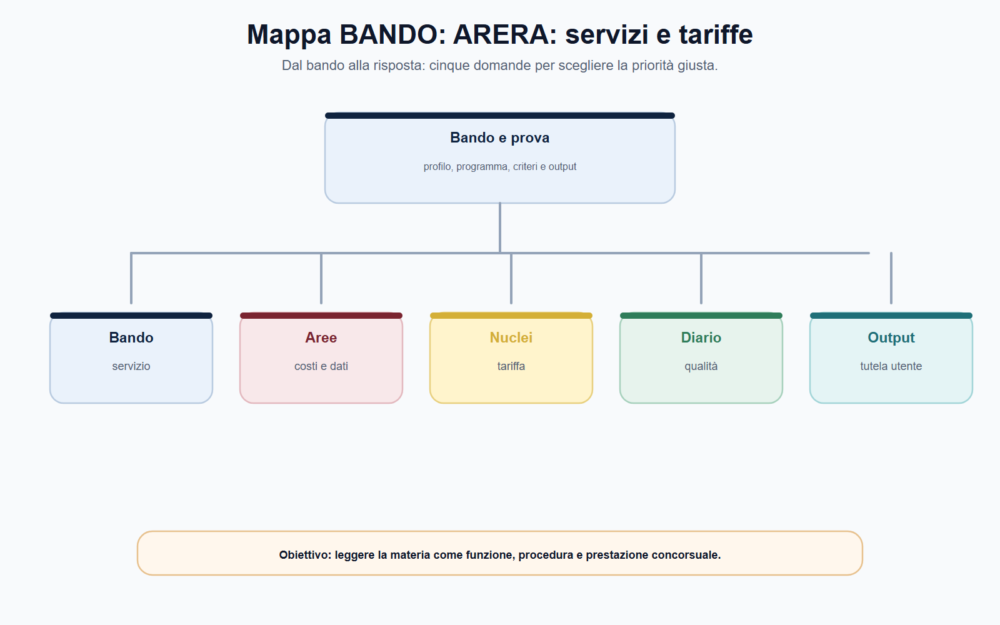
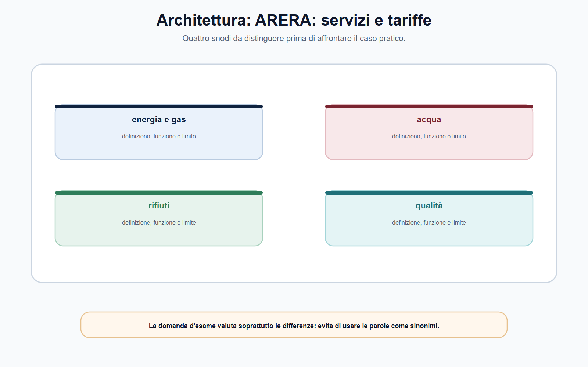
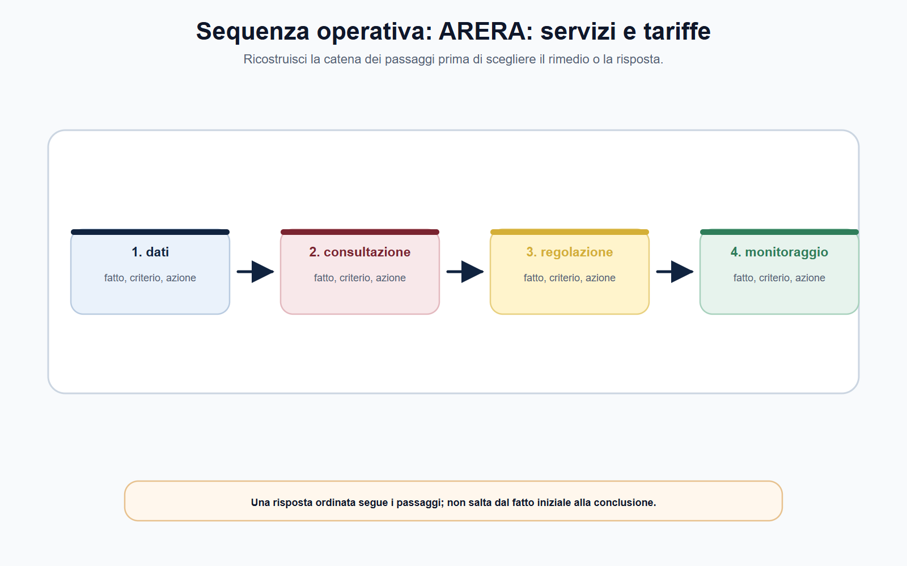
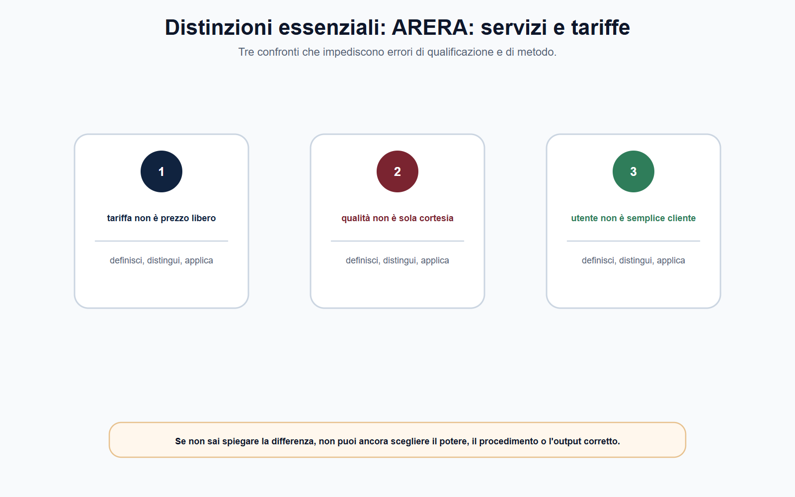
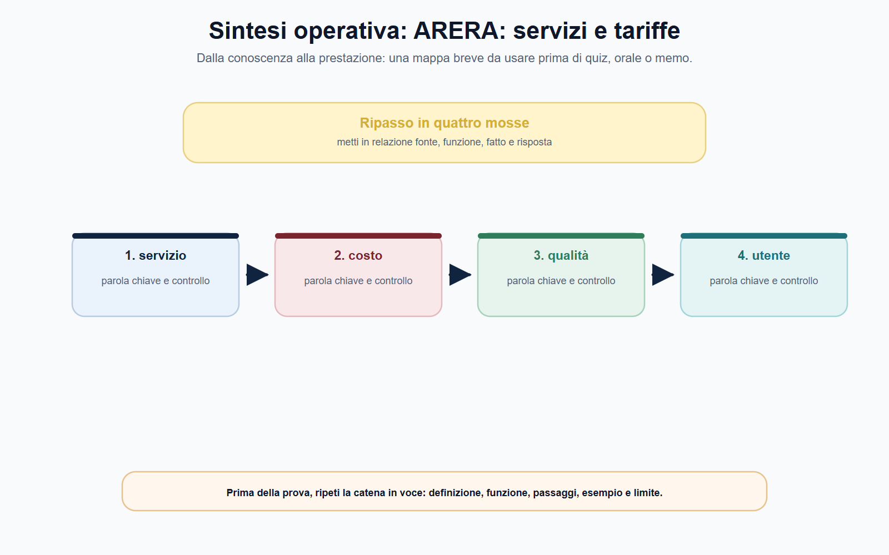

# ARERA: energia, gas, acqua, rifiuti e tariffe

## Scheda di lavoro

**Obiettivo.** Leggere l'azione regolatoria ARERA come collegamento tra servizio, utenti, costi, qualità, investimenti, dati e tutela, senza ridurre la materia alla sola bolletta.

**Domanda guida.** Quale servizio è regolato, quale problema deve essere affrontato e con quali dati, criteri tariffari, standard di qualità e strumenti di tutela l'Autorità può orientare il comportamento dei gestori?

**Output operativo.** Mappa servizio–problema–strumento, analisi tariffaria, nota su qualità e dati, caso guidato e risposta orale.

> **Regola di metodo.** Non confondere la tariffa con un prezzo deciso liberamente né con il costo dichiarato dal gestore. Individua prima il servizio, il perimetro regolatorio, il testo vigente, i dati e gli obiettivi di qualità; soltanto dopo valuta la componente economica.

## Testo editoriale

### Apertura editoriale

ARERA opera in settori nei quali il cittadino incontra ogni giorno una prestazione essenziale: energia elettrica, gas, servizio idrico, rifiuti urbani e altri servizi ricompresi nel suo perimetro normativo. Proprio perché l'utente vede soprattutto la fattura, è frequente un equivoco: immaginare che l'Autorità abbia il solo compito di «decidere le tariffe». La tariffa è invece un punto di arrivo di una regolazione più ampia, che riguarda qualità, continuità, investimenti, trasparenza, informazione, dati, efficienza, vigilanza e tutela.

La legge n. 481/1995 costituisce il quadro istitutivo delle autorità di regolazione dei servizi di pubblica utilità. Nel settore dei rifiuti urbani, la legge n. 205/2017 ha attribuito all'ARERA funzioni di regolazione e controllo secondo i principi e i poteri richiamati dalla legge n. 481/1995. La pluralità dei settori non cancella le differenze tra le filiere: acqua, energia e rifiuti hanno assetti istituzionali, infrastrutture, gestioni e discipline specifiche. Il buon funzionario riconosce il disegno comune, ma non esporta automaticamente una regola da un comparto all'altro.

In un concorso, il candidato deve dimostrare di saper ricostruire una catena: servizio e utenti interessati; problema regolatorio; dati disponibili; opzioni; regola tariffaria o di qualità; attuazione; monitoraggio; eventuale correzione. È la stessa logica del ciclo regolatorio, applicata ai servizi di pubblica utilità.

### Obiettivo operativo del capitolo

Al termine del capitolo il lettore deve saper:

1. individuare il perimetro di una domanda regolatoria nei settori energia, gas, acqua e rifiuti;
2. spiegare perché tariffa, qualità, investimenti e tutela dell'utente devono essere letti insieme;
3. distinguere metodo tariffario, applicazione territoriale e fattura dell'utente;
4. comprendere la funzione di dati, contabilità regolatoria e separazione contabile;
5. impostare un caso senza inventare formule, periodi, standard o competenze non verificati.

*Figura 9.1 — Schema di ripasso: usa la mappa per collegare regola, funzione e output di prova.*

### Il perimetro ARERA: servizi, utenti e regolazione multilivello

La regolazione di un servizio di pubblica utilità non elimina la pluralità delle istituzioni coinvolte. Il legislatore definisce l'assetto generale; ARERA adotta, nei limiti delle proprie attribuzioni, regolazioni e provvedimenti; gestori e operatori applicano le regole; enti territoriali, enti di governo d'ambito, amministrazioni competenti e soggetti di controllo esercitano le funzioni loro assegnate. Il cittadino, infine, è utente del servizio e titolare di posizioni di tutela che devono essere rese conoscibili e concretamente azionabili.

Nel servizio idrico, per esempio, la regolazione tariffaria è collegata a qualità contrattuale e tecnica, investimenti, validazione dei dati e specificità territoriali. Nel ciclo dei rifiuti urbani, il quadro ARERA si innesta su un'organizzazione territoriale articolata, su pianificazione, affidamenti e documenti economico-finanziari che non sono riducibili a un'unica decisione nazionale. Nei settori energetici occorre a loro volta distinguere attività, rete, vendita, clienti finali, qualità e assetti di mercato.

La domanda corretta non è quindi «di chi è la tariffa?», ma: **quale norma attribuisce il potere; quale servizio o componente è regolato; quale soggetto predispone, applica o controlla il dato; quale decisione deve essere assunta e con quale procedimento?**. Questa sequenza previene sia l'accentramento immaginario di tutte le funzioni in ARERA sia il contrario errore di considerare l'Autorità irrilevante perché sono presenti enti locali o gestori.

| Livello del problema | Domanda da porre | Esempio di output |
| --- | --- | --- |
| Servizio | Quale filiera, attività e utente sono coinvolti? | Perimetro della prestazione regolata |
| Fonte | Quale legge, testo integrato o deliberazione è applicabile? | Nota sulle fonti vigenti |
| Dati | Quali costi, volumi, investimenti e indicatori sono rilevanti? | Checklist istruttoria |
| Qualità | Quale risultato deve essere garantito all'utente o al sistema? | Standard e sistema di rilevazione |
| Tariffa | Quale criterio collega costi efficienti, investimenti e tutela? | Schema delle componenti da verificare |
| Attuazione | Chi applica la misura e come si controlla l'effetto? | Piano di monitoraggio |

*Figura 9.2 — Schema di ripasso: usa la mappa per collegare regola, funzione e output di prova.*

### Tariffe: un criterio regolatorio, non un numero isolato

La tariffa svolge molte funzioni contemporaneamente. Deve contribuire alla sostenibilità del servizio; può riconoscere costi pertinenti e investimenti; può incentivare efficienza e qualità; deve essere comprensibile e applicata secondo regole trasparenti; deve inoltre evitare che l'utente sostenga costi non giustificati dal perimetro e dalla disciplina. È una costruzione regolatoria, non la semplice somma dei costi esposti in bilancio né un prezzo fissato per intuizione politica.

Per leggere una decisione tariffaria, il candidato può utilizzare cinque domande:

1. **Quale servizio è incluso?** Senza perimetro non è possibile confrontare costi o prestazioni.
2. **Quali dati sono utilizzati?** I dati devono indicare periodo, fonte, quantità, classificazione e verifiche svolte.
3. **Quali costi sono pertinenti e con quale criterio?** Il costo dichiarato dal gestore non coincide automaticamente con il costo riconosciuto dalla regolazione.
4. **Come entrano qualità e investimenti?** Un'impostazione che guardi solo al costo immediato può produrre disincentivi alla manutenzione, all'affidabilità o allo sviluppo.
5. **Come si controlla l'applicazione?** Servono raccolta dati, confronti, verifiche e, se necessari, correzioni secondo l'atto vigente.

Il Metodo Tariffario Rifiuti MTR-3 costituisce un esempio utile, non una formula da memorizzare fuori contesto: per il terzo periodo regolatorio 2026-2029 definisce il quadro per le entrate tariffarie e per le tariffe di accesso agli impianti di trattamento. L'esempio insegna che il regolatore può costruire una relazione tra costi, investimenti, accesso agli impianti e trasparenza; non autorizza a trasferire formule o periodi a servizi diversi senza controllare l'atto vigente. La stessa prudenza vale per la regolazione idrica, aggiornata nel tempo attraverso provvedimenti e raccolte istruttorie proprie.

| Elemento | Funzione regolatoria | Errore da evitare |
| --- | --- | --- |
| Costo | Rappresenta una base informativa da qualificare | Ritenerlo automaticamente riconoscibile |
| Investimento | Collega servizio presente e capacità futura | Trattarlo come beneficio certo senza verifica |
| Qualità | Misura risultati per utenti e sistema | Ridurla alla sola rapidità di risposta |
| Tariffa | Trasforma criteri in corrispettivi secondo la fonte | Confonderla con l'intera bolletta o con una tassa |
| Dato | Rende controllabile la decisione | Usarlo senza periodo, perimetro o validazione |

L'uso di espressioni come *price cap*, recupero dei costi o regolazione incentivante deve restare disciplinato. Sono strumenti concettuali utili per capire che una variazione economica può essere associata a obiettivi di efficienza e qualità; coefficienti, periodi, basi di calcolo e deroghe dipendono dal testo integrato e dal provvedimento applicabile. Nella prova scritta è preferibile dichiarare questo limite piuttosto che inserire un numero non aggiornato.

*Figura 9.3 — Schema di ripasso: usa la mappa per collegare regola, funzione e output di prova.*

### Qualità contrattuale, qualità tecnica e tutela dell'utente

La regolazione di qualità impedisce che l'efficienza economica sia ottenuta comprimendo il livello del servizio. La **qualità contrattuale** riguarda la relazione con l'utente: accessibilità, tempi e modalità delle prestazioni, informazioni, reclami, fatturazione o altre prestazioni individuate dalla disciplina. La **qualità tecnica** riguarda invece gli esiti operativi e infrastrutturali: continuità, sicurezza, affidabilità, perdite o altri parametri propri della filiera. Le categorie si intrecciano nell'esperienza dell'utente, ma devono essere tenute distinte nell'istruttoria.

Nel settore idrico, le fonti ARERA mostrano un disegno che combina livelli e obiettivi di qualità contrattuale, indicatori, registrazione e verifica dei dati; la regolazione tecnica considera le condizioni specifiche dei diversi contesti. Il dato metodologico è più importante del singolo standard: definire una prestazione, misurarla in modo uniforme, rendere il gestore responsabile del dato, verificare gli scostamenti e collegare, nei casi previsti, conseguenze o incentivi alla performance.

Gli indennizzi automatici rappresentano, nei regimi che li prevedono, un collegamento concreto tra standard e utente. Non sono un risarcimento integrale di ogni danno e non vanno supposti per qualsiasi disservizio; operano alle condizioni, per le prestazioni e nelle misure indicate dalla disciplina vigente. Questa distinzione consente al candidato di evitare una risposta assoluta: può spiegare la funzione dell'indennizzo senza inventarne importo, presupposti o settore di applicazione.

La tutela dell'utente comprende anche informazione, reclami, segnalazioni e conciliazione. Lo Sportello per il consumatore Energia e Ambiente, gestito per conto dell'Autorità da Acquirente Unico, offre informazione e assistenza nei settori indicati dalla fonte. Il Servizio Conciliazione aiuta le parti a trovare un accordo con l'intervento di un conciliatore: non emette una pronuncia né liquida un danno come un giudice. Il tentativo di conciliazione, la sua obbligatorietà e gli strumenti alternativi devono essere verificati nel singolo settore; per i rifiuti urbani, ad esempio, la disciplina conosce un assetto specifico.

*Figura 9.4 — Schema di ripasso: usa la mappa per collegare regola, funzione e output di prova.*

### Dati, unbundling e contabilità regolatoria

Nessuna regolazione tariffaria o di qualità può reggere senza dati comparabili. Per questo ARERA utilizza raccolte, sistemi informativi, verifiche e regole di separazione contabile. La **separazione contabile** o *unbundling* permette, nei casi previsti, di distinguere attività, servizi, costi, ricavi e transazioni che non sarebbero leggibili in una rappresentazione aggregata. Può così rendere più controllabile il rapporto tra informazioni contabili e determinazioni tariffarie.

Il Testo Integrato Unbundling Contabile (TIUC), i conti annuali separati e i manuali applicativi sono esempi di questa architettura. La pagina ARERA sulla separazione contabile e riconciliazione richiama, tra l'altro, la coerenza tra movimentazioni delle immobilizzazioni e dati utilizzati ai fini tariffari. Non è un dettaglio meramente tecnico: se il costo o l'investimento entra nella valutazione regolatoria, deve essere possibile ricostruirne l'origine, il perimetro e il trattamento applicato.

| Controllo | Domanda operativa |
| --- | --- |
| Perimetro | L'attività o il servizio è incluso nella raccolta e nella regola applicabile? |
| Attribuzione | Costi e ricavi sono assegnati o ripartiti secondo criteri dichiarati? |
| Riconciliazione | I dati sono coerenti con le fonti contabili e con le raccolte previste? |
| Qualità del dato | Periodo, unità, fonti e limiti sono esplicitati? |
| Uso regolatorio | Il dato sostiene una decisione consentita o segnala solo un approfondimento? |

La contabilità regolatoria non decide da sola la tariffa e non dimostra automaticamente una violazione. È una base di conoscenza per il regolatore, da leggere insieme a qualità, investimenti, efficienza e prescrizioni del settore. Il Capitolo 7 illustra il metodo generale; qui il candidato deve riconoscere che ARERA lo declina mediante testi integrati, raccolte e atti non trasferibili automaticamente ad altre Authority.

### Consultazione e decisione regolatoria applicata

La consultazione rende più solida una regolazione quando consente di acquisire dati, criticità, proposte e conseguenze applicative da utenti, gestori, enti e altri interessati. Non è un voto sulla delibera né una delega della decisione. L'Autorità resta responsabile di selezionare le evidenze, confrontare opzioni, spiegare il criterio adottato e pubblicare l'atto nei modi previsti.

Nei settori tariffari, una buona consultazione deve rendere intellegibili almeno problema, perimetro, dati, opzioni, effetti su utenti e operatori, tempi di applicazione e modalità di monitoraggio. Il percorso che ha condotto all'MTR-3 mostra una sequenza di avvio, documenti di consultazione e metodo; le evoluzioni recenti del settore idrico evidenziano il collegamento tra aggiornamenti tariffari, qualità e validazione delle informazioni. L'insegnamento non è memorizzare i numeri delle delibere, ma descrivere il ciclo regolatorio senza confondere consultazione, decisione e controllo successivo.

*Figura 9.5 — Schema di ripasso: usa la mappa per collegare regola, funzione e output di prova.*

### Mappa BANDO

Le voci «ARERA», «tariffe», «qualità del servizio», «servizio idrico», «rifiuti», «unbundling» e «tutela dell'utente» richiedono una risposta che colleghi economia e amministrazione.

| Voce del bando | Nucleo da padroneggiare | Output da allenare |
| --- | --- | --- |
| Competenze ARERA | Servizi regolati, fonti e regolazione multilivello | Mappa soggetti–poteri–atti |
| Tariffe | Costi pertinenti, investimenti, qualità, dati e controlli | Nota tariffaria senza formule non verificate |
| Qualità | Distinzione contrattuale/tecnica e indicatori | Tabella standard–dato–effetto |
| Rifiuti e idrico | Specificità territoriale e quadro regolatorio | Caso su PEF/servizio/utente |
| Dati e unbundling | Separazione, conti, riconciliazione e uso dei dati | Checklist contabile-regolatoria |
| Tutela utenti | Reclamo, segnalazione, Sportello e conciliazione | Percorso di tutela da verificare |

> **Da sapere in cinque righe.** ARERA regola servizi di pubblica utilità attraverso strumenti che comprendono tariffe, qualità, dati, vigilanza e tutela degli utenti. La tariffa non coincide con il costo dichiarato dal gestore: dipende dal servizio, dai criteri vigenti, dai dati, dagli investimenti e dagli obiettivi di qualità. Qualità contrattuale e tecnica sono distinte ma complementari. Unbundling e conti annuali separati rendono i dati più leggibili ai fini regolatori, senza sostituire la decisione dell'Autorità. Reclami e conciliazione sono strumenti di tutela diversi dal giudizio e vanno verificati nel settore interessato.

### Caso guidato: piano economico-finanziario e qualità del servizio rifiuti

Un ente territoriale riceve dal gestore del servizio rifiuti un piano economico-finanziario che prevede un aumento delle entrate tariffarie. Il gestore giustifica la richiesta con maggiori costi di raccolta e con un programma di investimenti; le associazioni degli utenti segnalano, però, disservizi nella raccolta e informazioni poco chiare sulle modifiche del servizio. Un candidato afferma che ARERA deve approvare direttamente ogni singola tariffa comunale e che, se i costi aumentano, l'incremento è inevitabile.

La risposta è incompleta. Occorre prima individuare il quadro normativo e regolatorio vigente, il ruolo dell'ente territorialmente competente, il perimetro del servizio, i dati utilizzati nel piano e i criteri di riconoscimento applicabili. Bisogna poi verificare se i costi siano pertinenti, documentati e coerenti con le informazioni richieste; se gli investimenti siano descritti e collegati a risultati misurabili; se gli indicatori di qualità e gli obblighi informativi siano rispettati; quale atto e quale soggetto assumano le determinazioni nel procedimento previsto.

L'aumento del costo dichiarato non chiude l'analisi, così come il disservizio non dimostra da solo l'illegittimità di ogni componente tariffaria. La nota istruttoria deve collegare **dati → criterio → qualità → decisione → monitoraggio**. Se emergono criticità verso utenti, occorre anche indicare il canale di reclamo, segnalazione o tutela applicabile, senza confondere l'intervento regolatorio con il risarcimento individuale.

Il caso mostra il valore della regolazione multilivello: ARERA definisce il quadro e gli strumenti di propria competenza; gli attori territoriali e i gestori operano nei rispettivi ruoli; la decisione deve restare tracciabile, motivata e verificabile.

### Domanda da commissario

**Illustri il ruolo di ARERA nella regolazione tariffaria e nella tutela della qualità dei servizi pubblici regolati.**

### Risposta orale modello

«ARERA esercita funzioni di regolazione nei servizi di pubblica utilità entro il quadro della legge n. 481/1995 e delle attribuzioni settoriali, comprendendo energia, gas, servizio idrico e rifiuti urbani secondo le rispettive fonti. La tariffa non è un numero isolato: la regolazione collega perimetro del servizio, costi pertinenti, investimenti, qualità, dati e controlli, evitando sia il recupero automatico di ogni costo sia la compressione della qualità. Occorre distinguere qualità contrattuale, riferita al rapporto con l'utente, e qualità tecnica, riferita agli esiti del servizio. Raccolte dati, conti annuali separati e unbundling rendono le informazioni più confrontabili ai fini regolatori. La tutela dell'utente comprende informazione, reclami, segnalazioni e conciliazione, ma il relativo percorso e gli eventuali indennizzi dipendono dalla disciplina vigente del settore.»

### Domanda-trappola

**La tariffa regolata coincide sempre con il costo esposto dal gestore nel proprio bilancio?**

No. Il bilancio e le informazioni del gestore sono una base conoscitiva; la tariffa dipende da perimetro del servizio, criteri di riconoscimento, dati verificati, investimenti, qualità e atto regolatorio applicabile. La contabilità regolatoria rende l'analisi più controllabile, ma non sostituisce il giudizio previsto dalla fonte.

### Errore tipico

**Errore:** «ARERA decide direttamente ogni componente della bolletta o della tariffa locale.»

**Correzione:** la regolazione opera in un sistema di fonti e competenze multilivello. Occorre distinguere metodo e criteri dell'Autorità, applicazione nel settore e nel territorio, ruolo di gestori ed enti competenti e contenuto dell'atto effettivamente adottato.

### Mini-esercizio di consolidamento

Leggi l'affermazione: «Il costo del servizio è aumentato del 12%, quindi la tariffa deve aumentare del 12%». Trasformala in una nota istruttoria corretta.

| Verifica | Appunto da predisporre |
| --- | --- |
| Perimetro | Quale attività, utenti e periodo rappresenta il costo indicato? |
| Dati | Fonte, classificazione, volumi, evidenze e controlli svolti |
| Criterio | Quale disciplina vigente regola il riconoscimento del costo? |
| Qualità | Quali livelli e indicatori sono associati al servizio? |
| Investimenti | Sono distinti dai costi di esercizio e collegati a risultati? |
| Decisione | Quale soggetto e quale atto definiscono la determinazione applicabile? |
| Monitoraggio | Come si controlleranno effetti su utenti, servizio e gestore? |

L'esercizio è svolto correttamente se l'aumento dichiarato resta un dato da qualificare, non una conclusione tariffaria automatica. Il metodo evita risposte semplicistiche e rende la decisione difendibile nella sua motivazione.

### Riferimenti consolidati

[[sources/arera-energia-gas-acqua-rifiuti-tariffe-2026-07-24]], [[sources/economia-industriale-econometria-contabilita-regolatoria-authority-2026-07-24]], [[sources/ciclo-regolatorio-consultazione-air-vir-authority-2026-07-24]], [[entities/arera]], [[topics/arera-energia-gas-acqua-rifiuti-tariffe]].

### Note di review editoriale

Prima della chiusura del volume, verificare per ciascun settore: testo integrato e periodo regolatorio vigenti, metodo tariffario applicabile, eventuali aggiornamenti o riforme dei corrispettivi, standard di qualità, raccolte dati, disciplina dell'unbundling, bonus e strumenti di tutela, ruolo degli enti territoriali e procedure di conciliazione. Non riportare coefficienti, componenti di prezzo, soglie, tempi o indennizzi senza la fonte ARERA vigente e pertinente al servizio trattato.
