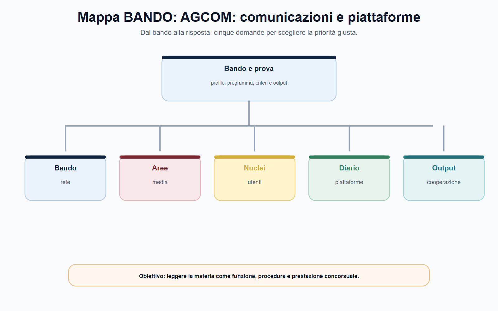
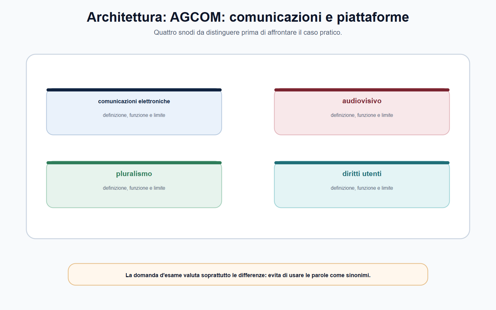
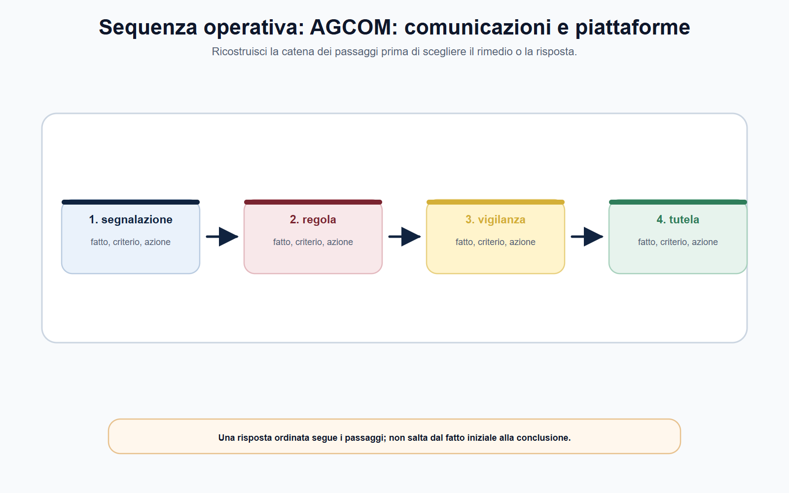
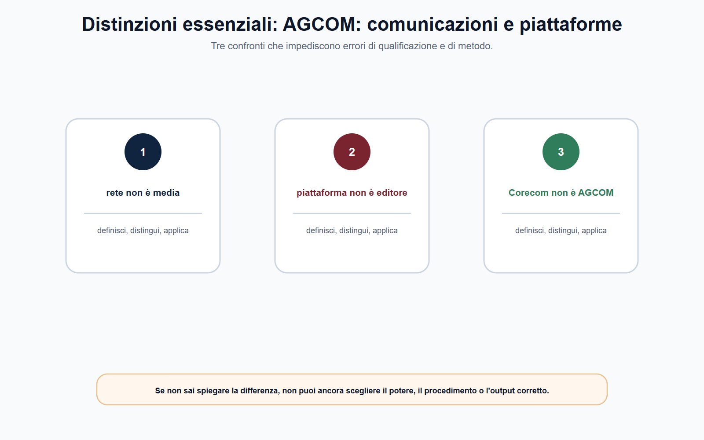
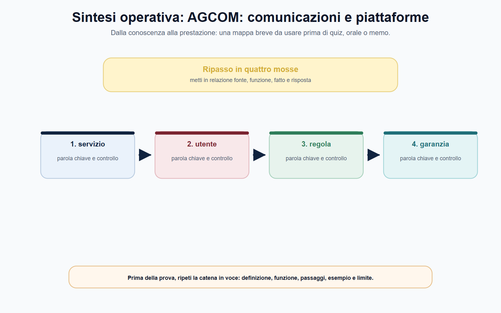

# AGCOM: comunicazioni, media, utenti e piattaforme

## N-MF05-10-01 · Quadro e criterio di lettura

**Obiettivo.** Collegare comunicazioni elettroniche, media, tutela degli utenti e piattaforme alla fonte e al procedimento effettivamente applicabili, evitando l'idea di un potere digitale indistinto.

**Domanda guida.** Il caso riguarda una rete o un servizio di comunicazione, un contenuto o fornitore media, un rapporto tra utente e operatore, oppure un obbligo europeo della piattaforma?

**Output operativo.** Griglia di qualificazione, caso piattaforma, percorso utente-operatore, schema di memo e risposta orale.

> **Regola di metodo.** Nel digitale non partire dal nome dell'app o della piattaforma. Parti dal servizio, dal fatto contestato, dall'utente interessato e dalla fonte; solo così individui il potere di AGCOM, di un Corecom, della Commissione europea o di altra autorità.

### Apertura editoriale

AGCOM è un'Autorità di regolazione che opera in un ecosistema nel quale reti, contenuti, mercati, diritti degli utenti e piattaforme si incontrano continuamente. Proprio questa vicinanza genera sovrapposizioni apparenti: un problema di connessione può avere rilievo contrattuale e regolatorio; un contenuto audiovisivo può coinvolgere tutela dei minori e pluralismo; una decisione di moderazione di una piattaforma può richiedere l'applicazione del DSA; una violazione del diritto d'autore online segue un percorso diverso ancora.

Il candidato non deve ricavare da ciò che AGCOM sia competente su «tutto ciò che accade online». L'Autorità esercita attività regolatorie, di vigilanza, controllo, ispezione e sanzione nei limiti delle attribuzioni normative. La risposta professionale non somma le etichette, ma ricostruisce l'oggetto: rete, servizio, contratto, contenuto, operatore, piattaforma, utente e fonte applicabile.

La legge n. 249/1997 è la fonte istitutiva; il Codice delle comunicazioni elettroniche, il Testo unico dei servizi di media audiovisivi, le norme europee e i regolamenti dell'Autorità completano un quadro stratificato. Studiare AGCOM significa quindi imparare un metodo di ripartizione delle competenze, non memorizzare un elenco statico di delibere.

### Obiettivo operativo del capitolo

Al termine del capitolo il lettore deve saper:

1. distinguere reti e servizi di comunicazioni elettroniche, media audiovisivi e servizi digitali;
2. ricostruire la tutela degli utenti e il ruolo dei Corecom nelle funzioni delegate;
3. spiegare l'assetto multilivello del DSA e il ruolo di AGCOM quale Digital Services Coordinator italiano;
4. non confondere DSA, diritto d'autore online, privacy, concorrenza e rimedi contrattuali;
5. impostare un caso digitale attraverso fatti, fonte, autorità, procedimento e possibile esito.

*Figura 10.1 — La tavola orienta la lettura di comunicazioni elettroniche e separa il perimetro dalle eccezioni.*

### Comunicazioni elettroniche, media e piattaforme: tre domande diverse

Le **comunicazioni elettroniche** riguardano reti, accesso, interconnessione, servizi e mercati connessi alla trasmissione di segnali e alla fruizione dei servizi. In questo spazio AGCOM può regolare, vigilare e risolvere le controversie nei limiti del Codice e dei propri regolamenti. Il problema tipico può riguardare condizioni di accesso, interconnessione, qualità, numerazione, trasparenza o diritti dell'utente: non è automaticamente un problema di contenuto.

I **media audiovisivi e radiofonici** richiedono invece di considerare il pluralismo, la tutela dei minori, i diritti fondamentali, le regole della comunicazione politica e gli obblighi previsti dal TUSMA. Il contenuto e il fornitore media diventano qui centrali. Anche quando il servizio è fruito online, non si può saltare dalla parola «video» alla disciplina del DSA o, al contrario, applicare il TUSMA a ogni post di una piattaforma.

Le **piattaforme online** sono soggette a una pluralità di fonti. Il DSA introduce obblighi sui servizi intermediari, tra cui trasparenza della moderazione, meccanismi di segnalazione e reclamo, pubblicità, sistemi di raccomandazione e, per alcuni soggetti, gestione dei rischi sistemici. Il DMA riguarda invece regole concorrenziali ex ante per determinati gatekeeper e non attribuisce a AGCOM una competenza generale su ogni profilo della concorrenza digitale. La prima operazione è dunque qualificare il servizio e il fatto, non scegliere l'acronimo più noto.

## N-MF05-10-02 · Istituti e distinzioni

| Oggetto del caso | Prima domanda | Fonte o percorso da verificare |
| --- | --- | --- |
| Disservizio di telefonia o accesso internet | Quale diritto contrattuale o regolatorio dell'utente è coinvolto? | Codice, regolamento utenti-operatori, Conciliaweb/Corecom |
| Accesso o interconnessione tra imprese | Quali obblighi di rete o mercato sono in discussione? | Codice comunicazioni e regolamenti AGCOM |
| Programma audiovisivo | Quale obbligo media, pluralismo o tutela è rilevante? | TUSMA e disciplina di settore |
| Moderazione su piattaforma | Quale obbligo DSA è contestato e chi è competente? | DSA, DSC, Commissione e cooperazione |
| Opera digitale illecitamente diffusa | Rientra nella procedura di diritto d'autore online? | Fonti sul diritto d'autore e regolamento AGCOM |

*Figura 10.2 — La tavola mette a confronto media e pluralismo e tutela degli utenti senza sovrapporli.*

### Utenti, controversie e Corecom

La tutela dell'utente non consiste soltanto nella possibilità di inviare una lamentela. Richiede un percorso riconoscibile: contratto o servizio interessato, disservizio o violazione, reclamo all'operatore quando previsto, canale di conciliazione, eventuale definizione della controversia e rimedi giudiziari che restano distinti. AGCOM disciplina la soluzione delle controversie tra utenti e operatori di comunicazioni elettroniche; i Corecom svolgono, a livello regionale e su delega, importanti funzioni per avvicinare l'esercizio di tali tutele al territorio.

Il tentativo di conciliazione ha funzione extragiudiziale: cerca una soluzione amichevole con l'intervento di un soggetto terzo. Non è una sentenza e non equivale automaticamente a un risarcimento integrale. Quando la conciliazione non riesce, l'utente può seguire le procedure di definizione previste oppure rivolgersi alla giustizia ordinaria nei casi e nei modi consentiti. AGCOM segnala inoltre la possibilità di provvedimenti temporanei a tutela della continuità del servizio o contro forme di abuso, nel perimetro del regolamento applicabile.

I **Corecom** non sono semplici sportelli regionali privi di funzione. Sono organi funzionali dell'Autorità per le competenze delegate e operano secondo convenzioni, linee guida e regole che mirano all'uniformità. Oltre alle controversie, possono svolgere altre funzioni stabilite dalla delega, quali attività nel settore radiotelevisivo locale, rettifica, vigilanza e Registro degli operatori di comunicazione. In un caso concreto occorre verificare quale funzione sia effettivamente delegata al Corecom interessato.

| Passaggio | Controllo necessario |
| --- | --- |
| Qualificazione | Il problema riguarda utente-operatore, operatori tra loro o contenuto? |
| Reclamo | È previsto o utile il previo reclamo e quali prove vanno conservate? |
| Conciliazione | Quale organismo e quale procedura sono applicabili? |
| Definizione | Ricorrono presupposti, termini e competenza per la procedura successiva? |
| Giudizio | Quale tutela resta davanti al giudice competente? |

*Figura 10.3 — La tavola ricostruisce il passaggio dai fatti alla competenza e alla decisione.*

### Piattaforme e DSA: una governance cooperativa

Il DSA non trasferisce ogni potere sulle piattaforme a un solo soggetto nazionale. Costruisce una governance europea e nazionale: la Commissione europea esercita competenze esclusive sulle piattaforme online e sui motori di ricerca di dimensioni molto grandi per gli obblighi supplementari loro imposti; il Digital Services Coordinator vigila e coordina a livello nazionale; il Comitato europeo per i servizi digitali sostiene applicazione coerente e cooperazione. AGCOM svolge il ruolo di DSC per l'Italia.

Il candidato deve ricordare soprattutto tre conseguenze. Primo: gli obblighi DSA non sono una generica richiesta di «censura dei contenuti», ma comprendono trasparenza, procedure, segnalazioni, reclami, pubblicità, tracciabilità e, nei casi previsti, rischi sistemici. Secondo: una segnalazione di contenuto non determina automaticamente la rimozione; il DSA disciplina meccanismi e garanzie, inclusi sistemi interni di reclamo e risoluzione extragiudiziale. Terzo: AGCOM deve cooperare con Commissione, altri DSC e autorità nazionali competenti; il caso può quindi richiedere un coordinamento, non una decisione isolata.

AGCOM ha adottato procedure, tra l'altro, per certificare organismi di risoluzione extragiudiziale e riconoscere segnalatori attendibili nei presupposti del DSA. Il segnalatore attendibile non è un'autorità che ordina la rimozione: è un soggetto riconosciuto per capacità, competenza, indipendenza e diligenza, le cui segnalazioni devono ricevere il trattamento prioritario previsto dal regolamento. Anche qui la parola corretta evita l'errore di attribuire a un privato il potere decisorio dell'Autorità o della piattaforma.

## N-MF05-10-03 · Poteri, procedura e conseguenze

*Figura 10.4 — La tavola evidenzia le distinzioni da controllare prima di rispondere.*

### Contenuti, pluralismo e diritto d'autore online

Pluralismo, tutela dei minori, diritti fondamentali, comunicazione politica e correttezza della programmazione sono temi propri del settore media e devono essere ricondotti al TUSMA e alle ulteriori fonti applicabili. L'uso di un mezzo digitale non sostituisce questa verifica. In sede concorsuale, è corretto descrivere AGCOM come autorità che svolge regolazione, vigilanza e, nei casi previsti, attività sanzionatoria nel settore audiovisivo; è improprio assegnarle una competenza illimitata su ogni informazione diffusa in rete.

Il diritto d'autore online segue un'altra base. AGCOM è autorità amministrativa competente nel perimetro definito dalle fonti sul diritto d'autore, sul commercio elettronico e sul regolamento in materia di tutela del diritto d'autore sulle reti di comunicazione elettronica. Il procedimento può riguardare violazioni online e prevede forme e garanzie proprie. Non va confuso con la disciplina del DSA: contenuto illegale, diritto d'autore, moderazione della piattaforma e tutela della privacy possono sovrapporsi sul piano dei fatti, ma ciascuno richiede la propria norma, autorità e procedura.

*Figura 10.5 — La tavola chiude il percorso collegando DSA a DMA e piattaforme.*

### DMA, DSA e competenze che non coincidono

Il DSA disciplina responsabilità e obblighi dei servizi intermediari, con un sistema di vigilanza che coinvolge Commissione europea e coordinatori nazionali dei servizi digitali. Il DMA segue una logica diversa: individua obblighi e divieti per i gatekeeper designati, con un ruolo centrale della Commissione europea nell'enforcement. AGCOM può essere coinvolta nelle funzioni nazionali attribuite e nella cooperazione, ma non diventa per questo l'autorità che applica indistintamente ogni regola europea alle piattaforme. In una prova scritta la prima frase deve quindi qualificare atto, soggetto e condotta: moderazione di contenuti, contendibilità del mercato e controversia dell'utente sono problemi diversi.

Un'impresa segnala che una piattaforma combina dati provenienti da servizi differenti e limita l'interoperabilità. Prima di concludere che vi sia una violazione del DMA, occorre verificare se l'impresa interessata sia un gatekeeper designato, quale servizio di piattaforma di base sia coinvolto e quale obbligo specifico venga in rilievo. Se invece un utente contesta la rimozione di un contenuto, il problema può riguardare motivazione, sistemi interni di reclamo e obblighi DSA. Se la controversia nasce da fatturazione e connettività, il percorso nazionale di tutela nelle comunicazioni elettroniche resta distinto.

### Memo breve in inglese

Una prova può chiedere di sintetizzare il caso in inglese senza trasformarlo in un esercizio letterario. Una struttura affidabile è: **Issue – Rule – Assessment – Next step**. Esempio: *Issue: a business user alleges that a designated platform restricts access to data generated through its service. Rule: the applicable duties depend on the platform's designation, the relevant core platform service and the specific DMA obligation. Assessment: the available facts are insufficient to establish a breach; the authority should identify the service, preserve the evidence and verify the competent enforcement channel. Next step: request the contract, technical logs and the platform's statement, then refer or cooperate with the competent authority where required.*

Il memo funziona perché non inventa la competenza né anticipa l'accertamento. Usa verbi controllati — *alleges, may apply, verify, request, assess* — e separa fatti, regola e attività istruttoria. Lo stesso metodo migliora la risposta italiana: riduce formule enfatiche, espone ciò che manca e rende verificabile il passaggio dalla segnalazione alla decisione.
### Mappa BANDO

| Voce del bando | Nucleo da padroneggiare | Output da allenare |
| --- | --- | --- |
| Comunicazioni elettroniche | Reti, servizi, mercati, accesso e utenti | Mappa servizio–obbligo–autorità |
| Media | TUSMA, pluralismo, minori e regole di contenuto | Qualificazione di un caso audiovisivo |
| Utenti e Corecom | Reclamo, conciliazione, definizione e tutele | Percorso utente-operatore |
| Piattaforme | DSA, Commissione, DSC e cooperazione | Memo «fatto–obbligo–competenza» |
| Diritto d'autore online | Fonte speciale e procedimento dedicato | Distinzione DSA–DDA–privacy |

> **Da sapere in cinque righe.** AGCOM opera su comunicazioni elettroniche, media, utenti e piattaforme con poteri che dipendono dalla fonte e dal servizio. I Corecom esercitano funzioni delegate, in particolare nella tutela territoriale e nelle controversie utenti-operatori. La conciliazione è una tutela extragiudiziale e non una sentenza. Nel DSA AGCOM è il DSC italiano, ma la Commissione mantiene competenze esclusive sulle VLOP e VLOSE per gli obblighi supplementari. DSA, TUSMA, diritto d'autore, privacy e concorrenza possono interagire ma non sono sinonimi.

## N-MF05-10-04 · Applicazione alla prova

### Caso guidato: sospensione di un account e doppia fatturazione

Un utente segnala che una piattaforma ha sospeso il suo account senza una motivazione comprensibile; nello stesso periodo, il suo operatore di accesso a internet gli addebita due fatture dopo il passaggio a un nuovo contratto. L'utente chiede al Corecom di ordinare alla piattaforma il ripristino dell'account e di ottenere il risarcimento completo dei danni.

Il caso contiene due piani. La doppia fatturazione e il passaggio di operatore richiedono di verificare contratto, reclamo, normativa sulle comunicazioni elettroniche e percorso di conciliazione o definizione applicabile. Il Corecom può essere coinvolto nell'ambito delle funzioni delegate e della procedura prevista. La sospensione dell'account, invece, va prima qualificata: occorre capire se si tratta di un servizio intermediario e quale obbligo DSA o altra fonte sia concretamente invocato. Per una presunta violazione DSA, il destinatario del servizio può presentare reclamo al DSC secondo l'articolo 53 e le modalità indicate; ciò non equivale automaticamente a un ordine immediato di ripristino.

Il candidato deve inoltre evitare di promettere un risarcimento integrale nel procedimento amministrativo. La tutela extragiudiziale, la definizione e l'eventuale azione giudiziaria hanno funzioni diverse. La risposta corretta separa i fatti, identifica due fonti e due canali possibili, raccoglie documenti e non attribuisce al Corecom competenze DSA non previste.

### Domanda da commissario

**Illustri le competenze di AGCOM in materia di comunicazioni, tutela degli utenti e piattaforme online.**

### Risposta orale modello

«AGCOM esercita attività di regolazione, vigilanza, controllo e sanzione nei settori delle comunicazioni elettroniche, dei media e delle piattaforme nei limiti delle fonti attributive. Nelle comunicazioni elettroniche tutela reti, mercati e utenti; per le controversie utenti-operatori è previsto un percorso che comprende reclamo, conciliazione e, se del caso, definizione, anche tramite Corecom nelle funzioni delegate. Nel settore media rilevano, tra l'altro, pluralismo, minori e TUSMA. Nel DSA AGCOM è il Coordinatore dei servizi digitali per l'Italia e coopera con Commissione, altri DSC e autorità nazionali; la Commissione ha competenze esclusive sulle VLOP e VLOSE per gli obblighi supplementari. Un caso digitale deve quindi essere qualificato per servizio, fatto e fonte, senza sovrapporre DSA, diritto d'autore, privacy e tutela contrattuale.»

### Domanda-trappola

**Ogni reclamo contro una piattaforma online deve essere presentato al Corecom?**

No. Il Corecom opera nelle funzioni delegate, soprattutto nel sistema delle controversie utenti-operatori di comunicazioni elettroniche. Per una presunta violazione del DSA occorre verificare il canale previsto dal regolamento e il ruolo di AGCOM quale DSC; per diritto d'autore, privacy o concorrenza valgono ancora fonti e autorità diverse.

### Errore tipico

**Errore:** «Il DSA impone ad AGCOM di decidere direttamente ogni rimozione di contenuto.»

**Correzione:** il DSA stabilisce obblighi, procedure e una governance cooperativa. Segnalazioni, decisioni delle piattaforme, reclami, organismi ADR, DSC e Commissione hanno ruoli distinti; la competenza va ricostruita dal tipo di servizio e dall'obbligo contestato.

### Mini-esercizio di consolidamento

Per ciascun fatto, indica la prima verifica senza scegliere subito il rimedio.

| Fatto | Prima verifica |
| --- | --- |
| Operatore non risponde a un reclamo su cessazione della linea | Contratto, reclamo, regolamento utenti-operatori e canale Corecom/Conciliaweb |
| Emittente locale diffonde un contenuto che potrebbe violare obblighi di programmazione | TUSMA, soggetto interessato e funzione di vigilanza competente |
| Piattaforma non spiega una decisione di moderazione | Tipo di servizio, obbligo DSA e canale di reclamo applicabile |
| Sito diffonde senza autorizzazione un'opera audiovisiva | Perimetro della procedura sul diritto d'autore online e prove dell'istanza |

L'esercizio è corretto se la prima risposta è sempre una fonte e un perimetro, non una sanzione presunta.

### Laboratorio di qualificazione

Per allenare comunicazioni elettroniche, parti da un fascicolo minimo: una richiesta, due documenti non perfettamente coerenti e una fonte che attribuisce il potere. Scrivi in colonne separate i fatti provati, le allegazioni e gli elementi ancora da acquisire. Poi confronta media e pluralismo con tutela degli utenti: annota soggetto, presupposto, funzione ed effetto di ciascun istituto. Il confronto impedisce di scegliere la soluzione soltanto perché una parola della traccia ricorda una definizione studiata.

## N-MF05-10-05 · Consolidamento e verifica

Passa quindi a Corecom. Indica chi avvia l'attività, quali garanzie devono essere rispettate e quale atto può chiuderla. Se la fonte lascia un margine di valutazione, rendi espliciti i criteri: gravità, durata, diffusione, rischio, collaborazione e proporzionalità, secondo il settore applicabile. Collega DSA al documento che ne permette la verifica e tratta DMA e piattaforme come una conclusione da motivare, non come un'etichetta. La scheda è completa quando un secondo lettore può ricostruire il percorso senza conoscere l'intenzione di chi l'ha compilata.

### Controllo incrociato

Rileggi ora il risultato da tre prospettive. Come candidato, verifica di avere definito comunicazioni elettroniche senza dilungarti su nozioni estranee. Come istruttore, controlla che la distinzione fra media e pluralismo e tutela degli utenti poggi su documenti e non su supposizioni. Come decisore, chiediti se il passaggio dedicato a Corecom giustifichi davvero l'esito proposto. Se una prospettiva non trova risposta, riapri l'analisi nel punto preciso invece di aggiungere una conclusione generica.

Completa il controllo con una riga dedicata alle alternative. Spiega quale diversa qualificazione sarebbe possibile se cambiasse un fatto decisivo, quale fonte farebbe mutare il perimetro di DSA e quale conseguenza produrrebbe su DMA e piattaforme. L'esercizio allena a riconoscere le opzioni quasi corrette: nei concorsi l'errore più insidioso non è sempre una regola falsa, ma una regola vera applicata al soggetto, al tempo o al procedimento sbagliato. La risposta finale deve perciò contenere anche il proprio limite di validità.

### ▣ Verifica ragionata

**Quesito 1.** Qual è il primo controllo quando la traccia richiama comunicazioni elettroniche?

**Risposta corretta:** individuare il fatto rilevante, la fonte e il perimetro della competenza prima di scegliere l'istituto. La parola usata nella traccia può orientare, ma non dimostra da sola quale autorità o quale potere siano applicabili. Una risposta efficace espone il criterio e poi lo applica ai dati disponibili.

**Quesito 2.** media e pluralismo e tutela degli utenti possono essere trattati come espressioni equivalenti?

**Risposta corretta:** no. Devono essere distinti per funzione, presupposti, soggetti ed effetti. Dopo la distinzione si può spiegare il loro coordinamento. Nei quiz, l'opzione errata spesso contiene una definizione plausibile ma trasferisce a un istituto la funzione dell'altro.

**Quesito 3.** Un dato tratto da un bando storico o da una pagina operativa vale per ogni procedura successiva?

**Risposta corretta:** no. Il dato è utile come esempio datato; requisiti, termini, soglie, composizione delle prove e modalità di ricorso devono essere ricontrollati nella fonte vigente e nel bando applicabile. La regola stabile va separata dal dato mobile.

**Quesito 4.** Come va usato Corecom nel caso proposto?

**Risposta corretta:** va collegato a fatti, competenza, sequenza procedurale e conseguenza. Limitarsi a una definizione non dimostra capacità applicativa; anticipare l'esito senza istruttoria produce invece una conclusione non sostenuta. La motivazione deve rendere visibile il passaggio compiuto.

**Quesito 5.** La finalità generale di tutela attribuisce automaticamente qualsiasi potere in materia di DSA?

**Risposta corretta:** no. Ogni potere richiede una fonte attributiva, un oggetto e un procedimento. La missione istituzionale aiuta a interpretare il sistema, ma non sostituisce la verifica della competenza concreta né consente di confondere vigilanza, rimedio individuale e sanzione.

**Quesito 6.** Quale controllo conclusivo riduce gli errori su DMA e piattaforme?

**Risposta corretta:** confrontare la conclusione con la domanda, la fonte e i fatti effettivamente disponibili. Se manca un elemento, la risposta deve indicare quale documento o accertamento serve. Dichiarare il limite informativo è più professionale che colmarlo con un automatismo.

### Caso ragionato di chiusura

Un ufficio riceve una segnalazione che usa formule generiche, richiama comunicazioni elettroniche e chiede un intervento immediato su DMA e piattaforme. Il fascicolo contiene una schermata, una comunicazione non datata e il riferimento a un bando precedente. La soluzione non consiste nello scegliere subito una sanzione. Occorre qualificare il fatto, verificare autenticità e data dei documenti, individuare la fonte vigente, distinguere media e pluralismo da tutela degli utenti e stabilire quale amministrazione possa acquisire gli elementi mancanti. Solo allora si valuta Corecom, si collega DSA al potere pertinente e si motiva il passo successivo. Il caso è risolto correttamente quando la conclusione resta proporzionata alle prove e separa la regola stabile dai dati da aggiornare.
