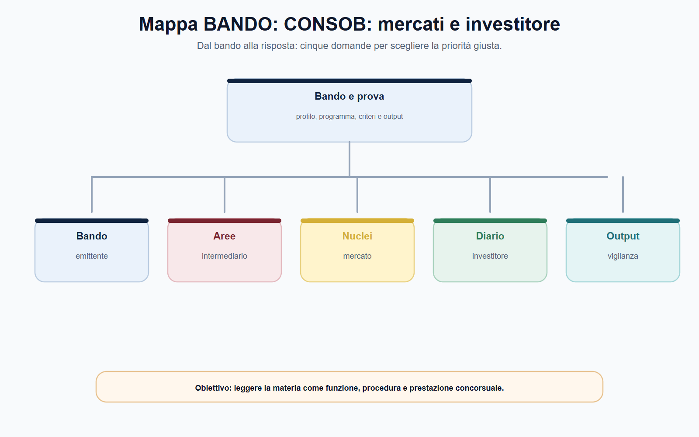
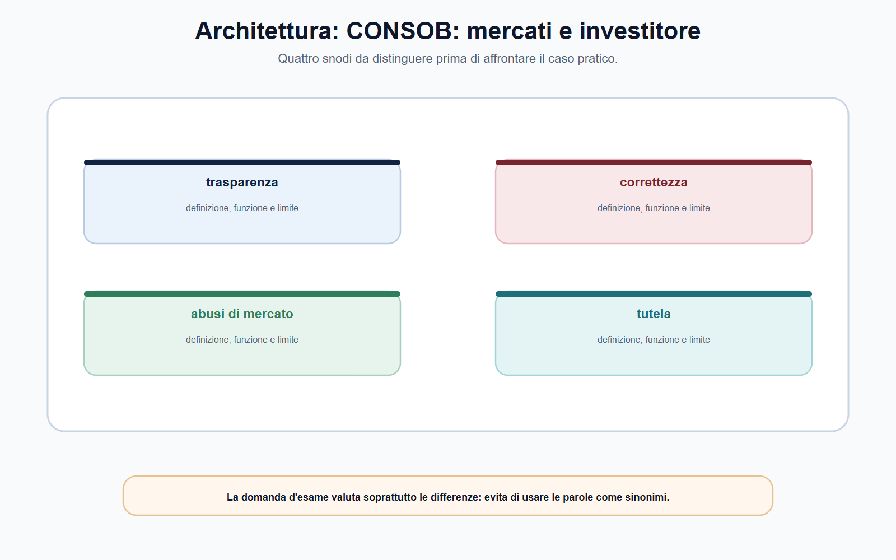
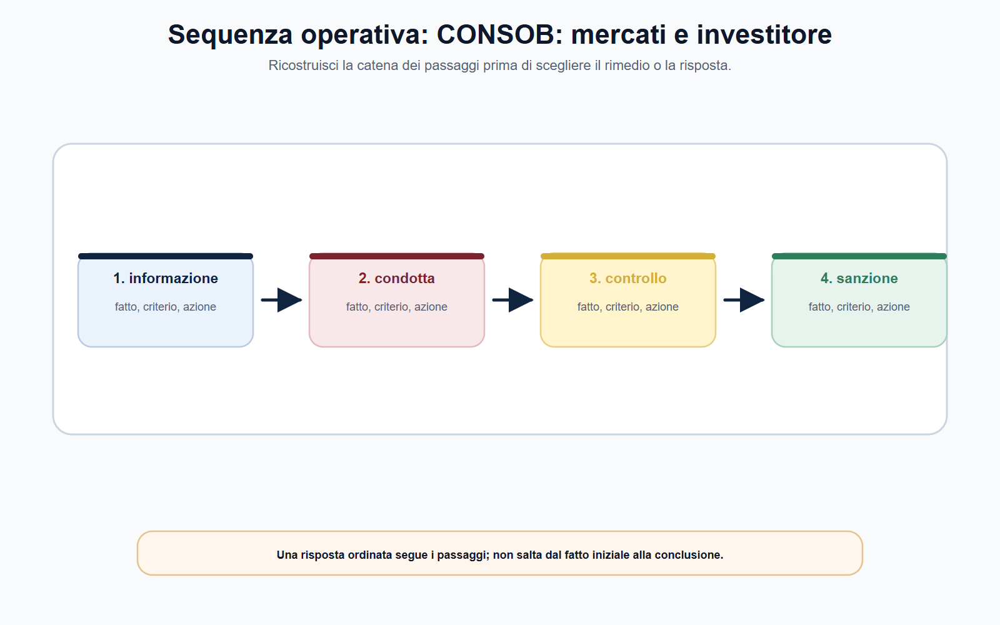
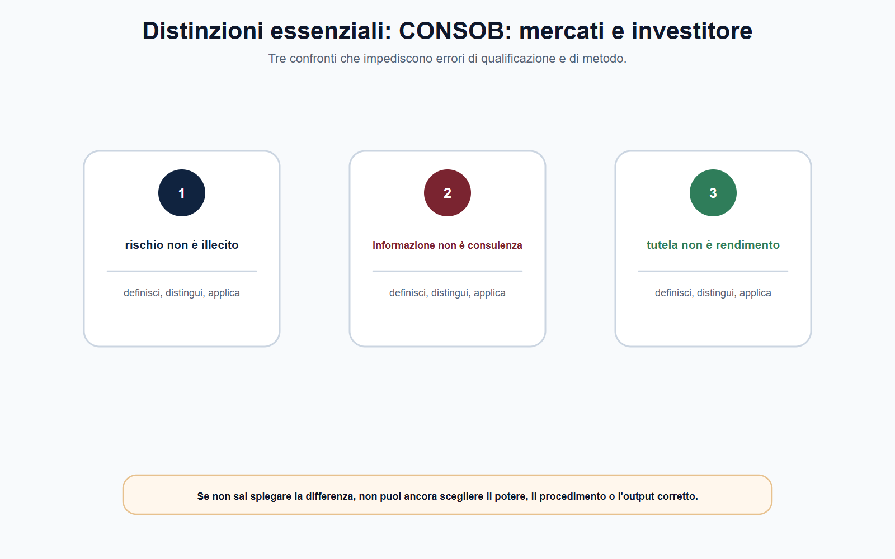
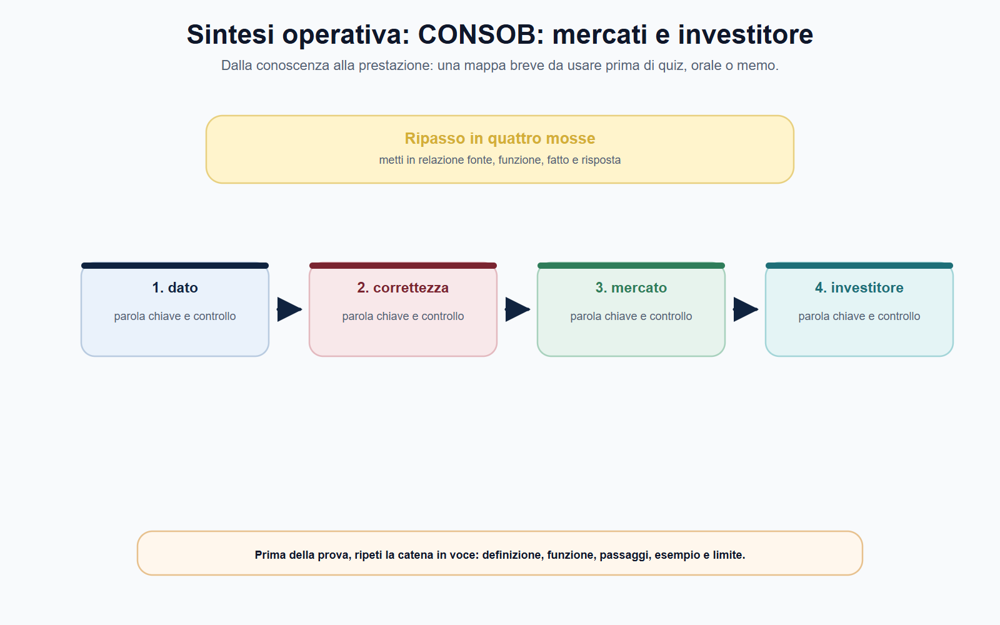

# CONSOB: mercati, intermediari e tutela dell'investitore

## N-MF05-11-01 · Quadro e criterio di lettura

**Obiettivo.** Comprendere come CONSOB presidi trasparenza, correttezza e integrità dei mercati, distinguendo emittenti, intermediari, sedi di negoziazione e tutela individuale dell'investitore.

**Domanda guida.** Il problema riguarda l'informazione dell'emittente, la condotta dell'intermediario, il funzionamento del mercato o un possibile abuso? Quale autorità e quale procedura sono realmente competenti?

**Output operativo.** Mappa soggetti–obblighi, caso di market abuse, nota sull'investitore retail e risposta orale.

> **Regola di metodo.** Non dedurre un illecito dalla perdita subita dall'investitore. Ricostruisci prodotto, servizio, informazione disponibile, comportamento dell'intermediario o dell'emittente, mercato coinvolto e fonte applicabile.

### Apertura editoriale

La vigilanza CONSOB si colloca nel punto in cui il risparmio incontra il mercato. La tutela dell'investitore non promette che ogni investimento sia redditizio o privo di rischio; mira a rendere il processo informativo e negoziale trasparente, corretto e vigilato, così da consentire decisioni consapevoli e da preservare l'integrità del mercato. Per questo la Commissione vigila su soggetti e fenomeni diversi: emittenti, intermediari, sedi di negoziazione, offerte, informazione societaria e abusi di mercato.

Il candidato deve evitare una semplificazione frequente: «CONSOB tutela il risparmiatore, Banca d'Italia tutela le banche». La realtà è più articolata. Consob e Banca d'Italia operano in aree talvolta distinte, talvolta coordinate, secondo riparti fissati da fonti nazionali ed europee. La vigilanza prudenziale riguarda, in sintesi, solidità, rischi e sana gestione; la vigilanza su mercato e condotta riguarda trasparenza, correttezza, informazioni, ordinato svolgimento delle negoziazioni e tutela degli investitori. Il caso concreto richiede sempre la fonte che distribuisce i poteri.

### Obiettivo operativo del capitolo

Al termine del capitolo il lettore deve saper:

1. distinguere emittente, intermediario, investitore e sede di negoziazione;
2. spiegare la funzione di trasparenza, correttezza e integrità del mercato;
3. distinguere le regole di condotta nei servizi di investimento dalla disciplina degli abusi di mercato;
4. impostare il riparto di competenze con Banca d'Italia senza formule assolute;
5. riconoscere il ruolo dell'ACF come tutela stragiudiziale nel suo perimetro.

*Figura 11.1 — La tavola orienta la lettura di emittenti e separa il perimetro dalle eccezioni.*

### Quattro soggetti, quattro domande

Un caso finanziario diventa leggibile se si separano i soggetti. L'**emittente** diffonde informazioni e può rivolgersi al mercato per raccogliere risorse; l'**intermediario** presta servizi o attività di investimento e deve operare secondo le regole applicabili; la **sede di negoziazione** organizza lo scambio secondo un quadro regolato; l'**investitore** compie scelte assumendo il rischio economico dell'operazione. CONSOB vigila attraverso strumenti differenziati proprio perché le obbligazioni non sono le stesse.

| Soggetto | Domanda essenziale | Rischio da evitare |
| --- | --- | --- |
| Emittente | Le informazioni rilevanti sono complete, corrette e tempestive nei casi previsti? | Confondere informazione al mercato con consiglio personalizzato |
| Intermediario | Il servizio è prestato con diligenza, correttezza, trasparenza e nel rispetto delle regole applicabili? | Considerare la vendita sempre lecita perché il cliente ha firmato |
| Sede di negoziazione | Le negoziazioni sono trasparenti e ordinate? | Trattare il mercato come semplice luogo tecnico privo di regole |
| Investitore | Quale prodotto, obiettivo, conoscenza e rischio rilevano nel caso? | Trasformare la perdita in prova automatica di illecito |

La vigilanza sui mercati persegue trasparenza, ordinato svolgimento delle negoziazioni e tutela degli investitori. Questo non significa che CONSOB sostituisca il giudizio economico dell'investitore; significa che il mercato deve funzionare secondo regole che contrastano opacità, informazione distorta, condotte scorrette e abusi. Una decisione ben motivata collega sempre potere, fatto, prova e interesse protetto.

*Figura 11.2 — La tavola mette a confronto intermediari e mercati senza sovrapporli.*

### Intermediari e tutela dell'investitore: correttezza non significa rendimento garantito

## N-MF05-11-02 · Istituti e distinzioni

MiFID II e MiFIR costituiscono, insieme alla disciplina nazionale di attuazione, un riferimento essenziale per la prestazione dei servizi di investimento. In termini di metodo, il candidato deve ricordare che le regole di condotta servono a ridurre asimmetrie informative e conflitti di interesse, a rendere comprensibili caratteristiche e rischi, e a collegare il servizio alla situazione dell'investitore secondo le verifiche previste. Non è necessario recitare ogni categoria o ogni modulo: è necessario sapere che appropriatezza, adeguatezza, informazione, costi, incentivi e gestione dei conflitti assumono rilievo soltanto nel perimetro del servizio e della regola concreta.

La firma di un documento non dimostra da sola che l'investitore sia stato informato in modo effettivo, né un risultato negativo dimostra da solo che l'intermediario abbia violato i propri obblighi. L'istruttoria deve confrontare contratto, prodotto, comunicazioni, profilatura o valutazioni previste, informazioni sui rischi e sui costi, ordini, tempi e comportamento del soggetto vigilato. La domanda operativa è: **quale obbligo era applicabile, quale prova ne documenta l'adempimento e quale pregiudizio o rischio ha generato l'eventuale violazione?**

La tutela dell'investitore è collegata, ma non identica, alla tutela bancaria della clientela esercitata dalla Banca d'Italia. Quest'ultima vigila, secondo le fonti applicabili, su trasparenza e correttezza nei rapporti bancari e finanziari e sulla stabilità degli intermediari; Consob presidia il mercato mobiliare, l'informazione, i servizi di investimento e i comportamenti rilevanti per investitori e mercati. Il confine non può essere risolto con una frase generica: prodotto, intermediario e servizio determinano il riparto.

*Figura 11.3 — La tavola ricostruisce il passaggio dai fatti alla competenza e alla decisione.*

### Mercati integri: MAR e abusi di mercato

Il Regolamento (UE) n. 596/2014, MAR, costruisce un quadro europeo per l'integrità dei mercati. Gli abusi di mercato includono, in termini generali, l'uso abusivo di informazioni privilegiate, la comunicazione illecita di tali informazioni e la manipolazione del mercato. La funzione della disciplina non è punire una scelta di investimento sbagliata: è impedire che alcuni soggetti sfruttino informazioni o pratiche capaci di falsare la parità informativa e la formazione dei prezzi.

L'**informazione privilegiata** non coincide con ogni notizia riservata. Occorre verificare i requisiti previsti dalla fonte, il collegamento con strumenti o emittenti interessati, la precisione e la potenziale incidenza sul prezzo nel senso richiesto dalla disciplina. Solo dopo può porsi la questione dell'uso, della comunicazione o degli obblighi di gestione e diffusione dell'informazione. La **manipolazione del mercato** richiede a sua volta un'analisi delle operazioni, degli ordini, delle informazioni o delle condotte che possano inviare segnali falsi o fuorvianti o alterare artificialmente il funzionamento del mercato, secondo le fattispecie applicabili.

| Ipotesi | Domanda istruttoria | Prova da preservare |
| --- | --- | --- |
| Informazione privilegiata | La notizia soddisfa i requisiti MAR ed era disponibile al soggetto? | Flussi informativi, date, ruoli, comunicazioni e operazioni |
| Uso o comunicazione illecita | È stata utilizzata o divulgata fuori dai casi consentiti? | Tracce temporali, ordini, messaggi e procedure interne |
| Manipolazione | Operazioni o informazioni hanno prodotto segnali falsi o artificiosi? | Dati di mercato, ordini, controparti, comunicazioni e contesto |

Il linguaggio prudente è decisivo: non basta dire «il prezzo è salito, quindi c'è manipolazione». Prezzo, volume o volatilità sono segnali da esaminare con dati, contesto, operatività e fattispecie. ESMA richiama che il MAR mira a integrità dei mercati e fiducia degli investitori: la conclusione sanzionatoria richiede quindi un procedimento e una prova proporzionati alla gravità della contestazione.

*Figura 11.4 — La tavola evidenzia le distinzioni da controllare prima di rispondere.*

### Poteri, cooperazione e tutela stragiudiziale

## N-MF05-11-03 · Poteri, procedura e conseguenze

CONSOB dispone di poteri di regolazione secondaria, controllo, richiesta di informazioni, ispezione, intervento e sanzione nei limiti della legge e dei regolamenti applicabili. Come per ogni Authority, potere e garanzie procedimentali restano inseparabili: base legale, contestazione, acquisizione delle prove, partecipazione e difesa, valutazione, motivazione e controllo dell'atto. Anche gli impegni, quando previsti dalla disciplina, sono strumenti specifici e non un'alternativa disponibile liberamente in ogni caso.

La dimensione europea richiede cooperazione con ESMA e con le altre autorità competenti. Le fonti UE armonizzano parti rilevanti del mercato finanziario, ma l'applicazione può prevedere competenze nazionali, cooperazione e riparti funzionali. Il MiCAR offre un esempio attuale: il documento Banca d'Italia–Consob distingue, per le cripto-attività, competenze prudenziali e di gestione delle crisi da competenze CONSOB su trasparenza, correttezza, ordinato svolgimento delle negoziazioni, tutela e abusi di mercato nei rispettivi perimetri.

L'**Arbitro per le controversie finanziarie (ACF)** è uno strumento di risoluzione stragiudiziale delle controversie tra investitori retail e intermediari, per violazioni degli obblighi di diligenza, correttezza, informazione e trasparenza nella prestazione di servizi di investimento o gestione collettiva del risparmio. Non è una sezione sanzionatoria CONSOB e non tratta automaticamente ogni controversia finanziaria. Nel caso pratico, occorre verificarne soggetto, materia, ammissibilità e rapporto con la tutela giudiziaria.

*Figura 11.5 — La tavola chiude il percorso collegando MAR a MiCAR e ACF.*

### MiCAR e riparto nazionale delle competenze

Il regolamento MiCAR è integralmente applicabile dal 30 dicembre 2024, dopo l'avvio anticipato del regime per asset-referenced token ed e-money token. Il d.lgs. n. 129/2024 individua Banca d'Italia e CONSOB come autorità nazionali competenti, secondo un riparto che dipende da soggetto, attività e tipo di cripto-attività. La Banca d'Italia presidia in particolare profili prudenziali e di gestione delle crisi; CONSOB presidia trasparenza, correttezza, ordinato svolgimento delle negoziazioni, tutela dei possessori e abusi di mercato nei rispettivi perimetri. Esistono eccezioni, competenze concorrenti e obblighi di cooperazione: la formula «le cripto-attività spettano alla CONSOB» è quindi inaffidabile.

Per un crypto-asset service provider occorre distinguere autorizzazione o notifica, servizio prestato, natura dell'intermediario e rischio esaminato. Custodia, gestione di una piattaforma, esecuzione di ordini, consulenza e trasferimento sono servizi differenti; la disciplina non si applica perché un prodotto è chiamato commercialmente “token”, ma perché ricorrono le definizioni normative. Anche il product intervention richiede di identificare autorità e presupposti, senza ricavare il potere da una generica finalità di protezione.

### Dalla vigilanza al rimedio dell'investitore

L'Arbitro per le controversie finanziarie tratta, nei limiti di ammissibilità, controversie tra investitori retail e intermediari relative agli obblighi di diligenza, correttezza, informazione e trasparenza. Non è una sezione sanzionatoria della CONSOB e non sostituisce ogni tutela giudiziaria. In un caso di raccomandazione online o di servizio su cripto-attività bisogna separare quattro piani: eventuale abuso di mercato; correttezza dell'intermediario; competenza di vigilanza; rimedio concretamente accessibile al cliente. Una sola condotta può produrre domande diverse, ma ciascuna richiede fonte, fatti e procedimento propri.

La risposta migliore non promette il recupero dell'investimento. Ricostruisce profilatura e informazioni, ordine o raccomandazione, caratteristiche del prodotto, nesso con il danno allegato, reclamo e condizioni dell'ADR. Sul piano pubblico, conserva evidenze e segnala il possibile rischio alla funzione competente; sul piano individuale, indica il rimedio senza confonderlo con l'accertamento sanzionatorio.
### Mappa BANDO

| Voce del bando | Nucleo da padroneggiare | Output da allenare |
| --- | --- | --- |
| Emittenti e mercato | Informazione, trasparenza, negoziazioni e integrità | Mappa soggetto–obbligo–dato |
| Intermediari | Regole di condotta, informazione, conflitti e investitore | Checklist di una raccomandazione/ordine |
| MAR | Informazione privilegiata, comunicazione illecita e manipolazione | Schema fatto–prova–fattispecie |
| Riparto autorità | CONSOB, Banca d'Italia, ESMA e fonti UE | Tabella funzione–autorità–limite |
| Tutela individuale | Reclamo, ACF e giudice nei rispettivi ambiti | Percorso di tutela senza promesse improprie |

## N-MF05-11-04 · Applicazione alla prova

> **Da sapere in cinque righe.** CONSOB tutela investitori, trasparenza, correttezza e buon funzionamento dei mercati attraverso poteri previsti da fonti nazionali ed europee. Emittente, intermediario, mercato e investitore hanno obblighi e posizioni diverse. Le regole MiFID riguardano la prestazione dei servizi di investimento; MAR presidia l'integrità dei mercati contro insider dealing, comunicazione illecita e manipolazione. Una perdita non prova da sola una violazione. Il riparto con Banca d'Italia dipende dal settore e dalla fonte: prudenza e tutela del mercato non sono sinonimi.

### Caso guidato: raccomandazione online e notizia riservata

Un intermediario pubblica una raccomandazione online su un titolo quotato; il giorno successivo il prezzo aumenta sensibilmente. Un dipendente dell'emittente aveva avuto accesso a una notizia non ancora diffusa e aveva acquistato titoli poco prima della pubblicazione. Alcuni investitori che hanno comprato al rialzo chiedono a CONSOB di rimborsare le perdite, sostenendo che ogni raccomandazione online costituisca manipolazione.

Il caso contiene due piani distinti. La raccomandazione va analizzata con riguardo a fonte, autore, contenuto, trasparenza, conflitti e regole applicabili; l'aumento del prezzo non basta a qualificarla come manipolazione. L'operatività del dipendente richiede invece la verifica rigorosa dell'informazione, del ruolo, della disponibilità della notizia, della sequenza temporale e dell'uso eventualmente abusivo secondo MAR. Le prove devono essere raccolte e valutate prima di qualsiasi conclusione.

CONSOB non trasforma automaticamente ogni perdita in rimborso. Gli investitori possono avere strumenti di tutela individuale, inclusi ACF o giudice nel perimetro previsto, ma l'enforcement sull'integrità del mercato e il rimedio del singolo sono piani differenti. La risposta efficace separa **vigilanza sul mercato, condotta dell'intermediario e tutela dell'investitore**.

### Domanda da commissario

**Illustri il ruolo della CONSOB nella tutela dell'investitore e nel contrasto agli abusi di mercato.**

### Risposta orale modello

«CONSOB vigila sui mercati finanziari per la tutela degli investitori, la trasparenza delle informazioni, la correttezza degli operatori e il buon funzionamento del sistema. Occorre distinguere emittenti, intermediari, sedi di negoziazione e investitori: ciascuno è sottoposto a obblighi diversi. Nella prestazione di servizi di investimento, le regole di condotta mirano a informazione, correttezza e gestione dei conflitti nel perimetro MiFID e TUF. Il MAR presidia invece l'integrità del mercato contro abuso di informazioni privilegiate, comunicazione illecita e manipolazione. Una perdita non prova da sola l'illecito: servono fonte, fatto, prove e motivazione. Il riparto con Banca d'Italia va ricostruito caso per caso, distinguendo vigilanza prudenziale da trasparenza, condotta, mercato e tutela dell'investitore.»

### Domanda-trappola

**Se un investimento perde valore, l'intermediario ha certamente violato le regole di condotta?**

No. L'investimento comporta rischio. Occorre verificare quale servizio è stato prestato, quali obblighi erano applicabili, quali informazioni e valutazioni erano dovute e quale prova documenta la condotta dell'intermediario.

### Errore tipico

**Errore:** «Ogni informazione non pubblica è informazione privilegiata e ogni operazione successiva è insider dealing.»

**Correzione:** l'informazione privilegiata deve possedere i requisiti previsti dal MAR; occorre poi verificare soggetto, disponibilità, uso e fattispecie applicabile. Riservatezza generica e successione temporale non bastano.

### Mini-esercizio di consolidamento

Completa la griglia per una segnalazione di investimento ritenuto non corretto.

| Campo | Appunto da raccogliere |
| --- | --- |
| Prodotto e servizio | Strumento finanziario, ordine, consulenza o gestione coinvolti |
| Soggetti | Investitore, intermediario, emittente e sede di negoziazione |
| Fonte | TUF, MiFID/MiFIR, MAR o altra disciplina da verificare |
| Fatti | Comunicazioni, profilo, documenti, ordini, tempi e costi |
| Rischio/violazione | Distinguere perdita economica da possibile violazione |
| Autorità e tutela | CONSOB, Banca d'Italia, ACF, giudice o cooperazione UE da qualificare |

L'esercizio è corretto se non conclude dalla perdita alla sanzione e se separa il profilo individuale da quello di integrità del mercato.

### Prova di trasferimento

Immagina che la stessa questione su emittenti compaia prima in un quiz, poi all'orale e infine in un caso. Nel quiz cerca la distinzione decisiva fra intermediari e mercati; all'orale enuncia criterio, limite ed esempio; nel caso individua fatti, fonte, competenza e passo istruttorio. Il contenuto di base non cambia, ma cambia la forma della prestazione: una risposta lunga non è automaticamente più completa e una risposta breve non può omettere il presupposto.

## N-MF05-11-05 · Consolidamento e verifica

Usa tutela dell'investitore come snodo operativo. Domandati quale documento manca, chi può richiederlo e quale conseguenza sarebbe prematura prima di acquisirlo. Per MAR, controlla se la regola descritta è stabile o dipende da data, bando, elenco o atto applicativo. Chiudi su MiCAR e ACF con una frase condizionata ai fatti realmente accertati. Questa prova di trasferimento serve anche al proofreading concettuale: se una stessa formula produce identica risposta in tre situazioni diverse, probabilmente il testo è troppo generico e va ricondotto al perimetro concreto.

### Controllo incrociato

Rileggi ora il risultato da tre prospettive. Come candidato, verifica di avere definito emittenti senza dilungarti su nozioni estranee. Come istruttore, controlla che la distinzione fra intermediari e mercati poggi su documenti e non su supposizioni. Come decisore, chiediti se il passaggio dedicato a tutela dell'investitore giustifichi davvero l'esito proposto. Se una prospettiva non trova risposta, riapri l'analisi nel punto preciso invece di aggiungere una conclusione generica.

Completa il controllo con una riga dedicata alle alternative. Spiega quale diversa qualificazione sarebbe possibile se cambiasse un fatto decisivo, quale fonte farebbe mutare il perimetro di MAR e quale conseguenza produrrebbe su MiCAR e ACF. L'esercizio allena a riconoscere le opzioni quasi corrette: nei concorsi l'errore più insidioso non è sempre una regola falsa, ma una regola vera applicata al soggetto, al tempo o al procedimento sbagliato. La risposta finale deve perciò contenere anche il proprio limite di validità.

### ▣ Verifica ragionata

**Quesito 1.** Qual è il primo controllo quando la traccia richiama emittenti?

**Risposta corretta:** individuare il fatto rilevante, la fonte e il perimetro della competenza prima di scegliere l'istituto. La parola usata nella traccia può orientare, ma non dimostra da sola quale autorità o quale potere siano applicabili. Una risposta efficace espone il criterio e poi lo applica ai dati disponibili.

**Quesito 2.** intermediari e mercati possono essere trattati come espressioni equivalenti?

**Risposta corretta:** no. Devono essere distinti per funzione, presupposti, soggetti ed effetti. Dopo la distinzione si può spiegare il loro coordinamento. Nei quiz, l'opzione errata spesso contiene una definizione plausibile ma trasferisce a un istituto la funzione dell'altro.

**Quesito 3.** Un dato tratto da un bando storico o da una pagina operativa vale per ogni procedura successiva?

**Risposta corretta:** no. Il dato è utile come esempio datato; requisiti, termini, soglie, composizione delle prove e modalità di ricorso devono essere ricontrollati nella fonte vigente e nel bando applicabile. La regola stabile va separata dal dato mobile.

**Quesito 4.** Come va usato tutela dell'investitore nel caso proposto?

**Risposta corretta:** va collegato a fatti, competenza, sequenza procedurale e conseguenza. Limitarsi a una definizione non dimostra capacità applicativa; anticipare l'esito senza istruttoria produce invece una conclusione non sostenuta. La motivazione deve rendere visibile il passaggio compiuto.

**Quesito 5.** La finalità generale di tutela attribuisce automaticamente qualsiasi potere in materia di MAR?

**Risposta corretta:** no. Ogni potere richiede una fonte attributiva, un oggetto e un procedimento. La missione istituzionale aiuta a interpretare il sistema, ma non sostituisce la verifica della competenza concreta né consente di confondere vigilanza, rimedio individuale e sanzione.

**Quesito 6.** Quale controllo conclusivo riduce gli errori su MiCAR e ACF?

**Risposta corretta:** confrontare la conclusione con la domanda, la fonte e i fatti effettivamente disponibili. Se manca un elemento, la risposta deve indicare quale documento o accertamento serve. Dichiarare il limite informativo è più professionale che colmarlo con un automatismo.

### Caso ragionato di chiusura

Un ufficio riceve una segnalazione che usa formule generiche, richiama emittenti e chiede un intervento immediato su MiCAR e ACF. Il fascicolo contiene una schermata, una comunicazione non datata e il riferimento a un bando precedente. La soluzione non consiste nello scegliere subito una sanzione. Occorre qualificare il fatto, verificare autenticità e data dei documenti, individuare la fonte vigente, distinguere intermediari da mercati e stabilire quale amministrazione possa acquisire gli elementi mancanti. Solo allora si valuta tutela dell'investitore, si collega MAR al potere pertinente e si motiva il passo successivo. Il caso è risolto correttamente quando la conclusione resta proporzionata alle prove e separa la regola stabile dai dati da aggiornare.
