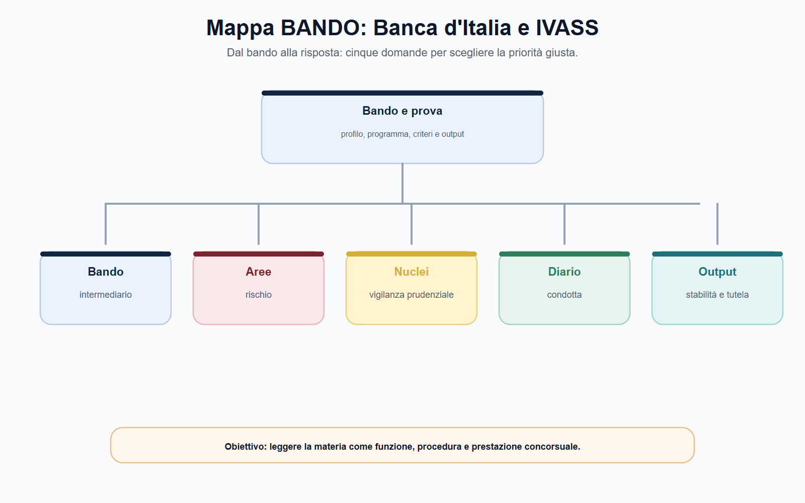
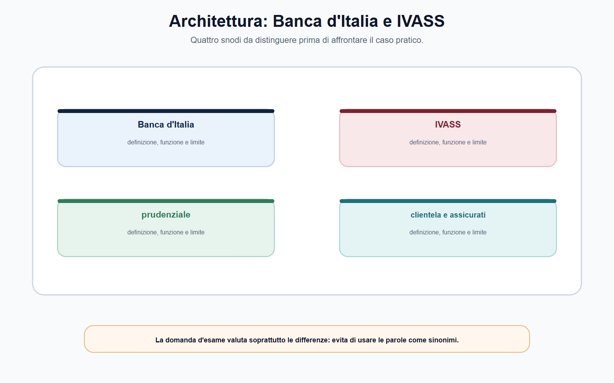
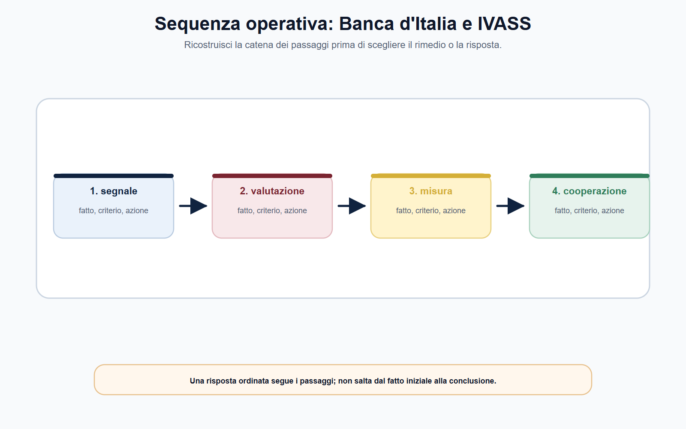
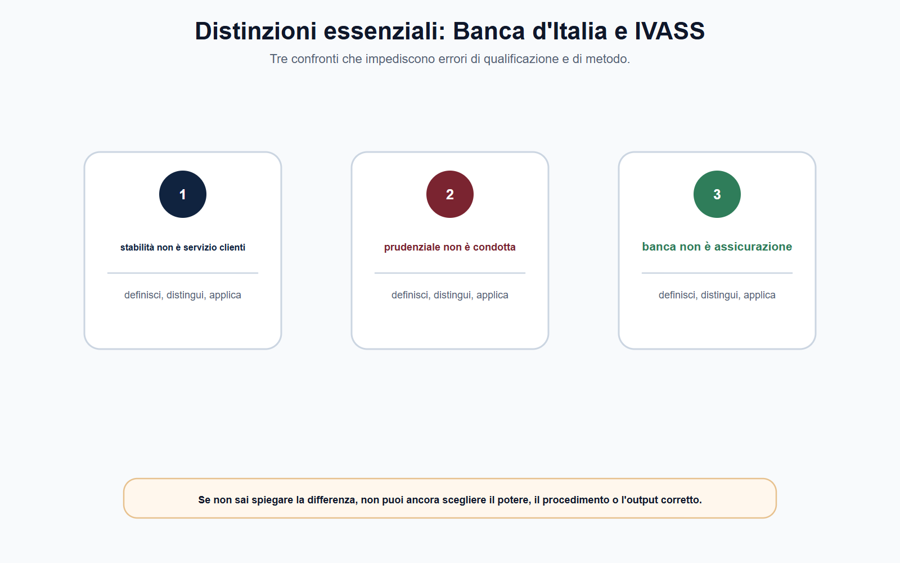
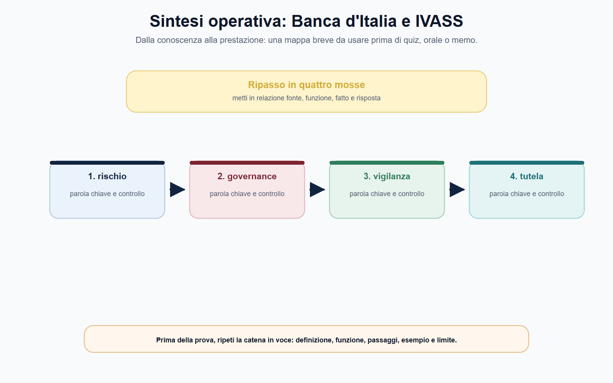

# Banca d'Italia e IVASS: vigilanza prudenziale, bancaria e assicurativa

## Scheda di lavoro

**Obiettivo.** Distinguere la vigilanza prudenziale dalla tutela della clientela e dalla soluzione delle controversie, applicando la distinzione al sistema bancario e a quello assicurativo.

**Domanda guida.** Il fatto segnala un rischio per la solidità dell'intermediario, una violazione di trasparenza o correttezza, oppure una pretesa contrattuale individuale? Quale fonte e quale soggetto sono competenti?

**Output operativo.** Schema Banca d'Italia–IVASS, griglia rischio–potere–prova e caso guidato su una controversia assicurativa.

> **Regola di metodo.** Non usare “vigilanza” come parola-ombrello. Prima individua il settore e il soggetto; poi separa prudenza, condotta, stabilità, rimedio individuale e autorità effettivamente competente.

## Testo editoriale

### Apertura editoriale

Banche e imprese di assicurazione raccolgono risorse, assumono rischi e instaurano rapporti durevoli con una pluralità di clienti. Per questa ragione la loro vigilanza non si limita a reprimere un illecito già verificato: cerca di prevenire fragilità organizzative, patrimoniali e finanziarie che potrebbero compromettere la continuità del servizio, l'affidamento del pubblico e, in ultima analisi, la stabilità del sistema. Banca d'Italia e IVASS presidiano questi interessi con poteri e perimetri diversi, inseriti in un quadro nazionale ed europeo.

Il punto da fissare è però altrettanto importante: la vigilanza prudenziale non è un giudizio sul singolo contratto. La solidità di una banca o di un'assicurazione e la correttezza di una specifica relazione con il cliente sono questioni collegate, ma non coincidenti. Un reclamo può rivelare una criticità sistemica e indurre l'autorità a controlli o interventi; non si trasforma, per ciò solo, in un ordine di pagamento né sostituisce i rimedi contrattuali, stragiudiziali o giurisdizionali previsti dall'ordinamento.

### Obiettivo operativo del capitolo

Al termine del capitolo il lettore deve saper:

1. definire la funzione prudenziale distinguendola da vigilanza di condotta e tutela individuale;
2. descrivere il ruolo della Banca d'Italia nel sistema bancario e finanziario, senza sovrapporlo a quello della BCE o di CONSOB;
3. ricostruire il ruolo di IVASS rispetto a imprese, gruppi, intermediari e assicurati;
4. impostare un caso concreto attraverso fatti, documenti, rischio, fonte, autorità e rimedio;
5. spiegare perché reclami e segnalazioni sono anche dati di vigilanza, senza attribuire loro effetti automatici.

*Figura 12.1 — Schema di ripasso: usa la mappa per collegare regola, funzione e output di prova.*

### Vigilanza prudenziale: la tenuta dell'intermediario

La vigilanza prudenziale verifica se l'intermediario è organizzato e gestito in modo da affrontare i rischi insiti nella sua attività. In una banca assumono rilievo, fra gli altri, i rischi di credito, di liquidità, di mercato e operativi; in un'impresa di assicurazione rilevano la capacità di far fronte agli impegni assunti, la valutazione dei rischi tecnici e finanziari, la qualità della governance e l'affidabilità delle scelte gestionali. Le categorie tecniche non sono formule da elencare meccanicamente: servono a comprendere perché l'autorità richiede dati, valuta assetti, effettua controlli e può intervenire.

La finalità è la **sana e prudente gestione** dell'intermediario e, su scala più ampia, la stabilità e l'efficienza del sistema. La prospettiva **microprudenziale** guarda alla condizione e ai rischi di ciascun soggetto vigilato; quella **macroprudenziale** considera le vulnerabilità che possono propagarsi nel sistema nel suo complesso. Le due prospettive si integrano: la crisi di un operatore rilevante o l'esposizione a uno stesso rischio da parte di molti operatori possono produrre conseguenze che superano il rapporto bilaterale con il cliente.

| Piano di analisi | Domanda essenziale | Errore da evitare |
| --- | --- | --- |
| Prudenziale | L'intermediario dispone di risorse, governo e controlli adeguati ai rischi? | Ridurre la vigilanza al solo patrimonio |
| Condotta | Il cliente ha ricevuto informazioni chiare e un comportamento corretto? | Confondere trasparenza con garanzia di solvibilità |
| Stabilità sistemica | Il rischio può diffondersi o compromettere la fiducia nel sistema? | Studiare ogni intermediario come se fosse isolato |
| Tutela individuale | Quale rimedio spetta per la concreta pretesa contrattuale? | Credere che l'autorità decida sempre il merito della lite |

Questa distinzione non separa compartimenti impermeabili. Un sistema organizzativo debole può generare, oltre a rischi prudenziali, pratiche commerciali scorrette; reclami ripetuti possono segnalare un problema di prodotto, distribuzione, procedure o controlli interni. Tuttavia, in un'analisi corretta, ciascun effetto deve essere ricondotto alla relativa fonte, al potere previsto e al procedimento applicabile.

*Figura 12.2 — Schema di ripasso: usa la mappa per collegare regola, funzione e output di prova.*

### Banca d'Italia: banche, intermediari, stabilità e clientela

La Banca d'Italia esercita funzioni di vigilanza nel settore bancario e finanziario nei limiti stabiliti dalle fonti nazionali ed europee. L'attenzione prudenziale riguarda banche, gruppi e altri intermediari rientranti nei rispettivi perimetri, con l'obiettivo di verificare condizioni di sana e prudente gestione e di concorrere alla stabilità del sistema. La funzione non è soltanto reattiva: analizza informazioni, bilanci, assetti organizzativi, controlli interni, profili di rischio e piani dell'intermediario, ricorrendo quando necessario a verifiche ispettive e ad altri strumenti previsti dalla disciplina.

Nel meccanismo di vigilanza unico europeo, la Banca centrale europea e le autorità nazionali operano secondo compiti ripartiti e coordinati. Per il candidato la regola utile è evitare due scorciatoie opposte: non è corretto dire che la Banca d'Italia sia estranea alla vigilanza bancaria perché esiste la BCE, né che ogni decisione prudenziale sia nazionale. Il soggetto vigilato, la natura dell'atto e la disciplina applicabile consentono di individuare la competenza concreta.

Accanto alla dimensione prudenziale, la Banca d'Italia svolge funzioni di **tutela della clientela** nei rapporti bancari e finanziari, in particolare con riguardo a trasparenza e correttezza, entro il perimetro normativo attribuito. Controlli documentali, ispezioni, analisi di siti e comunicazioni commerciali permettono di verificare se regole e procedure siano effettivamente osservate. Il cliente non è quindi protetto soltanto dalla stabilità dell'intermediario: è protetto anche dalla qualità delle informazioni, dalla comprensibilità delle condizioni e dalla correttezza del rapporto.

| Funzione | Oggetto principale | Quesito operativo |
| --- | --- | --- |
| Vigilanza prudenziale | Rischi, organizzazione, risorse e sana gestione | L'intermediario è in grado di operare in modo solido e controllato? |
| Stabilità finanziaria | Vulnerabilità e possibili propagazioni sistemiche | Il rischio supera la dimensione della singola impresa? |
| Tutela della clientela | Trasparenza e correttezza nei rapporti | Informazioni, condizioni e comportamenti rispettano le regole? |
| Educazione finanziaria | Consapevolezza di cittadini e clienti | Il destinatario comprende strumenti, rischi e tutele disponibili? |

È opportuno ricordare anche il limite della formula generale. Antiriciclaggio, gestione delle crisi, servizi di investimento, pagamenti, cripto-attività e prodotti finanziari possono coinvolgere fonti, autorità e riparti ulteriori. La guida della Banca d'Italia alla vigilanza prudenziale segnala espressamente che tutela della clientela, antiriciclaggio e risoluzione non ne costituiscono una semplice appendice: sono funzioni da qualificare autonomamente. Perciò, la risposta di concorso deve iniziare dal fatto e non dal nome dell'autorità.

*Figura 12.3 — Schema di ripasso: usa la mappa per collegare regola, funzione e output di prova.*

### IVASS: impresa assicurativa, distribuzione e assicurati

IVASS vigila sul mercato assicurativo e riassicurativo, su imprese e gruppi, sugli intermediari e sugli altri soggetti compresi nel proprio perimetro. La vigilanza prudenziale assicurativa considera la situazione patrimoniale, finanziaria e tecnica dell'impresa, la governance, gli assetti proprietari, i rischi e la capacità di adempiere agli impegni verso assicurati e beneficiari. Il riferimento europeo della disciplina di solvibilità richiede un approccio basato sul rischio: il dato contabile, da solo, non esaurisce la valutazione dell'autorità.

La funzione IVASS ha anche una chiara dimensione di **condotta di mercato**. Nel rapporto assicurativo rilevano chiarezza delle informazioni precontrattuali e contrattuali, correttezza della distribuzione, gestione dei reclami e rispetto delle regole applicabili al rapporto con contraenti, assicurati e beneficiari. Qui l'obiettivo non è stabilire che ogni sinistro debba essere liquidato, ma assicurare che l'offerta, la vendita e la gestione del rapporto non eludano gli obblighi di trasparenza, correttezza e protezione previsti dalla legge.

| Soggetto o fenomeno | Profilo di vigilanza | Documenti e dati utili nel caso |
| --- | --- | --- |
| Impresa assicurativa | Solidità, riserve, rischi, governance e continuità | Bilanci, report di rischio, procedure, assetti e flussi informativi |
| Gruppo assicurativo | Esposizioni e controlli su base di gruppo | Struttura del gruppo, partecipazioni, concentrazioni e governo |
| Intermediario o distributore | Condotta, informazioni, correttezza della distribuzione | Preventivi, informativa, bisogni del cliente, comunicazioni e reclami |
| Contraente o assicurato | Tutela nel rapporto e rimedi disponibili | Polizza, condizioni, denuncia di sinistro, corrispondenza e risposta al reclamo |

La distinzione è decisiva in sede d'esame. La solvibilità dell'impresa serve a proteggere, anche, la collettività degli assicurati; non decide automaticamente se una particolare garanzia sia operante nel singolo sinistro. Questa seconda domanda dipende da contratto, fatto denunciato, clausole, documenti, regole di trasparenza e rimedi applicabili. L'autorità può acquisire e usare le segnalazioni per la vigilanza, mentre la controversia individuale segue il percorso previsto: reclamo alla compagnia, eventuale strumento di risoluzione stragiudiziale nel suo ambito e tutela davanti al giudice, ove necessaria.

*Figura 12.4 — Schema di ripasso: usa la mappa per collegare regola, funzione e output di prova.*

### Dati, reclami e poteri: dal segnale all'intervento

La vigilanza è informata dai dati. Segnalazioni prudenziali, informazioni periodiche, bilanci, comunicazioni di vigilanza, esiti delle ispezioni, reclami e dati sulla distribuzione consentono alle autorità di individuare anomalie e tendenze. Il reclamo è, in questa prospettiva, una doppia fonte: per il cittadino è un modo di esporre una criticità; per l'autorità può essere un indicatore di disfunzioni ripetute, pratiche scorrette o carenze organizzative.

Il passaggio dal segnale alla decisione richiede però istruttoria e proporzionalità. Occorre delimitare il fatto, acquisire dati affidabili, verificare la fonte attributiva, ascoltare o contestare quanto previsto, motivare l'atto e scegliere uno strumento coerente con il rischio individuato. Ispezione, richiesta di informazioni, prescrizione, intervento organizzativo o sanzione non sono passaggi automatici di una scala rigida: dipendono dal potere conferito, dalla gravità, dall'urgenza, dalla prova disponibile e dalle garanzie procedimentali.

> **Punto fermo.** Un reclamo individuale può essere rilevante per la vigilanza, ma la vigilanza non è un servizio di liquidazione dei sinistri o di ricalcolo automatico del contratto. La separazione dei piani rende più forte, non più debole, la tutela.

### Cooperazione e confini tra autorità

L'intermediazione finanziaria e assicurativa è attraversata da attività ibride, gruppi, prodotti complessi e fonti europee. Perciò la competenza non si ricava solo dall'etichetta commerciale di un prodotto. Banca d'Italia, IVASS, CONSOB, BCE e le autorità europee possono operare in perimetri distinti o coordinati; il candidato deve ricostruire il rapporto tra soggetto, attività, rischio e disciplina applicabile.

Una polizza collegata a un investimento, un prodotto distribuito da un intermediario bancario o un gruppo con attività finanziarie e assicurative possono porre problemi di riparto. La risposta corretta non sceglie un'autorità “per intuizione”: formula un'ipotesi, identifica la fonte vigente e chiarisce quale profilo — prudenziale, di mercato, di condotta o di tutela individuale — richieda l'intervento. Coordinamento non significa sovrapposizione indistinta; significa scambio di informazioni e azione coerente nei limiti delle competenze.

*Figura 12.5 — Schema di ripasso: usa la mappa per collegare regola, funzione e output di prova.*

### Mappa BANDO

| Voce del bando | Nucleo da padroneggiare | Output da allenare |
| --- | --- | --- |
| Vigilanza prudenziale | Rischio, sana gestione, micro e macroprudenziale | Mappa rischio–dato–potere |
| Banca d'Italia e BCE | Unione bancaria, riparto e coordinamento | Risposta orale senza attribuzioni assolute |
| Tutela bancaria | Trasparenza, correttezza, controlli e clientela | Checklist di un rapporto banca–cliente |
| IVASS | Imprese, gruppi, intermediari, solvibilità e condotta | Confronto banca–assicurazione |
| Reclami e rimedi | Segnalazione, vigilanza, ADR e giudice | Percorso di tutela separato dal potere sanzionatorio |

> **Da sapere in cinque righe.** La vigilanza prudenziale verifica la capacità dell'intermediario di operare in modo sano e solido, controllando rischi, organizzazione e risorse. La Banca d'Italia concorre alla vigilanza bancaria e finanziaria e tutela la clientela nei rispettivi perimetri; nell'Unione bancaria opera in coordinamento con la BCE. IVASS vigila su imprese, gruppi e intermediari assicurativi, unendo profili di solvibilità e condotta. Trasparenza e correttezza non coincidono con la stabilità patrimoniale. Reclamo, vigilanza e soluzione della controversia individuale sono strumenti diversi, da collegare senza confonderli.

### Caso guidato: sinistro negato e segnali di fragilità

Un contraente denuncia un sinistro. La compagnia nega la liquidazione richiamando una clausola di esclusione; il cliente sostiene che la clausola non gli sia stata spiegata in fase di vendita. Nel frattempo numerosi reclami riguardano la medesima polizza e alcuni articoli di stampa riferiscono difficoltà finanziarie dell'impresa. Il cliente chiede a IVASS di ordinare il pagamento e di chiudere l'impresa.

Il caso va scomposto. La **pretesa individuale** richiede l'esame della polizza, della clausola, delle informazioni rese, della distribuzione, della denuncia e della risposta della compagnia. Il reclamo può essere presentato e gli strumenti di tutela stragiudiziale o giudiziale vanno verificati nel perimetro previsto. Il fatto che il cliente ritenga ingiusto il diniego non dimostra ancora una carenza prudenziale, né consente di presumere l'operatività della garanzia.

I reclami ripetuti possono però essere un segnale di **condotta**: IVASS può valutarne la serialità, il prodotto, la rete distributiva, le procedure e il rispetto degli obblighi applicabili. Le notizie sulla situazione finanziaria dell'impresa aprono un ulteriore piano, quello **prudenziale**, da valutare con dati affidabili su patrimonio, rischi, liquidità, assetti e capacità di far fronte agli impegni. La risposta completa distingue dunque: contratto e rimedio del cliente; condotta e vigilanza di mercato; solidità dell'impresa e vigilanza prudenziale. Solo dopo la ricostruzione della fonte e dei fatti possono essere ipotizzati interventi.

### Domanda da commissario

**Illustri le funzioni di Banca d'Italia e IVASS, distinguendo vigilanza prudenziale e tutela della clientela.**

### Risposta orale modello

«La vigilanza prudenziale mira a garantire la sana e prudente gestione degli intermediari, attraverso la valutazione di rischi, organizzazione, risorse e controlli; contribuisce così alla stabilità del sistema e alla protezione indiretta di clienti e assicurati. La Banca d'Italia esercita funzioni di vigilanza bancaria e finanziaria e di tutela della clientela nei perimetri fissati dalle fonti, operando nell'Unione bancaria in coordinamento con la BCE. IVASS vigila su imprese e gruppi assicurativi, riassicurativi e intermediari, sia sotto il profilo di solvibilità e governance sia sotto quello della trasparenza e correttezza della condotta. Non bisogna confondere questi piani con la soluzione della singola lite: reclamo, vigilanza, ADR e giudice hanno funzioni e presupposti diversi. In ogni caso occorre individuare soggetto, attività, rischio, fonte, potere e rimedio.»

### Domanda-trappola

**Se una compagnia è solvibile, il diniego di un sinistro non può essere scorretto?**

No. Solvibilità e correttezza della gestione di una pratica di sinistro sono profili diversi. La prima riguarda la capacità dell'impresa di far fronte complessivamente ai propri impegni; il secondo richiede di verificare contratto, fatti, informazioni, procedura e regole applicabili.

### Errore tipico

**Errore:** «Banca d'Italia e IVASS proteggono il cliente soltanto controllando il patrimonio dell'intermediario.»

**Correzione:** la stabilità patrimoniale è essenziale ma non esaurisce la tutela. Trasparenza, correttezza, organizzazione, gestione dei reclami e rimedi individuali operano secondo discipline e procedure proprie.

### Mini-esercizio di consolidamento

Compila la scheda per una segnalazione relativa a una polizza distribuita da una banca.

| Campo | Appunto da raccogliere |
| --- | --- |
| Soggetti | Cliente, banca distributrice, impresa assicurativa, eventuale intermediario |
| Prodotto e fatto | Polizza, garanzia, vendita, sinistro o reclamo specifico |
| Piano di analisi | Prudenziale, condotta, trasparenza, contratto o stabilità sistemica |
| Documenti | Polizza, preventivo, informativa, comunicazioni, denuncia e risposta |
| Fonte e autorità | Disciplina da verificare, IVASS, Banca d'Italia, CONSOB o altra autorità competente |
| Tutela | Reclamo, ADR o giudice nel perimetro concretamente applicabile |

L'esercizio è corretto se separa il rischio dell'impresa dalla questione contrattuale del cliente e non attribuisce un potere senza averne verificato la fonte.

### Riferimenti consolidati

[[sources/banca-italia-ivass-vigilanza-prudenziale-2026-07-24]], [[sources/regolazione-ue-digitale-e-finanziaria-vol-05]], [[entities/banca-ditalia]], [[entities/ivass]], [[topics/banca-italia-ivass-vigilanza-prudenziale]].

### Note di review editoriale

Prima della chiusura del volume, verificare TUB, Codice delle assicurazioni private, normativa secondaria di Banca d'Italia e IVASS, disciplina dell'Unione bancaria, Solvency II, distribuzione assicurativa, poteri ispettivi e sanzionatori, strumenti ABF e Arbitro Assicurativo. Per ogni caso concreto, controllare soggetto vigilato, attività, data del fatto, fonte vigente, riparto di competenze, procedura e rimedio effettivamente praticabile.
