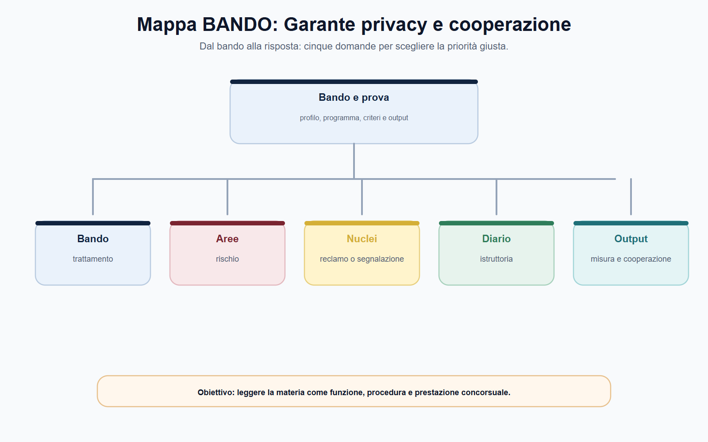
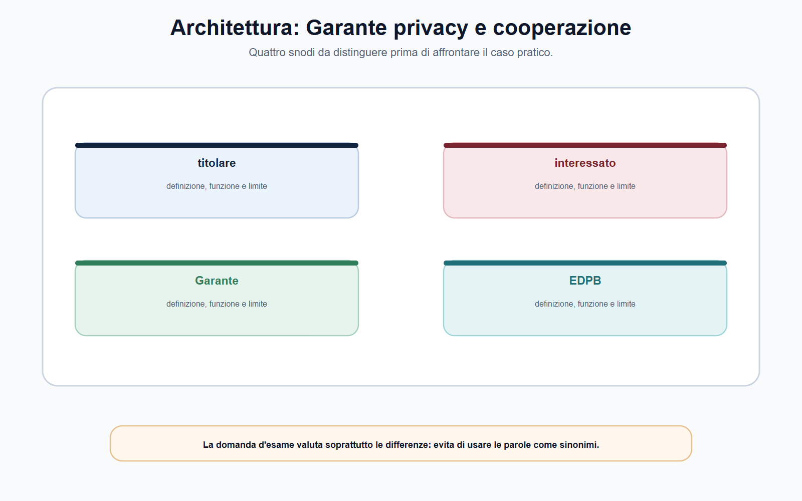
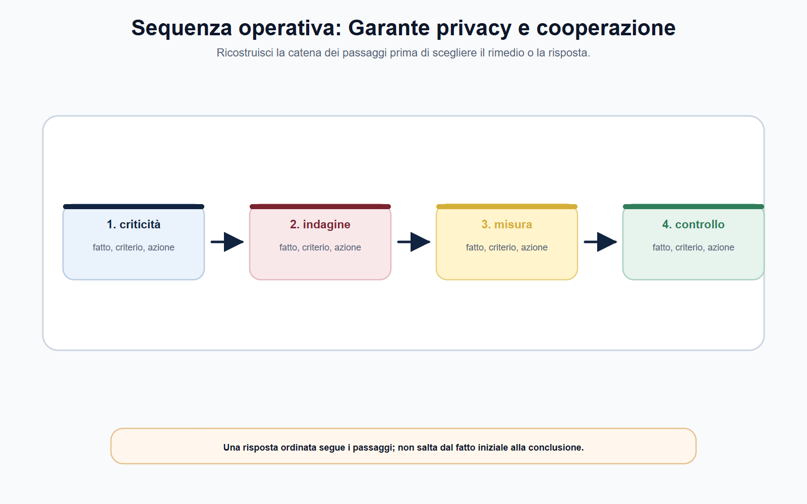
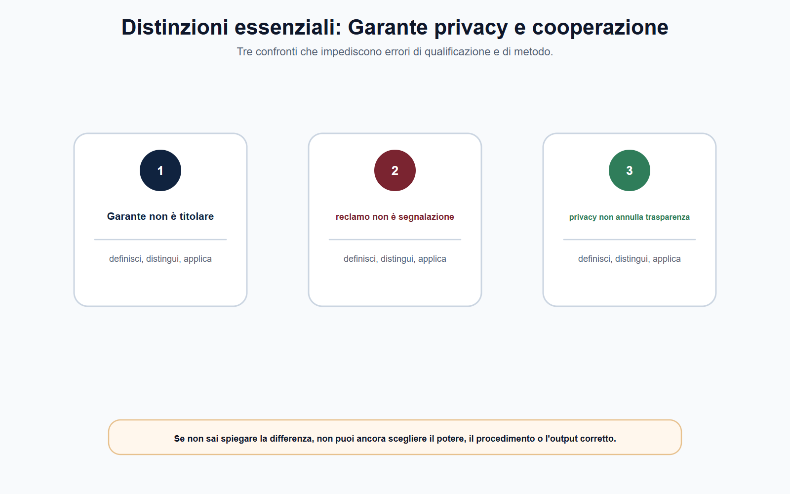
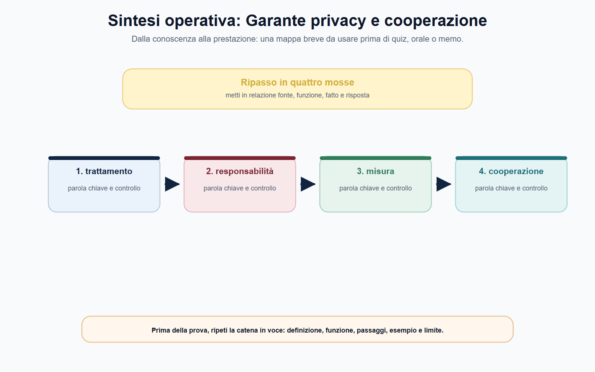

# Garante privacy: poteri, procedimenti e cooperazione europea

## N-MF05-13-01 · Quadro e criterio di lettura

**Obiettivo.** Applicare i fondamenti GDPR al ruolo dell'autorità di controllo, distinguendo reclamo, segnalazione, istruttoria, misure correttive, sanzioni e cooperazione europea.

**Domanda guida.** Quale trattamento è contestato, chi ne determina finalità e mezzi, quale diritto o obbligo è in gioco, quali prove sono disponibili e quale potere può essere esercitato nel procedimento corretto?

**Output operativo.** Schema reclamo–istruttoria–misura, mappa dei poteri del Garante, caso di trattamento digitale transfrontaliero e risposta orale.

> **Regola di metodo.** Non partire dalla parola “privacy” né dalla sanzione. Parti dal trattamento concreto: dati, soggetti, finalità, base giuridica, rischio, documenti e rimedio. Solo allora individua il Garante, il procedimento e l'eventuale cooperazione europea.

### Apertura editoriale

La protezione dei dati personali non consiste nel tenere nascosta qualunque informazione. È un sistema di regole che disciplina il potere di raccogliere, usare, conservare, comunicare e rendere accessibili dati riferibili a persone fisiche. Nella pubblica amministrazione, come nel settore privato, questo sistema incide su servizi digitali, lavoro, sanità, istruzione, controlli, pubblicazioni online, accessi e rapporti con cittadini e dipendenti. Il Garante per la protezione dei dati personali è l'autorità chiamata a sorvegliarne l'applicazione nei limiti attribuiti dal GDPR, dal Codice privacy e dalle altre fonti rilevanti.

Il candidato deve però evitare due riduzioni opposte. La prima: il Garante sarebbe un semplice sportello a cui chiedere la soluzione di ogni disaccordo con un ente o un'impresa. La seconda: il Garante sarebbe soltanto l'autorità delle multe. Il suo ruolo comprende compiti di controllo, indirizzo, consultazione, cooperazione e intervento; i poteri correttivi e sanzionatori si collocano in un procedimento che deve collegare fatto, norma, prova, contraddittorio e misura proporzionata.

### Obiettivo operativo del capitolo

Al termine del capitolo il lettore deve saper:

1. collocare il Garante nel sistema europeo e nazionale di protezione dei dati;
2. distinguere poteri di indagine, correttivi, autorizzatori e consultivi;
3. distinguere reclamo, segnalazione, istruttoria e ricorso giurisdizionale;
4. spiegare perché un provvedimento correttivo e una sanzione non sono esiti automatici;
5. ricostruire la cooperazione tra autorità nel trattamento transfrontaliero senza invocare impropriamente lo sportello unico.

*Figura 13.1 — La tavola orienta la lettura di ruolo del Garante e separa il perimetro dalle eccezioni.*

### Il Garante nel sistema GDPR: un'autorità di controllo, non il titolare del trattamento

Il GDPR affida a ciascuno Stato membro un'autorità di controllo indipendente. In Italia tale funzione è svolta dal Garante per la protezione dei dati personali. Il Garante non sostituisce il titolare del trattamento nelle scelte quotidiane, non assume su di sé la responsabilità organizzativa dell'ente o dell'impresa e non redige l'informativa al posto di chi tratta i dati. Verifica invece il rispetto del quadro normativo, interviene nei casi previsti, promuove consapevolezza e contribuisce alla coerenza dell'applicazione del diritto europeo.

Il punto di partenza resta l'**accountability** del titolare: chi determina finalità e mezzi del trattamento deve dimostrare che le proprie scelte sono conformi. Il responsabile tratta dati per conto del titolare secondo l'incarico e le istruzioni applicabili; il RPD/DPO svolge funzioni di consulenza, sorveglianza e punto di contatto, ma non trasferisce su di sé le decisioni o le responsabilità del titolare. Il Garante verifica queste posizioni quando sono rilevanti per il caso, senza confonderle.

| Soggetto | Funzione nel trattamento | Domanda da porre |
| --- | --- | --- |
| Titolare | Determina finalità e mezzi | Perché e come vengono trattati i dati? |
| Responsabile | Tratta per conto del titolare | Quale istruzione, contratto o atto disciplina il trattamento? |
| RPD/DPO | Consiglia, sorveglia e coopera con l'autorità | Ha potuto operare con autonomia e risorse adeguate? |
| Interessato | Esercita diritti e può attivare tutele | Quale dato o diritto è concretamente coinvolto? |
| Garante | Controlla e interviene nei limiti normativi | Quale potere è pertinente e quale procedimento lo sorregge? |

Il riferimento al GDPR non rende irrilevante la disciplina nazionale. Il Codice privacy, come adeguato al Regolamento europeo, completa il quadro negli spazi lasciati agli ordinamenti degli Stati membri; il regolamento del Garante sui procedimenti con rilevanza esterna organizza inoltre il percorso interno dell'autorità. Perciò una risposta adeguata non oppone “GDPR europeo” e “Codice nazionale”: individua il rapporto tra la fonte europea direttamente applicabile, le norme nazionali integrative e l'atto procedimentale pertinente.

*Figura 13.2 — La tavola mette a confronto poteri correttivi e reclamo e segnalazione senza sovrapporli.*

### Poteri: indagare, correggere, autorizzare, indirizzare

## N-MF05-13-02 · Istituti e distinzioni

I poteri del Garante non sono tutti della stessa natura. I **poteri di indagine** consentono di acquisire le informazioni necessarie per comprendere il trattamento, verificarne la liceità e accertare i fatti. I **poteri correttivi** permettono, quando ne ricorrano i presupposti, di intervenire sul trattamento: ad esempio con avvertimenti e ammonimenti, ingiunzioni di conformazione, ordini relativi all'esercizio dei diritti, limitazioni o divieti, rettifica o cancellazione dei dati e, nei casi previsti, sanzioni amministrative pecuniarie. Il GDPR attribuisce anche poteri autorizzatori e consultivi, che operano nei rispettivi ambiti.

L'elenco non va studiato come una graduatoria inevitabile. L'ammonimento non precede sempre una sanzione e la sanzione non è necessariamente la misura più adatta. La scelta richiede una valutazione del trattamento, della violazione, del rischio per le persone, del comportamento del soggetto destinatario, della cooperazione prestata, delle misure adottate e di tutti gli elementi richiesti dalla fonte applicabile. Le sanzioni, quando previste, devono essere effettive, proporzionate e dissuasive; la loro quantificazione non può essere dedotta da uno schema astratto o dalla sola risonanza del caso.

| Famiglia di poteri | Finalità | Esempio di domanda istruttoria |
| --- | --- | --- |
| Indagine | Acquisire fatti, documenti e dati | Quali sistemi, log, informative e procedure descrivono il trattamento? |
| Correttivi | Far cessare o correggere una non conformità | È necessario ordinare la conformazione, limitare il trattamento o soddisfare un diritto? |
| Sanzionatori | Reagire alla violazione nei casi e nei limiti previsti | Quali circostanze rendono la misura proporzionata ed effettiva? |
| Autorizzatori/consultivi | Prevenire criticità e orientare l'applicazione | Il caso richiede un parere, una consultazione o un atto previsto dalla disciplina? |

La logica è comune alle altre autorità indipendenti: il potere non è libero perché l'interesse protetto è rilevante. Base legale, istruttoria, partecipazione, motivazione e controllo dell'atto sono garanzie che rendono legittimo l'intervento. In materia di dati questa regola è particolarmente importante, poiché un ordine di limitazione o cancellazione può incidere su servizi, obblighi organizzativi, rapporti di lavoro e libertà economiche; allo stesso modo, l'inerzia può lasciare esposti gli interessati a rischi significativi.

*Figura 13.3 — La tavola ricostruisce il passaggio dai fatti alla competenza e alla decisione.*

### Reclamo e segnalazione: strumenti diversi, effetti diversi

L'interessato che ritenga violati i propri diritti può proporre un **reclamo** all'autorità di controllo. Il Garante lo descrive come un atto circostanziato con cui è rappresentata una violazione della disciplina di protezione dei dati. Al reclamo può seguire un'istruttoria preliminare e, se necessario, un procedimento amministrativo formale che può condurre all'esercizio dei poteri dell'articolo 58 GDPR. Il reclamo non è dunque una lettera generica di protesta: deve rendere riconoscibili trattamento, soggetti, fatti, diritto invocato e documenti disponibili.

La **segnalazione** è uno strumento distinto. Può portare all'attenzione del Garante una possibile non conformità e l'autorità può valutarla per l'esercizio dei propri poteri. Non è utile forzare l'equivalenza tra le due figure: chi studia deve comprendere che cambiano posizione del soggetto che agisce, contenuto dell'atto e percorso procedimentale. In entrambi i casi, la presenza di una segnalazione o di un reclamo non anticipa il giudizio finale né prova da sola la violazione.

| Passaggio | Cosa va verificato | Output utile per il candidato |
| --- | --- | --- |
| Fatto segnalato | Trattamento, dati, finalità, soggetti e periodo | Cronologia essenziale |
| Diritto o obbligo | Accesso, informativa, minimizzazione, sicurezza, base giuridica o altra regola | Fonte da controllare |
| Prova | Comunicazioni, screenshot, log, policy, registro, contratti e risposte | Fascicolo ragionato |
| Istruttoria | Competenza, rilevanza, chiarimenti e contraddittorio | Domande istruttorie |
| Misura | Correzione, ordine, limitazione, sanzione o archiviazione secondo il caso | Collegamento fatto–potere–motivazione |

Il ricorso al Garante non elimina gli altri rimedi previsti dall'ordinamento. Il GDPR riconosce, nei casi stabiliti, anche il diritto a un ricorso giurisdizionale effettivo contro l'autorità di controllo o contro titolare e responsabile. Un candidato non deve però promettere automaticamente il risultato di una causa, di un reclamo o di una segnalazione. Deve indicare il percorso: prima la ricostruzione del fatto e della fonte; poi la tutela amministrativa, stragiudiziale o giudiziale verificata nel concreto.

*Figura 13.4 — La tavola evidenzia le distinzioni da controllare prima di rispondere.*

### Istruttoria, ispezione e misura: dalla criticità al provvedimento

## N-MF05-13-03 · Poteri, procedura e conseguenze

Il procedimento serve a trasformare una possibile violazione in una decisione verificabile. Inizia dalla delimitazione del trattamento: non basta affermare che “sono stati violati dati personali”. Occorre capire quali dati sono coinvolti, chi li ha trattati, con quale finalità, su quale base giuridica, per quanto tempo, con quali destinatari e con quali misure di sicurezza. Una violazione di sicurezza, ad esempio, non si esaurisce nel fatto tecnico: impone di ricostruire l'evento, le misure preventive, l'impatto sugli interessati e gli adempimenti applicabili.

Richieste di informazioni, acquisizioni documentali e accertamenti ispettivi servono a colmare la distanza tra allegazione e prova. Il Garante può valutare informative, registro dei trattamenti, valutazioni d'impatto, contratti con responsabili, policy, misure tecniche e organizzative, log e comunicazioni agli interessati. Il destinatario dell'attività istruttoria deve poter far valere osservazioni e documenti secondo le garanzie previste. La motivazione conclusiva deve rendere leggibile il passaggio da fatti provati a norma applicata, e da norma applicata a misura adottata.

> **BANDO in pratica.** Scrivi sempre la catena: *trattamento → regola → fatto → prova → potere → misura → tutela*. Se salta una freccia, la risposta è incompleta o rischia di attribuire al Garante un potere non verificato.

### Cooperazione europea: autorità capofila, autorità interessate ed EDPB

Il GDPR costruisce un sistema europeo per evitare che trattamenti con effetti in più Stati ricevano risposte incoerenti. Quando ricorrono i presupposti del trattamento transfrontaliero, opera il meccanismo di cooperazione tra l'**autorità di controllo capofila** e le **autorità interessate**. L'autorità capofila conduce il processo di cooperazione, svolge l'istruttoria e predispone un progetto di decisione, confrontandosi con le altre autorità interessate per raggiungere il consenso. Queste ultime non sono spettatrici: partecipano alla procedura e restano un riferimento per gli interessati nei rispettivi territori.

Lo **sportello unico** non significa che esista una sola autorità per ogni piattaforma digitale né che un cittadino debba rinunciare alla propria autorità nazionale. È un meccanismo procedurale per specifici trattamenti transfrontalieri. Occorre verificare se il trattamento avviene in più Stati membri oppure incide, o può incidere in modo sostanziale, su interessati in più Stati; occorre inoltre identificare lo stabilimento principale e la competenza alla luce dei fatti. Per attività locali o per ipotesi sottratte al meccanismo, resta necessario applicare la disciplina di competenza ordinaria.

Se le autorità non raggiungono un accordo, interviene il **Comitato europeo per la protezione dei dati (EDPB)** nei casi e con gli strumenti previsti. L'EDPB non conduce ordinariamente l'istruttoria nazionale al posto delle autorità: promuove cooperazione e applicazione coerente, adotta linee guida e pareri e può emanare decisioni vincolanti per risolvere controversie tra autorità. Il meccanismo di coerenza svolge una funzione più ampia di armonizzazione: impedisce che decisioni o strumenti con rilievo europeo siano valutati isolatamente.

| Livello | Funzione | Cosa non confondere |
| --- | --- | --- |
| Garante nazionale | Istruttoria, poteri e decisione nel proprio perimetro | Non è automaticamente capofila in ogni caso digitale |
| Autorità capofila | Coordina un caso transfrontaliero nel meccanismo GDPR | Non cancella il ruolo delle autorità interessate |
| Autorità interessate | Cooperano e rappresentano interessi connessi ai rispettivi territori | Non sono semplici destinatarie della decisione |
| EDPB | Coerenza, linee guida, pareri e decisioni vincolanti nei casi previsti | Non è il giudice di ogni reclamo individuale |

### Trasparenza amministrativa e privacy: un bilanciamento, non un conflitto astratto

Nella PA, molte questioni sottoposte al Garante nascono dal rapporto tra obblighi di pubblicità, richieste di accesso e protezione dei dati. La soluzione non è scegliere in astratto “trasparenza” o “riservatezza”. È necessario identificare la norma che impone o consente la pubblicazione, verificare quali dati siano necessari rispetto alla finalità, limitare l'esposizione di dati non pertinenti e applicare le cautele previste. La minimizzazione è una regola operativa: pubblicare un atto non implica diffondere ogni dato contenuto nell'atto.

Questo bilanciamento mostra anche la differenza tra consulenza preventiva e controllo. L'ufficio che gestisce un procedimento deve progettare il trattamento in modo conforme, coinvolgendo le figure interne previste e documentando le scelte; non può attendere un reclamo per decidere se una pubblicazione è lecita. L'intervento del Garante può correggere una non conformità o orientare l'applicazione, ma non sostituisce l'organizzazione responsabile dell'ente.

*Figura 13.5 — La tavola chiude il percorso collegando cooperazione europea a bilanciamento con la trasparenza.*

### Mappa BANDO

| Voce del bando | Nucleo da padroneggiare | Output da allenare |
| --- | --- | --- |
| Autorità di controllo | Garante, GDPR, Codice privacy e accountability | Mappa soggetto–funzione–responsabilità |
| Poteri | Indagine, correzione, sanzione, autorizzazione e consultazione | Griglia fatto–potere–limite |
| Procedimenti | Reclamo, segnalazione, istruttoria, provvedimento e ricorso | Schema reclamo–prova–misura |
| Cooperazione UE | Autorità capofila, interessate, EDPB e coerenza | Flow chart di un caso transfrontaliero |
| PA e pubblicazione | Necessità, proporzionalità, minimizzazione e documentazione | Checklist prima della pubblicazione online |

## N-MF05-13-04 · Applicazione alla prova

> **Da sapere in cinque righe.** Il Garante controlla l'applicazione della disciplina sui dati personali, ma non sostituisce titolare, DPO o giudice. I suoi poteri includono indagine, correzione, sanzione, autorizzazione e consultazione nei rispettivi limiti. Reclamo e segnalazione sono strumenti diversi: il primo è circostanziato e può avviare un percorso di tutela, la seconda può far emergere una criticità da valutare. Ogni misura richiede fatto, fonte, istruttoria, garanzie e motivazione. Nei casi transfrontalieri il GDPR coordina autorità capofila e interessate; l'EDPB assicura coerenza e può risolvere conflitti tra autorità nei casi previsti.

### Caso guidato: piattaforma per candidature e pubblicazione eccessiva

Un ente pubblico utilizza una piattaforma per gestire una procedura concorsuale. Il fornitore conserva documenti di identità e curriculum oltre la fase necessaria; una sezione pubblica del sito rende scaricabili elenchi con informazioni ulteriori rispetto a quelle richieste per la pubblicità della graduatoria. Alcuni candidati presentano reclamo al Garante. Il fornitore afferma che ogni scelta dipende dall'ente; l'ente replica che la piattaforma è gestita dal fornitore. Poiché il servizio è usato anche da amministrazioni di altri Stati membri, si invoca immediatamente lo sportello unico.

La prima attività è qualificare i soggetti e i trattamenti. Occorre verificare chi determina finalità e mezzi per gestione della procedura e pubblicazione, quale ruolo contrattuale ha il fornitore, quali dati sono esposti, per quali finalità, per quanto tempo e con quale base giuridica. Il contratto, il registro dei trattamenti, le istruzioni al fornitore, le impostazioni della piattaforma, le pagine pubbliche e i log sono elementi istruttori essenziali. Non è sufficiente che ciascun soggetto attribuisca all'altro la responsabilità.

Seguono due profili distinti. Per la pubblicazione, va verificata la base normativa, la necessità dei dati diffusi e la minimizzazione; per la conservazione, vanno esaminati finalità, tempi, misure organizzative e informazioni rese. Il Garante può acquisire chiarimenti e valutare i poteri correttivi appropriati. Un eventuale trattamento transfrontaliero richiede, in più, di accertare i suoi presupposti: il semplice uso della stessa tecnologia in altri Stati non basta, da solo, a individuare un'autorità capofila o a sottrarre il caso alla competenza ordinaria.

La soluzione ragionata non è “multa certa” né “privacy contro trasparenza”. È una sequenza: **trattamento e ruoli → regola sulla pubblicazione e sulla conservazione → documenti e prova → procedimento → misura proporzionata → eventuale cooperazione UE**. È questa sequenza che il candidato deve saper esporre.

### Domanda da commissario

**Illustri i poteri del Garante per la protezione dei dati personali e il funzionamento della cooperazione europea nel GDPR.**

### Risposta orale modello

«Il Garante è l'autorità di controllo italiana in materia di protezione dei dati personali. Opera nel quadro del GDPR, del Codice privacy e delle altre fonti applicabili; non sostituisce il titolare del trattamento, che resta responsabile delle finalità, dei mezzi e della conformità. Il Garante esercita poteri di indagine, correttivi, sanzionatori, autorizzatori e consultivi nei limiti di legge. Il reclamo dell'interessato è un atto circostanziato che può condurre a istruttoria e procedimento, mentre la segnalazione è uno strumento distinto per far emergere possibili violazioni. Ogni provvedimento deve essere fondato su fatti, prove, contraddittorio e motivazione. Per trattamenti transfrontalieri, il GDPR prevede cooperazione tra autorità capofila e autorità interessate; l'EDPB promuove coerenza, adotta linee guida e può assumere decisioni vincolanti nelle controversie tra autorità.»

### Domanda-trappola

**Ogni reclamo al Garante deve concludersi con una sanzione amministrativa?**

No. Il reclamo apre un percorso di valutazione e, se necessario, di istruttoria e procedimento. L'esito dipende da competenza, fatti, prova, fonte applicabile e potere proporzionato; possono rilevare anche archiviazione, misure correttive o altri esiti previsti.

### Errore tipico

**Errore:** «Se un servizio è online ed è usato in più Paesi, decide sempre e soltanto l'autorità del Paese in cui ha sede il fornitore.»

**Correzione:** lo sportello unico opera solo quando ricorrono i presupposti del GDPR per il trattamento transfrontaliero. Vanno verificati trattamento, stabilimenti, effetti sugli interessati, autorità capofila e autorità interessate; le questioni locali o sottratte al meccanismo seguono il riparto ordinario.

### Mini-esercizio di consolidamento

Compila la griglia per una possibile diffusione indebita di dati in una pagina istituzionale.

| Campo | Appunto da raccogliere |
| --- | --- |
| Trattamento | Pubblicazione, consultazione o indicizzazione coinvolta |
| Soggetti | Ente titolare, fornitore/responsabile, DPO e interessati |
| Dati e finalità | Dati esposti, scopo della pubblicazione, necessità e proporzionalità |
| Fonti | GDPR, Codice privacy, norma di pubblicità/accesso e atto interno da verificare |
| Prove | URL, schermate datate, atto pubblicato, informative, log e comunicazioni |
| Percorso | Istanza al titolare, reclamo/segnalazione, Garante, giudice o cooperazione UE se pertinente |

L'esercizio è corretto se non identifica la sanzione prima di aver ricostruito trattamento, regola, prova e competenza.

### Laboratorio di qualificazione

## N-MF05-13-05 · Consolidamento e verifica

Per allenare ruolo del Garante, parti da un fascicolo minimo: una richiesta, due documenti non perfettamente coerenti e una fonte che attribuisce il potere. Scrivi in colonne separate i fatti provati, le allegazioni e gli elementi ancora da acquisire. Poi confronta poteri correttivi con reclamo e segnalazione: annota soggetto, presupposto, funzione ed effetto di ciascun istituto. Il confronto impedisce di scegliere la soluzione soltanto perché una parola della traccia ricorda una definizione studiata.

Passa quindi a istruttoria. Indica chi avvia l'attività, quali garanzie devono essere rispettate e quale atto può chiuderla. Se la fonte lascia un margine di valutazione, rendi espliciti i criteri: gravità, durata, diffusione, rischio, collaborazione e proporzionalità, secondo il settore applicabile. Collega cooperazione europea al documento che ne permette la verifica e tratta bilanciamento con la trasparenza come una conclusione da motivare, non come un'etichetta. La scheda è completa quando un secondo lettore può ricostruire il percorso senza conoscere l'intenzione di chi l'ha compilata.

### Controllo incrociato

Rileggi ora il risultato da tre prospettive. Come candidato, verifica di avere definito ruolo del Garante senza dilungarti su nozioni estranee. Come istruttore, controlla che la distinzione fra poteri correttivi e reclamo e segnalazione poggi su documenti e non su supposizioni. Come decisore, chiediti se il passaggio dedicato a istruttoria giustifichi davvero l'esito proposto. Se una prospettiva non trova risposta, riapri l'analisi nel punto preciso invece di aggiungere una conclusione generica.

Completa il controllo con una riga dedicata alle alternative. Spiega quale diversa qualificazione sarebbe possibile se cambiasse un fatto decisivo, quale fonte farebbe mutare il perimetro di cooperazione europea e quale conseguenza produrrebbe su bilanciamento con la trasparenza. L'esercizio allena a riconoscere le opzioni quasi corrette: nei concorsi l'errore più insidioso non è sempre una regola falsa, ma una regola vera applicata al soggetto, al tempo o al procedimento sbagliato. La risposta finale deve perciò contenere anche il proprio limite di validità.

### ▣ Verifica ragionata

**Quesito 1.** Qual è il primo controllo quando la traccia richiama ruolo del Garante?

**Risposta corretta:** individuare il fatto rilevante, la fonte e il perimetro della competenza prima di scegliere l'istituto. La parola usata nella traccia può orientare, ma non dimostra da sola quale autorità o quale potere siano applicabili. Una risposta efficace espone il criterio e poi lo applica ai dati disponibili.

**Quesito 2.** poteri correttivi e reclamo e segnalazione possono essere trattati come espressioni equivalenti?

**Risposta corretta:** no. Devono essere distinti per funzione, presupposti, soggetti ed effetti. Dopo la distinzione si può spiegare il loro coordinamento. Nei quiz, l'opzione errata spesso contiene una definizione plausibile ma trasferisce a un istituto la funzione dell'altro.

**Quesito 3.** Un dato tratto da un bando storico o da una pagina operativa vale per ogni procedura successiva?

**Risposta corretta:** no. Il dato è utile come esempio datato; requisiti, termini, soglie, composizione delle prove e modalità di ricorso devono essere ricontrollati nella fonte vigente e nel bando applicabile. La regola stabile va separata dal dato mobile.

**Quesito 4.** Come va usato istruttoria nel caso proposto?

**Risposta corretta:** va collegato a fatti, competenza, sequenza procedurale e conseguenza. Limitarsi a una definizione non dimostra capacità applicativa; anticipare l'esito senza istruttoria produce invece una conclusione non sostenuta. La motivazione deve rendere visibile il passaggio compiuto.

**Quesito 5.** La finalità generale di tutela attribuisce automaticamente qualsiasi potere in materia di cooperazione europea?

**Risposta corretta:** no. Ogni potere richiede una fonte attributiva, un oggetto e un procedimento. La missione istituzionale aiuta a interpretare il sistema, ma non sostituisce la verifica della competenza concreta né consente di confondere vigilanza, rimedio individuale e sanzione.

**Quesito 6.** Quale controllo conclusivo riduce gli errori su bilanciamento con la trasparenza?

**Risposta corretta:** confrontare la conclusione con la domanda, la fonte e i fatti effettivamente disponibili. Se manca un elemento, la risposta deve indicare quale documento o accertamento serve. Dichiarare il limite informativo è più professionale che colmarlo con un automatismo.

### Caso ragionato di chiusura

Un ufficio riceve una segnalazione che usa formule generiche, richiama ruolo del Garante e chiede un intervento immediato su bilanciamento con la trasparenza. Il fascicolo contiene una schermata, una comunicazione non datata e il riferimento a un bando precedente. La soluzione non consiste nello scegliere subito una sanzione. Occorre qualificare il fatto, verificare autenticità e data dei documenti, individuare la fonte vigente, distinguere poteri correttivi da reclamo e segnalazione e stabilire quale amministrazione possa acquisire gli elementi mancanti. Solo allora si valuta istruttoria, si collega cooperazione europea al potere pertinente e si motiva il passo successivo. Il caso è risolto correttamente quando la conclusione resta proporzionata alle prove e separa la regola stabile dai dati da aggiornare.
