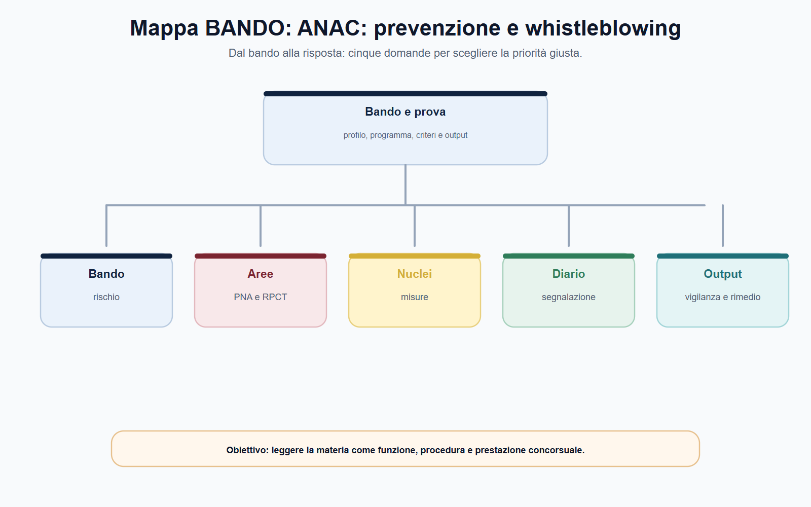
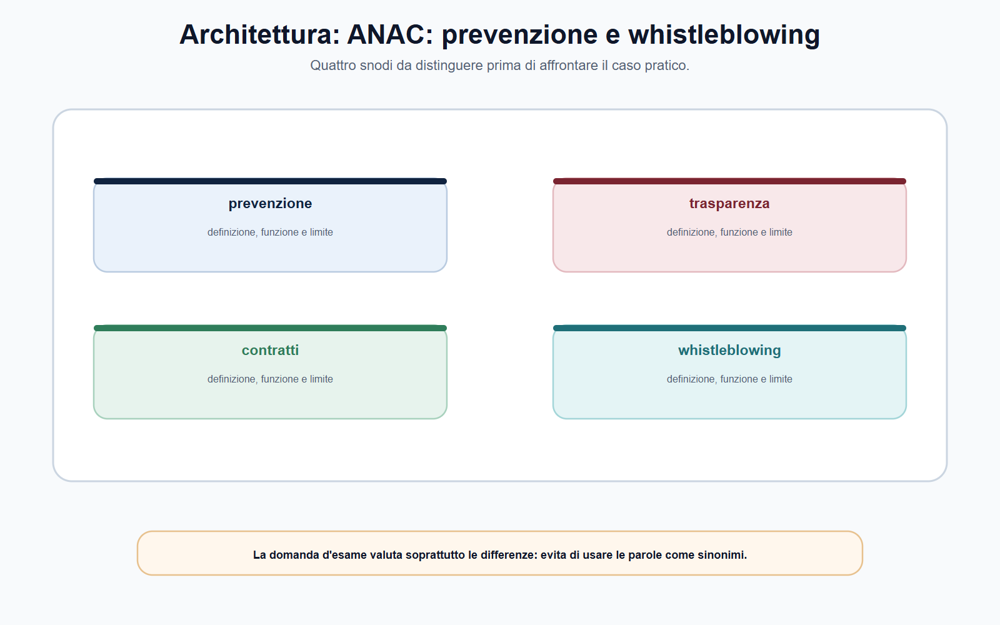
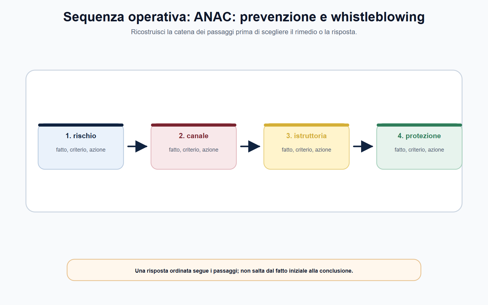
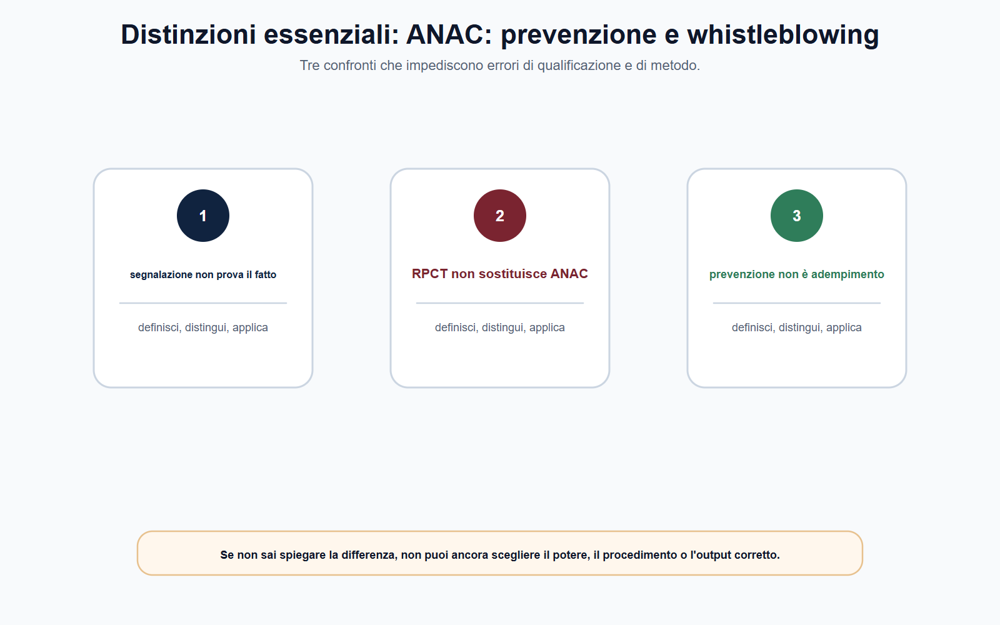
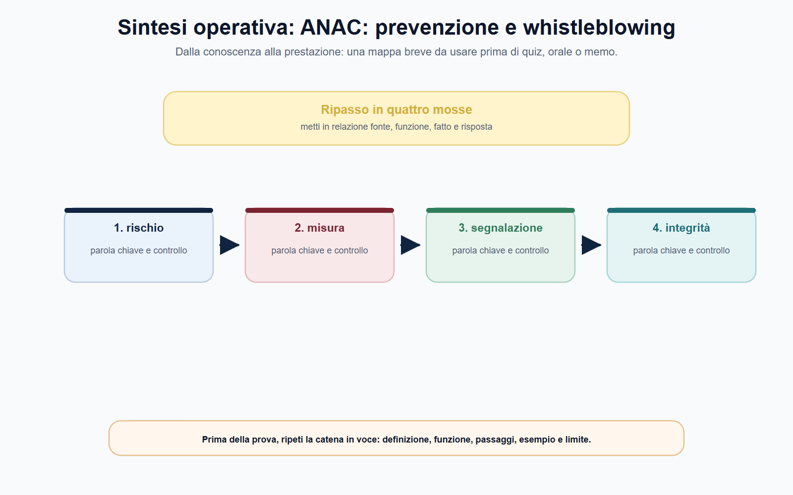

# ANAC: prevenzione, vigilanza e whistleblowing

## N-MF05-14-01 · Quadro e criterio di lettura

**Obiettivo.** Leggere ANAC come autorità di prevenzione e vigilanza, collegando PNA, trasparenza, contratti e whistleblowing senza duplicare la teoria generale già studiata nel VOL-01.

**Domanda guida.** Quale processo dell'amministrazione è esposto a rischio, quale misura organizzativa o obbligo di trasparenza è pertinente, chi deve attuarlo e quando può intervenire ANAC?

**Output operativo.** Mappa processo–rischio–misura, schema di vigilanza ANAC, caso whistleblowing e risposta orale.

> **Regola di metodo.** Non chiamare “anticorruzione” ogni irregolarità. Individua processo, rischio, soggetti, misura preventiva, prova e canale di tutela. La qualificazione corretta viene prima dell'eventuale vigilanza o sanzione.

### Apertura editoriale

La prevenzione della corruzione non è una cartella di documenti da aggiornare una volta l'anno. È un metodo di governo dell'amministrazione: conoscere i processi, individuare i punti in cui una decisione può essere deviata da interessi impropri, adottare misure ragionevoli, controllarne l'effettiva applicazione e correggere gli scostamenti. In questa prospettiva, trasparenza, tracciabilità, separazione dei compiti, gestione dei conflitti di interesse, rotazione ove pertinente, controlli e canali di segnalazione sono strumenti che rendono verificabile l'azione pubblica.

ANAC opera nel sistema come autorità indipendente di promozione, regolazione e vigilanza nei perimetri stabiliti dalla legge. La sua funzione non si esaurisce nelle sanzioni, né trasforma l'Autorità nel responsabile diretto dei processi interni di ogni ente. L'amministrazione resta responsabile della qualità del proprio assetto organizzativo; ANAC orienta, vigila e interviene attraverso i poteri attribuiti in materia di prevenzione della corruzione, trasparenza e contratti pubblici.

### Obiettivo operativo del capitolo

Al termine del capitolo il lettore deve saper:

1. spiegare la funzione preventiva di ANAC e il rapporto con le responsabilità dell'ente;
2. collegare PNA, programmazione anticorruzione, RPCT, misure e monitoraggio;
3. distinguere vigilanza, indirizzo, controllo, trasparenza e poteri sanzionatori;
4. qualificare correttamente una segnalazione whistleblowing, i canali e le tutele;
5. separare il procedimento ANAC da responsabilità disciplinare, penale, contabile o civile.

*Figura 14.1 — La tavola orienta la lettura di prevenzione della corruzione e separa il perimetro dalle eccezioni.*

### ANAC e la prevenzione: dall'adempimento al governo del rischio

La corruzione amministrativa non coincide soltanto con il reato. In chiave preventiva, comprende il rischio che una funzione pubblica sia esercitata in modo non imparziale, opaco o orientato a interessi diversi da quelli istituzionali. Per questo la legge n. 190/2012 e le discipline collegate puntano su una strategia che non attende necessariamente l'illecito concluso: interviene sull'organizzazione, sui processi e sulle condizioni che possono favorire deviazioni.

ANAC promuove trasparenza e buona gestione e svolge compiti di regolazione, vigilanza, consulenza, ispezione e sanzione nei settori attribuiti. Il candidato deve però collocare ciascuna funzione nel suo oggetto. In prevenzione della corruzione, il punto centrale è la capacità dell'ente di passare da un rischio astratto a misure effettive; in trasparenza, la questione è il corretto adempimento degli obblighi di pubblicazione e il relativo controllo; nei contratti pubblici, l'Autorità esercita funzioni specifiche sul mercato e sulle stazioni appaltanti. Dire che «ANAC controlla tutto» è quindi inesatto.

| Livello | Domanda essenziale | Output corretto |
| --- | --- | --- |
| Processo | Dove si forma la decisione o si usa una risorsa pubblica? | Mappa del processo e dei passaggi sensibili |
| Rischio | Quale condotta o vulnerabilità può deviare l'interesse pubblico? | Descrizione concreta, non formula generica |
| Misura | Quale presidio è adeguato e sostenibile? | Controllo, tracciabilità, trasparenza, separazione o altra misura motivata |
| Monitoraggio | Come si verifica che la misura funzioni? | Indicatore, responsabilità, evidenza e riesame |
| Vigilanza | Quale potere può esercitare ANAC se emergono criticità? | Fonte, procedimento e misura da verificare |

Il metodo è più importante dell'elenco. Un ente non previene il rischio copiando una tabella standard: deve conoscere struttura, attività, relazioni esterne, risorse gestite e vulnerabilità specifiche. Una misura utile per una gara complessa può essere irrilevante per un procedimento di autorizzazione; un obbligo di pubblicazione può migliorare il controllo diffuso, ma non sostituisce la verifica interna della legittimità della decisione.

*Figura 14.2 — La tavola mette a confronto PNA e programmazione e RPCT senza sovrapporli.*

### PNA, programmazione e RPCT: una catena di responsabilità

Il Piano Nazionale Anticorruzione costituisce il riferimento per la strategia nazionale di prevenzione e per gli indirizzi rivolti alle amministrazioni. Il PNA 2025, approvato da ANAC con delibera n. 19 del 28 gennaio 2026, va letto come strumento di orientamento: aiuta a costruire misure proporzionate ai processi e ai rischi, ma non autorizza la trasposizione meccanica di modelli uguali per enti diversi. La pianificazione interna deve essere coerente con dimensione, funzioni, risorse, contesto e disciplina applicabile, anche nel raccordo con gli strumenti di programmazione dell'ente.

## N-MF05-14-02 · Istituti e distinzioni

Il **Responsabile della prevenzione della corruzione e della trasparenza (RPCT)** ha una funzione di impulso, coordinamento e presidio del sistema interno secondo le attribuzioni normative e organizzative. Non può però sostituire organi di indirizzo, dirigenti, responsabili di procedimento, uffici di controllo o gestori dei canali di segnalazione. Se tutti gli obblighi sono scaricati sull'RPCT, l'ente costruisce un sistema apparente: il responsabile raccoglie dati e redige documenti, ma chi gestisce i processi non modifica comportamenti, controlli o flussi informativi.

| Attore | Responsabilità principale | Errore da evitare |
| --- | --- | --- |
| Organo di indirizzo | Definisce indirizzi e assicura risorse e responsabilità organizzative | Considerare la prevenzione un compito solo tecnico |
| RPCT | Coordina, propone, monitora e segnala criticità nel proprio ruolo | Farne il responsabile esclusivo di ogni rischio |
| Dirigenti e responsabili | Applicano misure nei processi, organizzano controlli e rendicontano | Limitarsi a dichiarazioni formali di conformità |
| Personale | Rispetta regole, segnala criticità e collabora ai controlli | Pensare che integrità e prevenzione riguardino solo i vertici |
| ANAC | Indirizza, vigila e interviene nei limiti attribuiti | Attribuirle la gestione ordinaria dell'ente |

La programmazione preventiva è efficace quando collega un rischio a un comportamento osservabile. «Rafforzare la legalità» è una finalità; non è ancora una misura. Più utile è stabilire, ad esempio, chi verifica determinate incompatibilità, con quali dati, in quale momento del procedimento, come documenta l'esito e chi riceve il risultato. In questo modo il monitoraggio non verifica se il documento esiste, ma se il presidio ha operato.

*Figura 14.3 — La tavola ricostruisce il passaggio dai fatti alla competenza e alla decisione.*

### Vigilanza ANAC, trasparenza e contratti: distinguere gli oggetti

ANAC esercita vigilanza in ambiti diversi. In materia di anticorruzione e trasparenza, può verificare l'adozione e l'effettività di misure, gli obblighi di pubblicazione, le segnalazioni e le condizioni che rendono il sistema prevenzione credibile. Nell'area dei contratti pubblici esercita funzioni specifiche di regolazione e vigilanza, che richiedono di considerare il Codice dei contratti, gli atti dell'Autorità e i dati della procedura. Il capitolo non sostituisce la disciplina specialistica degli appalti: insegna a non confondere il controllo preventivo sul rischio con la ricostruzione completa della gara.

La **trasparenza** serve a rendere conoscibili informazioni rilevanti e a consentire responsabilità e controllo; non rende automaticamente lecito pubblicare ogni documento o dato. Gli obblighi di pubblicazione devono essere verificati insieme alla disciplina sulla protezione dei dati personali, alla pertinenza, alla necessità e alle regole di accesso. ANAC non decide in astratto che la pubblicità prevalga sempre: il corretto bilanciamento nasce dalla fonte che regola quel dato, quell'atto e quel procedimento.

La vigilanza non è sinonimo di colpevolezza. Una segnalazione, un'anomalia nei dati o l'assenza di una pubblicazione possono avviare una verifica; la conclusione richiede competenza, istruttoria, acquisizione di elementi, contraddittorio nei casi previsti e motivazione. Anche gli atti di indirizzo, i pareri e i provvedimenti d'ordine hanno natura e presupposti diversi. Il candidato deve quindi formulare la domanda giusta: **quale potere attribuisce la fonte, per quale oggetto, con quale procedura e con quale possibile effetto?**

> **BANDO in pratica.** Per ogni episodio di possibile irregolarità, scrivi una riga per ciascun piano: *organizzativo-preventivo*, *trasparenza*, *contratti*, *disciplinare*, *penale/contabile*. Un fatto può toccarne più di uno, ma nessun piano assorbe automaticamente gli altri.

*Figura 14.4 — La tavola evidenzia le distinzioni da controllare prima di rispondere.*

### Whistleblowing: emersione delle violazioni e protezione della persona segnalante

Il whistleblowing, disciplinato dal d.lgs. n. 24/2023, protegge le persone che segnalano informazioni sulle violazioni acquisite nel contesto lavorativo, quando ricorrono le condizioni previste. La sua funzione è favorire l'emersione tempestiva di condotte o omissioni rilevanti nell'interesse pubblico o nell'integrità dell'amministrazione o dell'ente. Perciò non coincide con una contestazione personale sul proprio rapporto di lavoro, con una richiesta di riesame di un provvedimento, con una doglianza generica o con la diffusione indiscriminata di informazioni.

Il sistema prevede canali e tutele differenziati. Il **canale interno** è un presidio centrale nel contesto di lavoro; l'ente deve assicurare modalità idonee, riservatezza e gestione corretta secondo la disciplina applicabile. Il **canale esterno** presso ANAC non è un'alternativa liberamente scegliibile per convenienza: è utilizzabile nelle condizioni stabilite dalla legge, tra le quali rientrano, in sintesi, assenza o non conformità del canale interno obbligatorio, mancato seguito alla segnalazione interna, rischio ragionevole di inefficacia o ritorsione, oppure pericolo imminente o palese per il pubblico interesse. Divulgazione pubblica e denuncia alle autorità competenti costituiscono ulteriori percorsi, con presupposti propri.

## N-MF05-14-03 · Poteri, procedura e conseguenze

| Elemento | Domanda di qualificazione | Errore frequente |
| --- | --- | --- |
| Contesto | L'informazione è stata acquisita nel contesto lavorativo? | Trattare ogni notizia esterna come whistleblowing |
| Contenuto | Riguarda una violazione rientrante nel perimetro normativo? | Usare il canale per un dissenso organizzativo generico |
| Interesse | Mira all'interesse pubblico o all'integrità dell'ente? | Confondere il canale con una vertenza individuale |
| Canale | Interno, esterno ANAC, divulgazione o denuncia: quali presupposti ricorrono? | Scegliere il canale esterno senza verificare le condizioni |
| Tutela | Esistono riservatezza, ragionevolezza e protezione da ritorsioni? | Credere che ogni segnalazione anonima o infondata riceva le stesse tutele |

La **riservatezza** protegge identità e informazioni nei limiti della legge e del procedimento; il **divieto di ritorsione** protegge la persona segnalante dalle conseguenze pregiudizievoli collegate alla segnalazione. Entrambe le tutele sono essenziali per rendere affidabile il sistema, ma non autorizzano segnalazioni consapevolmente false né eliminano la necessità di agire con ragionevole convinzione sulla veridicità delle informazioni. L'amministrazione deve quindi organizzare un canale sicuro e imparziale, senza trasformarlo in un canale informale di gestione del personale.

### ANAC e le segnalazioni esterne: procedimento, non automatismo

ANAC gestisce le segnalazioni esterne e le comunicazioni relative a possibili ritorsioni nel quadro stabilito dal d.lgs. n. 24/2023, dalle linee guida e dal regolamento dell'Autorità. Il procedimento serve anzitutto a verificare la ricevibilità e la pertinenza della comunicazione, a preservare la riservatezza e a individuare eventuali misure o interlocuzioni necessarie. Non decide automaticamente ogni vicenda lavorativa né sostituisce il datore di lavoro, il giudice del lavoro, l'autorità giudiziaria o la Corte dei conti.

Quando si allega una ritorsione, occorre distinguere l'atto sfavorevole dalla sua possibile connessione con la segnalazione. Trasferimento, mancato rinnovo, valutazione negativa o esclusione da un incarico non sono automaticamente ritorsivi: vanno ricostruiti contesto, cronologia, motivazioni, soggetti coinvolti, criteri applicati e documenti. Allo stesso modo, la protezione non può essere negata soltanto perché la segnalazione non ha condotto all'accertamento definitivo della violazione, se ricorrono le condizioni previste dalla disciplina. Il ragionamento deve essere probatorio e non intuitivo.

| Fase | Verifica indispensabile | Documento o prova utile |
| --- | --- | --- |
| Ricezione | Canale, soggetto e contenuto rientrano nel perimetro? | Segnalazione, allegati e dati di contesto |
| Qualificazione | Violazione, informazione lavorativa e interesse protetto sono individuabili? | Cronologia, atti, comunicazioni e regolamenti |
| Riservatezza | Identità e informazioni sono trattate secondo le cautele applicabili? | Accessi al fascicolo, ruoli autorizzati e tracciature |
| Istruttoria | Quali verifiche sono necessarie e quale autorità è competente? | Richieste di chiarimenti, documenti e riscontri |
| Esito | Occorre tutela, invio, vigilanza o altra azione prevista? | Motivazione e collegamento fatto–potere–misura |

La correttezza del procedimento protegge tutte le persone coinvolte: chi segnala, chi è menzionato, l'ente e i terzi. Per questo il candidato deve evitare formule come «il segnalante ha sempre ragione» o «la segnalazione è segreta in assoluto». Riservatezza, difesa, accesso e circolazione delle informazioni sono disciplinati da fonti e limiti da verificare nel caso concreto.

*Figura 14.5 — La tavola chiude il percorso collegando canali whistleblowing a prova della ritorsione.*

### La prova della ritorsione

La protezione non richiede al segnalante di dimostrare direttamente il movente interiore di chi ha adottato la misura. Nei procedimenti giudiziari o amministrativi e nelle controversie stragiudiziali, quando il segnalante prova di avere effettuato una segnalazione, denuncia o divulgazione conforme e di avere subito una condotta ritenuta ritorsiva, si presume il collegamento: chi ha adottato la misura deve dimostrare che essa è fondata su ragioni estranee. La presunzione opera anche nella valutazione ANAC, nel contraddittorio con il presunto responsabile.

La regola non autorizza automatismi. Occorre verificare che ricorrano ambito soggettivo e oggettivo del d.lgs. n. 24/2023, condizioni della tutela e sequenza temporale; meri sospetti o voci non bastano. Inoltre l'inversione dell'onere della prova non si estende automaticamente ai soggetti collegati indicati dall'art. 3, comma 5 — come facilitatori, taluni colleghi ed enti — se sono essi a lamentare la ritorsione. La protezione può riguardarli, ma il regime probatorio resta distinto.

Nel caso di un trasferimento successivo alla segnalazione, il funzionario non conclude subito che vi sia ritorsione. Registra segnalazione e misura, conserva date e atti, verifica le condizioni di tutela e chiede al soggetto che ha disposto il trasferimento le ragioni organizzative e la documentazione contemporanea alla decisione. ANAC accerta la ritorsione nei limiti delle proprie attribuzioni; la dichiarazione di nullità dell'atto spetta all'autorità giudiziaria. Questa distinzione fra presunzione, prova contraria, competenza amministrativa ed effetto civilistico rende la risposta precisa e impedisce di promettere rimedi automatici.
### Mappa BANDO

## N-MF05-14-04 · Applicazione alla prova

| Voce del bando | Nucleo da padroneggiare | Output da allenare |
| --- | --- | --- |
| Prevenzione della corruzione | Processo, rischio, misura, monitoraggio e responsabilità | Mappa processo–rischio–presidio |
| PNA e RPCT | Indirizzo nazionale, programmazione interna e ruoli | Tabella attore–compito–evidenza |
| Vigilanza ANAC | Indirizzo, controllo, trasparenza, contratti e poteri | Schema oggetto–fonte–procedimento |
| Whistleblowing | Contenuto, canali, riservatezza e ritorsioni | Checklist di qualificazione della segnalazione |
| Responsabilità | Distinzione fra piani preventivo, disciplinare, contabile e penale | Caso con più percorsi possibili |

> **Da sapere in cinque righe.** ANAC promuove trasparenza e buona gestione e svolge funzioni di prevenzione, vigilanza, regolazione, consulenza e intervento nei limiti attribuiti. La prevenzione si basa su processi, rischi, misure e monitoraggio; PNA e RPCT non sostituiscono la responsabilità dei vertici e degli uffici. Trasparenza e contratti pubblici sono ambiti collegati ma dotati di regole proprie. Il whistleblowing riguarda segnalazioni qualificate nel contesto lavorativo e richiede canali e presupposti corretti. La segnalazione non accerta da sola un illecito e non sostituisce procedimenti disciplinari, penali, contabili o civili.

### Caso guidato: affidamento ricorrente, canale interno e presunta ritorsione

Un dipendente di un ente segnala attraverso il canale interno che piccoli affidamenti relativi a un servizio informatico sono ripetutamente assegnati agli stessi operatori, con motivazioni simili e documentazione incompleta. Dopo alcune settimane viene escluso da un gruppo di lavoro. L'ente sostiene che l'esclusione dipenda da esigenze organizzative; il dipendente ritiene di aver subito una ritorsione e invia direttamente la segnalazione ad ANAC, allegando soltanto alcuni messaggi di posta elettronica.

Il caso richiede quattro piani. Primo: **processo e prevenzione**. Occorre ricostruire affidamenti, responsabilità, programmazione, controlli, conflitti di interesse e tracciabilità; la ricorrenza degli affidamenti è un segnale da verificare, non la prova automatica di un illecito. Secondo: **contratti e trasparenza**. Vanno individuati gli obblighi e i dati rilevanti, senza supporre che ogni irregolarità documentale abbia la stessa conseguenza. Terzo: **whistleblowing**. Bisogna verificare contenuto della segnalazione, canale interno, riscontro ricevuto e condizioni per l'eventuale canale esterno.

Quarto: **ritorsione**. L'esclusione dal gruppo di lavoro deve essere confrontata con il tempo della segnalazione, le motivazioni dell'ente, le prassi organizzative, i criteri di scelta e gli atti disponibili. Non basta la successione temporale; non basta neppure l'etichetta “esigenza organizzativa”. ANAC potrà operare nel proprio perimetro, mentre eventuali profili disciplinari, contabili o penali seguono le competenze e i procedimenti propri. La risposta efficace separa i piani e indica le prove necessarie.

### Domanda da commissario

**Illustri il ruolo di ANAC nella prevenzione della corruzione, nella vigilanza e nella tutela del whistleblower.**

### Risposta orale modello

«ANAC è un'autorità indipendente che promuove trasparenza e buona gestione e svolge funzioni di prevenzione, regolazione, vigilanza, consulenza e intervento nei settori attribuiti, tra cui anticorruzione, trasparenza e contratti pubblici. La prevenzione non è un adempimento formale: parte dall'analisi dei processi e dei rischi, individua misure proporzionate e ne verifica l'effettività. Il PNA offre indirizzi nazionali, mentre l'ente resta responsabile della propria programmazione e i diversi soggetti interni, incluso l'RPCT, esercitano compiti differenziati. Nel whistleblowing, il d.lgs. n. 24/2023 tutela chi segnala violazioni acquisite nel contesto lavorativo e nell'interesse pubblico o dell'integrità dell'ente. Il canale esterno ANAC opera alle condizioni previste dalla legge; riservatezza e divieto di ritorsione richiedono un procedimento corretto e non sostituiscono l'accertamento disciplinare, penale, contabile o civile.»

### Domanda-trappola

**Una denuncia di disagio lavorativo è sempre una segnalazione whistleblowing protetta?**

No. Occorre verificare che riguardi informazioni su violazioni rientranti nella disciplina, acquisite nel contesto lavorativo, e che sia effettuata nell'interesse pubblico o dell'integrità dell'ente attraverso il canale e con le condizioni applicabili. Le tutele del lavoro restano comunque valutabili nei loro procedimenti propri.

### Errore tipico

**Errore:** «Il PNA è un piano che ogni amministrazione deve copiare integralmente nel proprio documento interno.»

**Correzione:** il PNA definisce strategia e indirizzi nazionali. L'ente deve tradurli in misure proporzionate a struttura, processi, rischi e risorse, integrandoli negli strumenti organizzativi applicabili e monitorandone l'attuazione.

### Mini-esercizio di consolidamento

Completa la griglia per una possibile criticità nel ciclo di affidamento di un ente.

| Campo | Appunto da raccogliere |
| --- | --- |
| Processo | Programmazione, affidamento, esecuzione, pagamento o controllo interessato |
| Rischio | Favoritismo, conflitto, carenza di tracciabilità, opacità o altra vulnerabilità da qualificare |
| Soggetti | Responsabile, ufficio, dirigente, RPCT, operatore economico e terzi coinvolti |
| Misura | Controllo, separazione, pubblicazione, dichiarazione, tracciabilità o monitoraggio pertinente |
| Prove | Atti, cronologie, dati, comunicazioni, registri e documenti di gara |
| Canale e seguito | Gestione ordinaria, misura preventiva, whistleblowing, vigilanza ANAC o altra autorità competente |

L'esercizio è corretto se non qualifica come corruzione ogni anomalia e se indica, per ciascun possibile seguito, la fonte e il procedimento da verificare.

### Prova di trasferimento

## N-MF05-14-05 · Consolidamento e verifica

Immagina che la stessa questione su prevenzione della corruzione compaia prima in un quiz, poi all'orale e infine in un caso. Nel quiz cerca la distinzione decisiva fra PNA e programmazione e RPCT; all'orale enuncia criterio, limite ed esempio; nel caso individua fatti, fonte, competenza e passo istruttorio. Il contenuto di base non cambia, ma cambia la forma della prestazione: una risposta lunga non è automaticamente più completa e una risposta breve non può omettere il presupposto.

Usa vigilanza e trasparenza come snodo operativo. Domandati quale documento manca, chi può richiederlo e quale conseguenza sarebbe prematura prima di acquisirlo. Per canali whistleblowing, controlla se la regola descritta è stabile o dipende da data, bando, elenco o atto applicativo. Chiudi su prova della ritorsione con una frase condizionata ai fatti realmente accertati. Questa prova di trasferimento serve anche al proofreading concettuale: se una stessa formula produce identica risposta in tre situazioni diverse, probabilmente il testo è troppo generico e va ricondotto al perimetro concreto.

### Controllo incrociato

Rileggi ora il risultato da tre prospettive. Come candidato, verifica di avere definito prevenzione della corruzione senza dilungarti su nozioni estranee. Come istruttore, controlla che la distinzione fra PNA e programmazione e RPCT poggi su documenti e non su supposizioni. Come decisore, chiediti se il passaggio dedicato a vigilanza e trasparenza giustifichi davvero l'esito proposto. Se una prospettiva non trova risposta, riapri l'analisi nel punto preciso invece di aggiungere una conclusione generica.

Completa il controllo con una riga dedicata alle alternative. Spiega quale diversa qualificazione sarebbe possibile se cambiasse un fatto decisivo, quale fonte farebbe mutare il perimetro di canali whistleblowing e quale conseguenza produrrebbe su prova della ritorsione. L'esercizio allena a riconoscere le opzioni quasi corrette: nei concorsi l'errore più insidioso non è sempre una regola falsa, ma una regola vera applicata al soggetto, al tempo o al procedimento sbagliato. La risposta finale deve perciò contenere anche il proprio limite di validità.

### ▣ Verifica ragionata

**Quesito 1.** Qual è il primo controllo quando la traccia richiama prevenzione della corruzione?

**Risposta corretta:** individuare il fatto rilevante, la fonte e il perimetro della competenza prima di scegliere l'istituto. La parola usata nella traccia può orientare, ma non dimostra da sola quale autorità o quale potere siano applicabili. Una risposta efficace espone il criterio e poi lo applica ai dati disponibili.

**Quesito 2.** PNA e programmazione e RPCT possono essere trattati come espressioni equivalenti?

**Risposta corretta:** no. Devono essere distinti per funzione, presupposti, soggetti ed effetti. Dopo la distinzione si può spiegare il loro coordinamento. Nei quiz, l'opzione errata spesso contiene una definizione plausibile ma trasferisce a un istituto la funzione dell'altro.

**Quesito 3.** Un dato tratto da un bando storico o da una pagina operativa vale per ogni procedura successiva?

**Risposta corretta:** no. Il dato è utile come esempio datato; requisiti, termini, soglie, composizione delle prove e modalità di ricorso devono essere ricontrollati nella fonte vigente e nel bando applicabile. La regola stabile va separata dal dato mobile.

**Quesito 4.** Come va usato vigilanza e trasparenza nel caso proposto?

**Risposta corretta:** va collegato a fatti, competenza, sequenza procedurale e conseguenza. Limitarsi a una definizione non dimostra capacità applicativa; anticipare l'esito senza istruttoria produce invece una conclusione non sostenuta. La motivazione deve rendere visibile il passaggio compiuto.

**Quesito 5.** La finalità generale di tutela attribuisce automaticamente qualsiasi potere in materia di canali whistleblowing?

**Risposta corretta:** no. Ogni potere richiede una fonte attributiva, un oggetto e un procedimento. La missione istituzionale aiuta a interpretare il sistema, ma non sostituisce la verifica della competenza concreta né consente di confondere vigilanza, rimedio individuale e sanzione.

**Quesito 6.** Quale controllo conclusivo riduce gli errori su prova della ritorsione?

**Risposta corretta:** confrontare la conclusione con la domanda, la fonte e i fatti effettivamente disponibili. Se manca un elemento, la risposta deve indicare quale documento o accertamento serve. Dichiarare il limite informativo è più professionale che colmarlo con un automatismo.

### Caso ragionato di chiusura

Un ufficio riceve una segnalazione che usa formule generiche, richiama prevenzione della corruzione e chiede un intervento immediato su prova della ritorsione. Il fascicolo contiene una schermata, una comunicazione non datata e il riferimento a un bando precedente. La soluzione non consiste nello scegliere subito una sanzione. Occorre qualificare il fatto, verificare autenticità e data dei documenti, individuare la fonte vigente, distinguere PNA e programmazione da RPCT e stabilire quale amministrazione possa acquisire gli elementi mancanti. Solo allora si valuta vigilanza e trasparenza, si collega canali whistleblowing al potere pertinente e si motiva il passo successivo. Il caso è risolto correttamente quando la conclusione resta proporzionata alle prove e separa la regola stabile dai dati da aggiornare.
