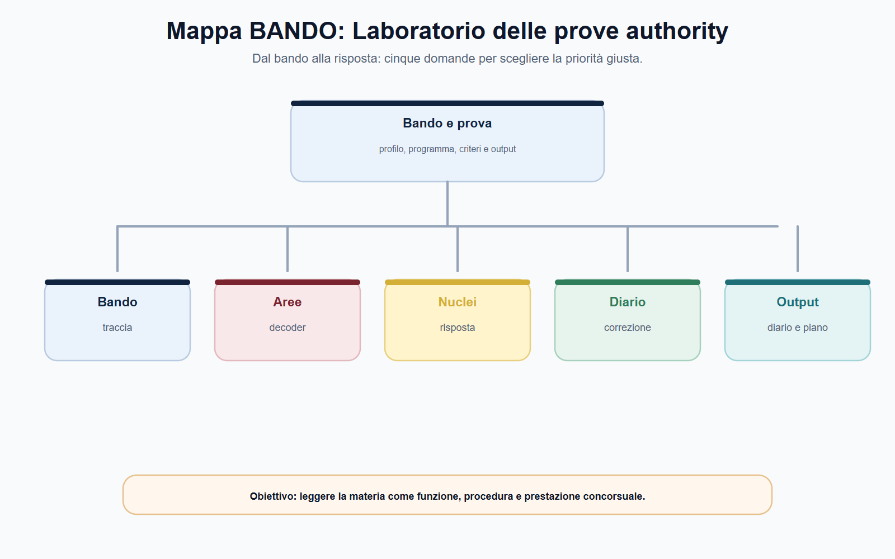
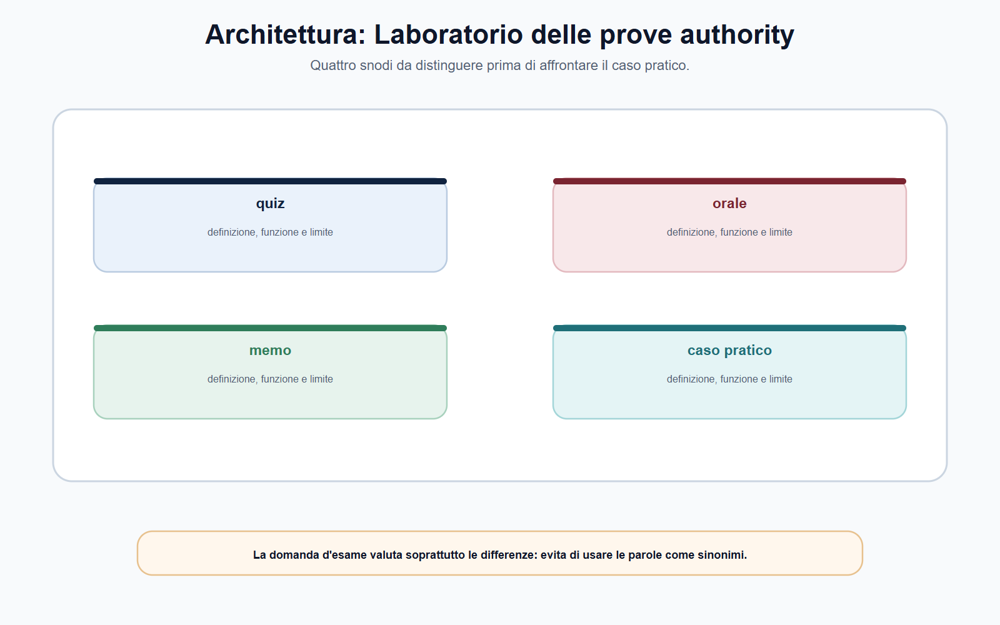
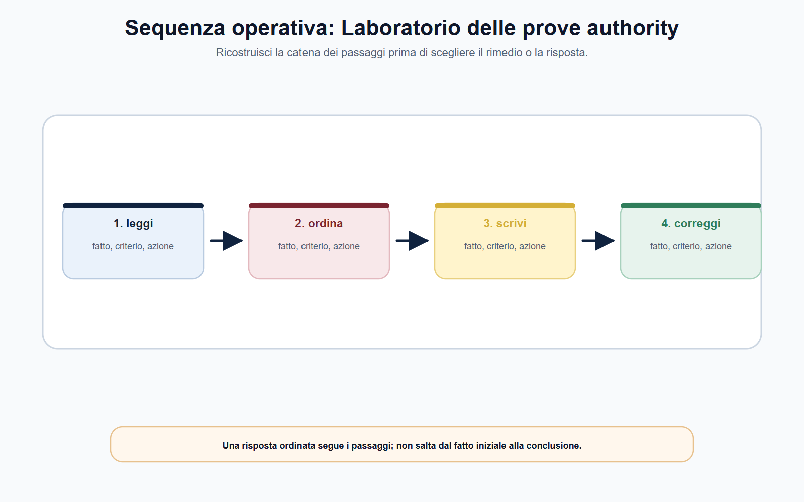
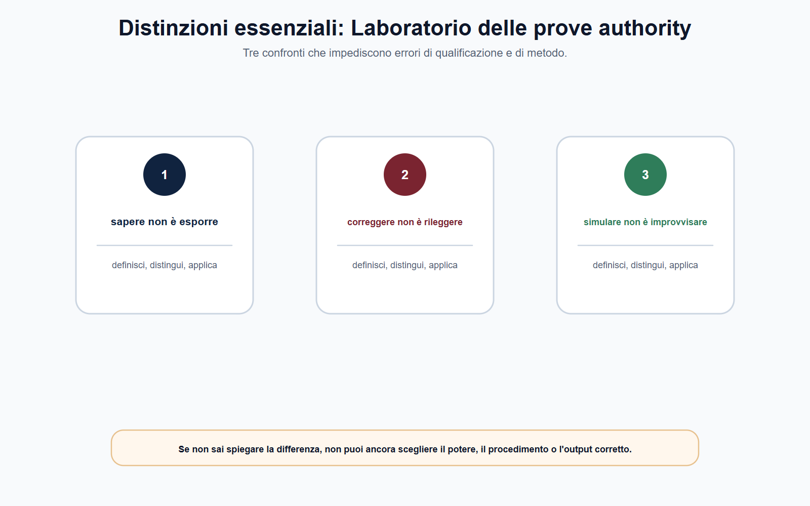
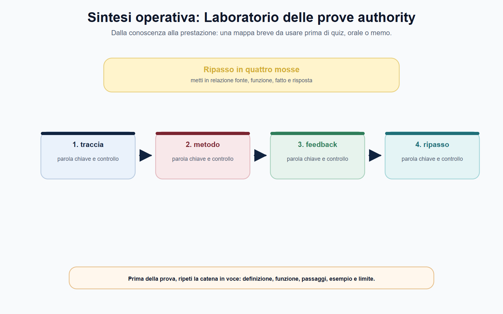

# Laboratorio delle prove authority

## N-MF05-15-01 · Quadro e criterio di lettura

**Obiettivo.** Trasformare le conoscenze settoriali in output concorsuali: quesito sintetico, caso, nota economico-regolatoria, schema di decisione, memo in inglese e colloquio tecnico.

**Domanda guida.** La traccia chiede di definire, decidere, comparare, misurare o proporre un percorso? Quale interesse è protetto e quale catena di fonti, fatti, poteri, procedure e prove deve comparire nell'output?

**Output operativo.** Dieci simulazioni, rubrica di autovalutazione, diario degli errori e piano personale 30/60/90 giorni.

> **Regola di metodo.** In una prova authority non cominciare dalla soluzione. Comincia dalla qualificazione: *quale fatto, quale settore, quale fonte, quale potere e quale prova?* Una conclusione prudente e motivata vale più di una sanzione nominata senza presupposti.

### Apertura editoriale

Il laboratorio non è la parte conclusiva in cui si “controlla se si ricorda la teoria”. È il luogo in cui la teoria diventa capacità di lavoro. Un candidato può conoscere le definizioni di regolazione, vigilanza, consultazione, sanzione o tutela dell'utente e tuttavia produrre un elaborato debole se non sa selezionare la fonte, ordinare il fatto, distinguere le autorità competenti e dichiarare quali verifiche mancano.

Le prove delle authority chiedono spesso un ragionamento composto: diritto e procedimento, dati e mercato, garanzie e impatto della decisione. Per questa ragione l'allenamento non consiste nel recitare tutti i capitoli del modulo. Consiste nell'applicare una struttura ripetibile a problemi diversi. La catena che hai usato nell'intero volume resta il tuo strumento principale:

> **fonte → interesse protetto → fatto o problema → potere → procedimento e garanzie → decisione o rimedio → controllo.**

### Obiettivo operativo del capitolo

Al termine del laboratorio il lettore deve saper:

1. leggere una traccia distinguendo richiesta espressa, dati utili e dati mancanti;
2. scegliere il formato dell'output: quesito, caso, nota, schema, memo o risposta orale;
3. usare i percorsi G, E e P senza confonderne le priorità;
4. costruire una risposta con fonte, fatto, potere, prova, garanzia e conclusione;
5. autovalutare contenuto, metodo, chiarezza, prudenza e gestione del tempo;
6. aggiornare il piano di studio alla luce degli errori reali e del bando target.

*Figura 15.1 — La tavola orienta la lettura di decoder della traccia e separa il perimetro dalle eccezioni.*

### Prima della risposta: il decoder della traccia

Una traccia può essere breve e ugualmente complessa. «Valuti l'intervento dell'Autorità» non chiede un commento generico: impone di capire quale Autorità, quale intervento, quale materia e quale standard di valutazione siano pertinenti. Prima di scrivere, annota sei elementi in forma telegrafica.

| Campo | Domanda | Cosa scrivere nel foglio di brutta |
| --- | --- | --- |
| Verbo della traccia | Illustrare, valutare, proporre, redigere, comparare? | Tipo di risposta richiesto |
| Settore | Concorrenza, servizio regolato, comunicazioni, finanza, privacy, integrità? | Autorità e fonti da cercare |
| Interesse protetto | Utente, investitore, concorrenza, stabilità, dato, integrità pubblica? | Finalità da dichiarare |
| Fatti certi | Che cosa è davvero affermato? | Cronologia e soggetti |
| Fatti mancanti | Quale informazione serve prima di decidere? | Verifiche e prove necessarie |
| Output | Quesito, parere, memo, atto o risposta orale? | Struttura e lunghezza |

Questo lavoro richiede poco tempo ma evita l'errore più costoso: rispondere a una domanda immaginata. Se la traccia non fornisce l'elemento necessario per concludere, non inventarlo. Dichiaralo e spiega come lo verificheresti. In un concorso per authority questa prudenza dimostra padronanza del procedimento, non indecisione.

*Figura 15.2 — La tavola mette a confronto profilo giuridico e profilo economico senza sovrapporli.*

### I percorsi G, E e P nella prova

Il modulo distingue tre percorsi di allenamento. Non sono tre recinti chiusi: sono priorità diverse nella selezione delle fonti e nella forma dell'argomentazione.

| Percorso | Baricentro della prova | Domanda iniziale | Rischio tipico |
| --- | --- | --- | --- |
| **G — giuridico** | Fonte, competenza, procedimento, garanzie e rimedi | Quale potere può essere esercitato e con quali limiti? | Citare norme senza applicarle ai fatti |
| **E — economico-regolatorio** | Problema di mercato, dati, incentivi, costi, qualità e impatti | Quale evidenza serve per scegliere una misura efficiente e proporzionata? | Usare indicatori o formule senza nesso regolatorio |
| **P — giuridico-economico** | Integrazione tra regola, mercato, dato e decisione | Come si costruisce una misura giuridicamente fondata e tecnicamente motivata? | Accumulare nozioni senza una tesi ordinata |

Il percorso G non può ignorare i fatti economici che spiegano un potere; il percorso E non può ignorare fonte e garanzie; il percorso P non deve raddoppiare il programma, ma tenere insieme i due piani. In ogni elaborato, quindi, scrivi almeno una frase sul perché la misura tutela un interesse e almeno una frase sul procedimento che ne rende controllabile l'esercizio.

*Figura 15.3 — La tavola ricostruisce il passaggio dai fatti alla competenza e alla decisione.*

### La struttura universale dell'elaborato

Per un quesito sintetico o un caso, usa sei blocchi. Non devono comparire necessariamente come sei titoli, ma devono essere riconoscibili.

1. **Qualificazione.** Definisci il problema e il settore, senza anticipare la conclusione.
2. **Fonte e competenza.** Individua la disciplina e l'autorità competente o il riparto da verificare.
3. **Fatti e prove.** Distingui ciò che è noto da ciò che va acquisito.
4. **Procedimento e garanzie.** Indica istruttoria, contraddittorio, consultazione, riservatezza o altre garanzie pertinenti.
5. **Opzioni e proporzionalità.** Collega le possibili misure al fatto, al rischio e all'interesse protetto.
6. **Conclusione operativa.** Formula un esito condizionato alle verifiche, indicando eventuale controllo o rimedio.

## N-MF05-15-02 · Istituti e distinzioni

> **Come lo chiede la commissione.** Una risposta eccellente non è quella che usa più sigle. È quella in cui ogni frase svolge una funzione: qualifica, prova, collega, limita o conclude. Elimina ciò che non aiuta a risolvere la traccia.

*Figura 15.4 — La tavola evidenzia le distinzioni da controllare prima di rispondere.*

### Dieci simulazioni: come usarle

Le tracce che seguono sono originali e non riproducono prove ufficiali. Allenano le competenze evidenziate da bandi rappresentativi del settore. Per ciascuna: concediti il tempo fissato dal bando; scrivi senza consultare appunti; correggi con la griglia; poi prepara una versione orale di novanta secondi. Le fonti normative e regolamentari vanno verificate sul bando e al cut-off della prova.

### Percorso G — Simulazione G1: pratica commerciale e istruttoria

**Traccia.** Un operatore pubblicizza online un abbonamento come “senza vincoli”, ma le condizioni contrattuali prevedono costi di recesso riportati in una sezione poco visibile. Numerosi consumatori segnalano il problema. Illustra come imposteresti la verifica dell'Autorità competente.

**Chiave di correzione.** Non affermare subito che esista una pratica scorretta. Qualifica il messaggio, il destinatario, il prodotto e il mercato; individua le informazioni, la loro visibilità e il possibile scarto tra promessa e condizioni. Ricostruisci potere, istruttoria, documenti, comunicazioni, contraddittorio e possibili misure nel perimetro applicabile. Distingui l'enforcement generale dalla tutela contrattuale del singolo consumatore.

### Percorso G — Simulazione G2: reclamo privacy e poteri del Garante

**Traccia.** Un candidato a una selezione pubblica scopre che una pagina istituzionale indicizza documenti contenenti dati ulteriori rispetto a quelli necessari per la pubblicazione della graduatoria. Redigi uno schema di istruttoria per il Garante.

**Chiave di correzione.** Separa obbligo di pubblicità, minimizzazione, dati esposti, ruoli del titolare e del fornitore, prove digitali e possibile tutela dell'interessato. Indica che reclamo e segnalazione non anticipano l'esito; una misura correttiva richiede fonte, verifica e motivazione. Non risolvere il caso con la formula «privacy prevale sempre sulla trasparenza».

### Percorso G — Simulazione G3: whistleblowing e ritorsione

**Traccia.** Un dipendente ha segnalato tramite il canale interno anomalie nell'esecuzione di un contratto. Poco dopo riceve una valutazione professionale negativa. Predisponi una nota sui controlli necessari prima di qualificare il fatto come ritorsione.

**Chiave di correzione.** Verifica contesto lavorativo, contenuto della segnalazione, canale, cronologia, conoscenza della segnalazione, motivazioni della valutazione, criteri usati e comparazione con situazioni analoghe. Distingui la comunicazione di ritorsione dalla prova dell'illecito contrattuale e dai procedimenti disciplinari, contabili o penali eventualmente rilevanti. La tutela del segnalante non rende irrilevante la prova.

### Percorso E — Simulazione E1: qualità del servizio e incentivo regolatorio

**Traccia.** In un servizio regolato i tempi medi di risposta ai reclami aumentano, mentre i costi dichiarati dal gestore restano invariati. Proponi una nota di analisi preliminare per l'Autorità di regolazione.

**Chiave di correzione.** Definisci il servizio, gli utenti interessati, l'indicatore di qualità e il periodo di osservazione. Chiedi dati disaggregati, confronti temporali e territoriali, metodologia di rilevazione, reclami, cause organizzative e possibili effetti distributivi. L'ipotesi di incentivo o standard deve seguire, non precedere, l'evidenza; valuta anche consultazione, proporzionalità e monitoraggio.

### Percorso E — Simulazione E2: consultazione e impatto regolatorio

**Traccia.** Un'Autorità intende aggiornare le regole di accesso a una rete essenziale. Elabora la scaletta di una consultazione che consenta di comparare le opzioni regolatorie.

**Chiave di correzione.** Parti dal problema e dagli obiettivi; identifica stakeholder, dati necessari, opzioni realistiche, impatti su concorrenza, investimenti, utenti e operatori minori. Spiega che la consultazione non è un referendum: raccoglie evidenze e ragioni da valutare nella motivazione. Prevedi pubblicazione dei contributi secondo le regole applicabili, analisi delle osservazioni e monitoraggio successivo.

### Percorso E — Simulazione E3: tariffa, dati e contabilità regolatoria

**Traccia.** Un gestore propone un incremento tariffario per coprire costi comuni di attività regolata e non regolata. Indica i dati e i controlli necessari per valutarne l'ammissibilità.

**Chiave di correzione.** Non calcolare una tariffa senza base dati. Richiedi separazione contabile, criteri di imputazione, cost driver, perimetro delle attività, verificabilità delle fonti e coerenza nel tempo. La questione è evitare trasferimenti impropri di costo e mantenere un collegamento tra tariffa, qualità, investimento e tutela dell'utente, secondo il metodo applicabile.

### Percorso P — Simulazione P1: piattaforma digitale, utenti e concorrenza

**Traccia.** Una piattaforma modifica le condizioni di accesso per gli operatori professionali e rende meno visibili alcune offerte, senza spiegare i criteri. Esponi quali profili devono essere distinti prima di individuare l'autorità competente.

**Chiave di correzione.** Separa comunicazioni e servizi digitali, tutela dell'utente o dell'operatore, concorrenza, trasparenza dei criteri, eventuale regolazione europea e riparto nazionale. Non basta indicare AGCOM o AGCM: descrivi attività, soggetti, effetti, fonte, dati da acquisire e possibili cooperazioni. Il fatto digitale non elimina il bisogno di una competenza specifica.

### Percorso P — Simulazione P2: intermediario finanziario, condotta e prudenza

**Traccia.** Un cliente lamenta che una banca abbia proposto un prodotto complesso senza spiegare rischi e costi; nello stesso periodo emergono notizie sulla riduzione della redditività dell'istituto. Redigi una nota che distingua i possibili piani di controllo.

**Chiave di correzione.** Distingui subito condotta verso il cliente, servizio e prodotto; stabilità e sana gestione dell'intermediario; eventuale mercato finanziario; rimedi individuali. La perdita o il disagio economico non provano automaticamente violazione o fragilità prudenziale. Indica documenti, flussi informativi e autorità da qualificare secondo prodotto e fonte, evitando un riparto per slogan.

## N-MF05-15-03 · Poteri, procedura e conseguenze

### Percorso P — Simulazione P3: assicurazione, reclami e solvibilità

**Traccia.** Un'impresa assicurativa riceve molti reclami per dinieghi di sinistro relativi alla stessa garanzia e presenta una crescita rapida dei premi. Illustra il percorso di verifica.

**Chiave di correzione.** Costruisci due piani: condotta e gestione della garanzia, da valutare attraverso polizze, informative, distribuzione e reclami; profilo prudenziale, da esaminare con dati su rischi, organizzazione, risorse e capacità di adempiere agli impegni. Il reclamo individuale non decide la solvibilità, ma la serialità dei reclami può essere un segnale di vigilanza. Indica i possibili rimedi individuali senza trasformare l'autorità in giudice di ogni sinistro.

### Percorso P — Simulazione P4: memo in inglese e cooperazione europea

**Traccia.** Write a short memo (maximum 140 words) explaining why a national authority should cooperate with EU counterparts before adopting a measure affecting a cross-border digital service.

**Model outline.** Open with the public interest and the cross-border element. State that competence and legal basis must be assessed under the applicable EU and national framework. Mention information exchange, consistent enforcement, procedural rights and evidence. Close by explaining that cooperation improves effectiveness and legal certainty but does not remove the need for a reasoned national decision. Avoid legal claims that cannot be verified from the applicable source.

### Rubrica di correzione: dieci punti per ogni risposta

Assegna un punto a ogni voce. Non usare il punteggio per premiarti: usalo per scegliere il prossimo ripasso.

| Criterio | Domanda di controllo |
| --- | --- |
| 1. Domanda compresa | Ho risposto al verbo e all'oggetto della traccia? |
| 2. Settore qualificato | Ho individuato attività, mercato o interesse protetto? |
| 3. Fonte prudente | Ho richiamato la fonte o dichiarato la necessità di verificarla? |
| 4. Competenza | Ho evitato di attribuire il caso a un'autorità per semplice intuizione? |
| 5. Fatti distinti | Ho separato fatti certi, allegazioni e punti da accertare? |
| 6. Prova | Ho indicato dati, documenti, log, atti o elementi istruttori utili? |
| 7. Garanzie | Ho considerato contraddittorio, riservatezza, consultazione o partecipazione quando pertinenti? |
| 8. Proporzionalità | Ho collegato la misura al rischio e alle alternative? |
| 9. Conclusione | Ho dato un esito operativo, senza presentarlo come automatico? |
| 10. Lingua e ordine | Il testo è leggibile, sintetico e privo di sigle non spiegate? |

Una risposta sotto 6/10 non richiede di riscrivere l'intero capitolo di teoria: individua il primo anello mancante della catena. Se manca la competenza, ripassa la mappa delle autorità; se manca la prova, ripassa istruttoria e dati; se manca la proporzionalità, confronta le opzioni prima di decidere.

### Gestione del tempo e diario degli errori

Il tempo non si gestisce scrivendo più velocemente. Si gestisce decidendo quando smettere di raccogliere idee e iniziare a ordinare la risposta. In una prova breve, riserva una prima quota alla decodifica della traccia e alla scaletta, la parte centrale alla redazione e una quota finale alla verifica di competenza, fonte e conclusione. Adatta le percentuali al tempo effettivamente previsto dal bando: questo capitolo non sostituisce istruzioni, griglie o prove ufficiali dell'ente.

Nel **Diario degli errori** registra una sola frase precisa, non commenti vaghi come «devo studiare di più». Esempi utili: «ho attribuito la tutela dell'investitore alla vigilanza prudenziale senza qualificare il prodotto»; «ho proposto una sanzione senza indicare fatti e contraddittorio»; «ho usato un indicatore tariffario senza spiegare fonte e periodo». Accanto, scrivi l'azione di correzione: pagina da ripassare, fonte da verificare, mini-caso da riscrivere o risposta orale da registrare.

| Errore osservato | Correzione immediata | Ripasso mirato |
| --- | --- | --- |
| Confusione fra autorità | Rifai la mappa interesse–potere–ente | Capitoli 1, 8–14 pertinenti |
| Conclusione automatica | Aggiungi una sezione “verifiche necessarie” | Capitoli 5 e 6 |
| Dati senza metodo | Indica fonte, periodo, unità e limite del dato | Capitolo 7 |
| Procedimento assente | Inserisci istruttoria e garanzie | Capitoli 4 e 5 |
| Testo dispersivo | Riduci a sei blocchi universali | Questo laboratorio |

### Piano 30/60/90 giorni e registro degli aggiornamenti

Il laboratorio funziona se entra nel calendario di studio. Il piano seguente è una traccia modulabile, non una promessa di preparazione universale.

| Orizzonte | Priorità | Output minimo |
| --- | --- | --- |
| 30 giorni | Mappa enti, fonti e nucleo comune; quattro simulazioni | Un elaborato G, uno E, due P e diario degli errori |
| 60 giorni | Verticale dell'ente target, fonti vigenti e altre quattro simulazioni | Due risposte orali registrate, un memo e una revisione del Decoder |
| 90 giorni | Simulazioni complete, prova a tempo e correzione comparata | Dieci tracce corrette, registro aggiornamenti e piano degli ultimi sette giorni |

Il **registro degli aggiornamenti** contiene soltanto ciò che incide sulla prova: bando, allegati, programma, forma dell'esame, fonti settoriali, atti dell'ente e scadenze. Ogni riga deve indicare data di verifica, fonte primaria, capitolo coinvolto e azione di aggiornamento. Non trasformarlo in una raccolta indistinta di notizie.

*Figura 15.5 — La tavola chiude il percorso collegando memo e caso a piano 30/60/90.*

### Conclusione: decidere senza scorciatoie

Il filo che unisce le authority non è una presunta uniformità istituzionale. È un modo di lavorare: definire il problema, individuare la fonte attributiva, distinguere competenze vicine, costruire un'istruttoria proporzionata e motivare la decisione senza anticipare ciò che i fatti non dimostrano. Indipendenza non significa assenza di controlli; cooperazione non significa gerarchia; vigilanza non coincide con sanzione; reclamo individuale e rischio sistemico possono comunicare senza diventare lo stesso procedimento.

## N-MF05-15-04 · Applicazione alla prova

Nella prova, questa architettura vale più di un elenco di articoli. Una risposta giuridica solida nomina presupposto, potere, garanzia ed effetto. Una risposta economica espone dati, metodo, controfattuale e incertezza. Un memo di policy rende visibili opzioni, costi, benefici, rischio di attuazione e indicatore di monitoraggio. In tutti e tre i casi il candidato deve dichiarare ciò che manca: l'assenza di un documento o di un dato non si colma con una formula assoluta, ma con una richiesta istruttoria mirata.

Il percorso dei quindici capitoli può essere ricondotto a cinque domande finali. **Che cosa è accaduto?** Si separano fatti, allegazioni e dati mobili. **Chi può intervenire?** Si verifica la fonte, anche quando il caso attraversa livelli nazionali ed europei. **Con quale procedimento?** Si rispettano contraddittorio, prova, proporzionalità e motivazione. **Quale esito è possibile?** Si distinguono prescrizione, rimedio, impegno, sanzione, ADR e controllo del giudice. **Come si controlla l'effetto?** Si definiscono monitoraggio, indicatori e condizioni di riapertura.

Prima di consegnare, il candidato può rileggere il testo in tre passaggi. Nel primo cancella attribuzioni indimostrate come “sempre”, “solo” e “automaticamente”. Nel secondo controlla che ogni autorità sia associata a un potere previsto, non a una generica missione. Nel terzo verifica che la conclusione risponda alla domanda e indichi un passo operativo. Se i tre controlli reggono, la risposta non è soltanto corretta: è utilizzabile da un ufficio.

Il volume mantiene infine una regola di aggiornamento. Bandi, soglie, termini, moduli, elenchi di vigilati e assetti applicativi vanno controllati alla data della procedura. Le architetture concettuali restano il punto di partenza, ma non autorizzano a ignorare la fonte vigente. Studiare le authority significa quindi allenare una competenza durevole: orientarsi in sistemi complessi conservando precisione, prudenza e capacità di decisione.
### Mappa BANDO

| Passaggio | Azione nel laboratorio | Output verificabile |
| --- | --- | --- |
| **B — Bando** | Leggi forma della prova, ente, profilo, tempo e fonti richieste | Decoder aggiornato |
| **A — Aree** | Seleziona nucleo comune, verticale e richiami puntuali a  | Piano G/E/P motivato |
| **N — Nuclei** | Trasforma capitoli in domande e casi | Dieci scalette di risposta |
| **D — Diario** | Registra un errore concreto dopo ogni prova | Tabella errore–causa–correzione |
| **O — Output** | Scrivi, esponi, confronta e riscrivi | Elaborato, memo e risposta orale |

> **Da sapere in cinque righe.** Le prove authority valutano il ragionamento, non l'accumulo di sigle. Ogni risposta parte dalla qualificazione del fatto e collega fonte, interesse, potere, procedimento, prova e conclusione. Il percorso G privilegia garanzie e competenza; E evidenze, dati e impatti; P integra i due piani. Una simulazione è utile solo se viene corretta con criteri espliciti. Il bando target decide sempre forma, tempi, fonti e livello di approfondimento richiesto.

### Caso guidato conclusivo: il memo intersettoriale

**Traccia.** Un'impresa che gestisce una piattaforma di comparazione di offerte energetiche comunica agli utenti una variazione delle condizioni di servizio. Alcuni dati indicano che le offerte con maggiore remunerazione per la piattaforma sono poste in evidenza; un'associazione di consumatori lamenta informazioni insufficienti. L'impresa opera in più Stati membri.

La risposta iniziale non deve scegliere una sola autorità. Il caso può coinvolgere tutela dell'utente, correttezza dell'informazione, regolazione del settore energetico, comunicazioni digitali, concorrenza e, se necessario, cooperazione europea. Il candidato deve prima descrivere attività, servizio, destinatari, funzionamento dei criteri di visibilità e fonti applicabili. Poi individua quali dati servono: condizioni contrattuali, architettura dell'interfaccia, remunerazioni, log di visualizzazione, reclami, quote di traffico e mercato rilevante da verificare.

La nota prosegue distinguendo possibili competenze e cooperazioni, senza sommarle. Se emerge una questione di pratica commerciale, va considerato il relativo quadro; se la questione riguarda regole settoriali o utenti di un servizio regolato, serve la fonte pertinente; se vi sono effetti transfrontalieri, occorre verificare il meccanismo europeo applicabile. La conclusione non è «tutte le Autorità devono sanzionare»: è una proposta di istruttoria coordinata, con oggetto, prove, garanzie e limiti di ciascun intervento.

### Domanda da commissario

**Come imposta una risposta scritta a un caso che coinvolge più authority?**

### Risposta orale modello

«Parto dalla qualificazione dei fatti e dall'interesse protetto, senza scegliere subito l'autorità. Individuo attività, soggetti, mercato o servizio e fonti potenzialmente applicabili. Distinguo poi i profili: concorrenza, tutela dell'utente, regolazione settoriale, prudenza, privacy o integrità, verificando se siano davvero presenti. Per ciascun profilo collego potere, procedimento, prove necessarie e garanzie. Solo alla fine indico l'autorità competente, l'eventuale cooperazione e una conclusione proporzionata. Questo metodo evita sovrapposizioni e consente di spiegare perché un unico fatto può generare procedimenti diversi.»

### Domanda-trappola

**In una simulazione, se riconosco l'autorità competente posso omettere la fonte e l'istruttoria?**

No. La competenza è solo un anello della risposta. Senza fonte, fatti, prove, garanzie e motivazione, la conclusione resta un'affermazione non verificabile.

### Errore tipico

**Errore:** «Per dimostrare preparazione, elenco tutte le authority che potrebbero avere un interesse nel caso.»

**Correzione:** seleziona soltanto le competenze che derivano dai fatti e dalla fonte. Se il riparto non è risolvibile con i dati della traccia, dichiara la verifica necessaria invece di creare un elenco di sigle.

### Mini-esercizio di consolidamento

Scegli una delle dieci simulazioni e produci, in 25 minuti, una risposta di massimo 350 parole. Poi usa la rubrica dei dieci punti e completa la scheda.

## N-MF05-15-05 · Consolidamento e verifica

| Campo | Nota personale |
| --- | --- |
| Percorso scelto | G, E o P e motivo |
| Punto più forte | Il passaggio che hai argomentato con maggiore precisione |
| Punto da correggere | Fonte, competenza, prova, garanzia, dato o conclusione |
| Azione entro 48 ore | Riscrittura, ripasso, fonte primaria o simulazione gemella |
| Errore da trasferire nel Diario | Una frase concreta e riutilizzabile |

L'esercizio è concluso soltanto quando hai prodotto la seconda versione. La prima stesura misura il livello; la riscrittura costruisce la competenza.

### Checklist per una nota d'ufficio

Una nota professionale su decoder della traccia deve consentire al decisore di capire che cosa è noto, quale regola si applica e che cosa resta da verificare. L'apertura contiene il quesito in una frase; il quadro distingue profilo giuridico da profilo economico; l'analisi collega ogni fatto a un documento. Le citazioni normative sostengono il ragionamento, ma non lo sostituiscono. Se due fonti sembrano divergere, controlla data, rango, ambito e disciplina transitoria prima di parlare di conflitto.

La sezione operativa descrive profilo policy in ordine cronologico e assegna ogni attività al soggetto competente. La parte su memo e caso espone rischio e alternativa, evitando verbi assoluti quando l'istruttoria è incompleta. La conclusione su piano 30/60/90 propone il passo successivo, il controllo da svolgere e, se utile, un termine interno di riesame che non venga confuso con un termine legale. Riletta da sola, la nota deve mostrare perché l'opzione scelta è preferibile e quali nuovi elementi potrebbero modificarla.

### Controllo incrociato

Rileggi ora il risultato da tre prospettive. Come candidato, verifica di avere definito decoder della traccia senza dilungarti su nozioni estranee. Come istruttore, controlla che la distinzione fra profilo giuridico e profilo economico poggi su documenti e non su supposizioni. Come decisore, chiediti se il passaggio dedicato a profilo policy giustifichi davvero l'esito proposto. Se una prospettiva non trova risposta, riapri l'analisi nel punto preciso invece di aggiungere una conclusione generica.

Completa il controllo con una riga dedicata alle alternative. Spiega quale diversa qualificazione sarebbe possibile se cambiasse un fatto decisivo, quale fonte farebbe mutare il perimetro di memo e caso e quale conseguenza produrrebbe su piano 30/60/90. L'esercizio allena a riconoscere le opzioni quasi corrette: nei concorsi l'errore più insidioso non è sempre una regola falsa, ma una regola vera applicata al soggetto, al tempo o al procedimento sbagliato. La risposta finale deve perciò contenere anche il proprio limite di validità.

### ▣ Verifica ragionata

**Quesito 1.** Qual è il primo controllo quando la traccia richiama decoder della traccia?

**Risposta corretta:** individuare il fatto rilevante, la fonte e il perimetro della competenza prima di scegliere l'istituto. La parola usata nella traccia può orientare, ma non dimostra da sola quale autorità o quale potere siano applicabili. Una risposta efficace espone il criterio e poi lo applica ai dati disponibili.

**Quesito 2.** profilo giuridico e profilo economico possono essere trattati come espressioni equivalenti?

**Risposta corretta:** no. Devono essere distinti per funzione, presupposti, soggetti ed effetti. Dopo la distinzione si può spiegare il loro coordinamento. Nei quiz, l'opzione errata spesso contiene una definizione plausibile ma trasferisce a un istituto la funzione dell'altro.

**Quesito 3.** Un dato tratto da un bando storico o da una pagina operativa vale per ogni procedura successiva?

**Risposta corretta:** no. Il dato è utile come esempio datato; requisiti, termini, soglie, composizione delle prove e modalità di ricorso devono essere ricontrollati nella fonte vigente e nel bando applicabile. La regola stabile va separata dal dato mobile.

**Quesito 4.** Come va usato profilo policy nel elaborato finale?

**Risposta corretta:** va collegato a fatti, competenza, sequenza procedurale e conseguenza. Limitarsi a una definizione non dimostra capacità applicativa; anticipare l'esito senza istruttoria produce invece una conclusione non sostenuta. La motivazione deve rendere visibile il passaggio compiuto.

**Quesito 5.** La finalità generale di tutela attribuisce automaticamente qualsiasi potere in materia di memo e caso?

**Risposta corretta:** no. Ogni potere richiede una fonte attributiva, un oggetto e un procedimento. La missione istituzionale aiuta a interpretare il sistema, ma non sostituisce la verifica della competenza concreta né consente di confondere vigilanza, rimedio individuale e sanzione.

**Quesito 6.** Quale controllo conclusivo riduce gli errori su piano 30/60/90?

**Risposta corretta:** confrontare la conclusione con la domanda, la fonte e i fatti effettivamente disponibili. Se manca un elemento, la risposta deve indicare quale documento o accertamento serve. Dichiarare il limite informativo è più professionale che colmarlo con un automatismo.

### Caso ragionato di chiusura

Un ufficio riceve una segnalazione che usa formule generiche, richiama decoder della traccia e chiede un intervento immediato su piano 30/60/90. Il fascicolo contiene una schermata, una comunicazione non datata e il riferimento a un bando precedente. La soluzione non consiste nello scegliere subito una sanzione. Occorre qualificare il fatto, verificare autenticità e data dei documenti, individuare la fonte vigente, distinguere profilo giuridico da profilo economico e stabilire quale amministrazione possa acquisire gli elementi mancanti. Solo allora si valuta profilo policy, si collega memo e caso al potere pertinente e si motiva il passo successivo. Il caso è risolto correttamente quando la conclusione resta proporzionata alle prove e separa la regola stabile dai dati da aggiornare.
