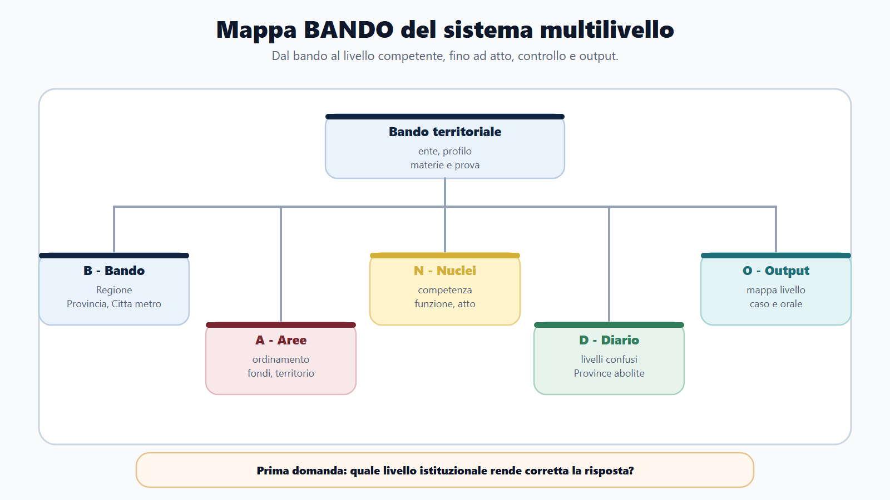
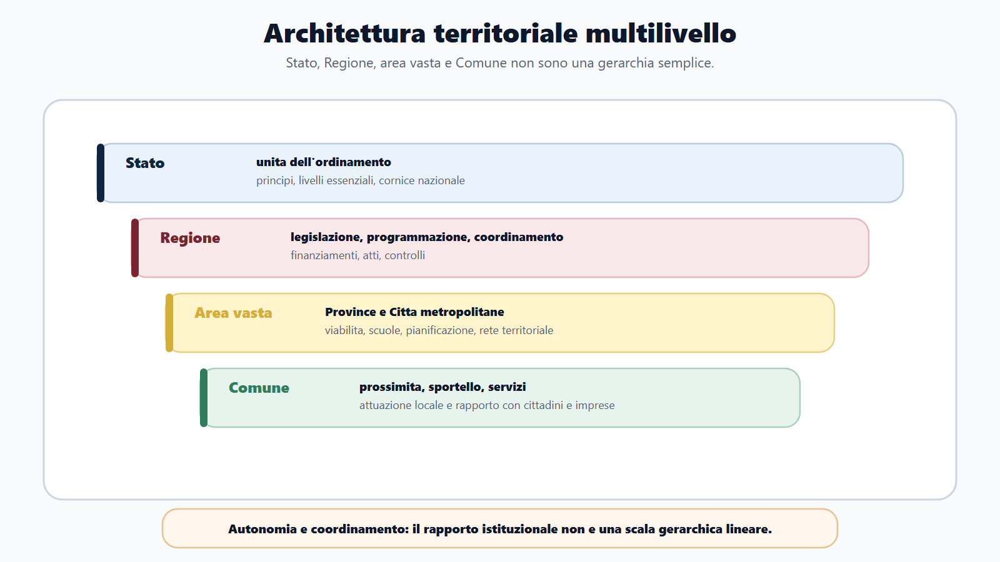
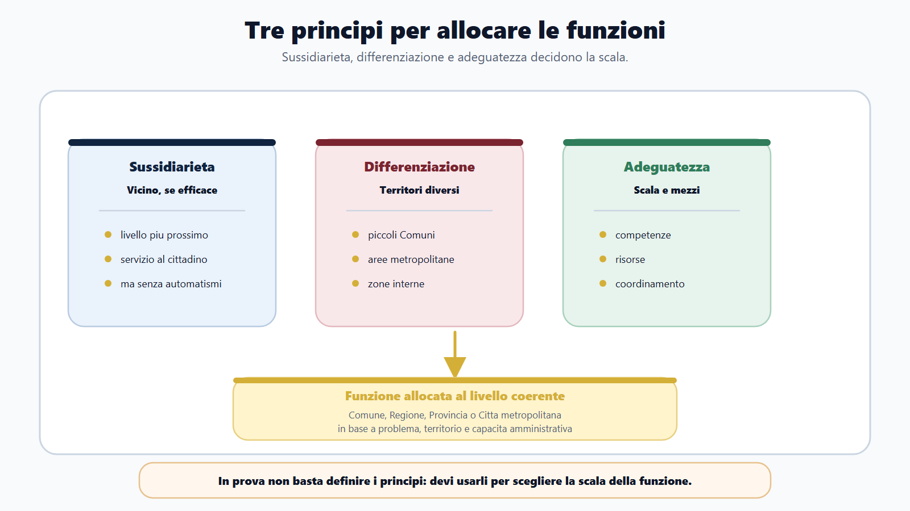
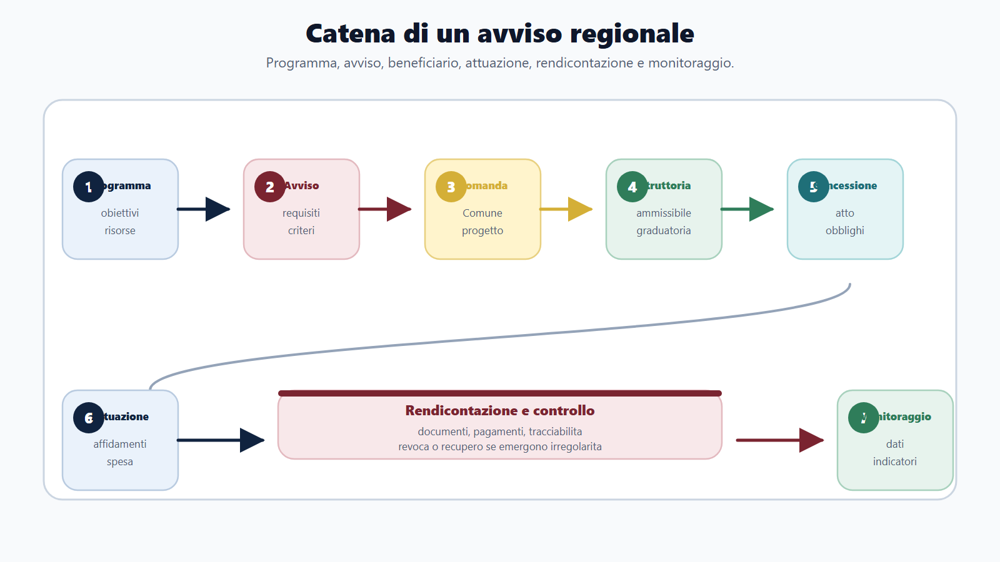
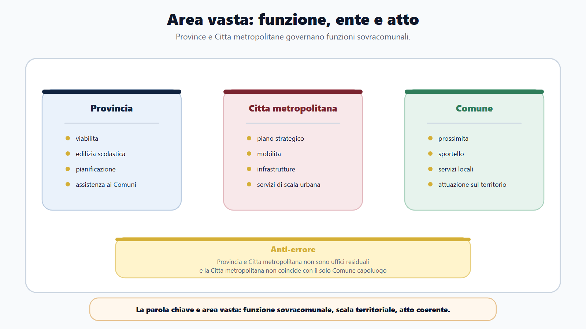

# Il sistema territoriale multilivello

## Apertura editoriale: non un ente, ma un sistema
Nei concorsi delle funzioni locali la parola "ente locale" compare spesso come se indicasse un soggetto unico. È un'impostazione rischiosa per i Comuni e diventa fuorviante quando il programma comprende Regioni, Province e Città metropolitane. In questo caso bisogna studiare un sistema territoriale multilivello, formato da livelli di governo con autonomie, funzioni, organi, atti e responsabilità differenti.

La Regione non è un Comune più grande. La Provincia non è un residuo amministrativo privo di rilievo. La Città metropolitana non è semplicemente il Comune capoluogo. Il Comune, a sua volta, non scompare quando si passa al livello regionale o di area vasta: resta il punto in cui molte politiche diventano servizio, autorizzazione, intervento, contributo, opera pubblica o controllo sul territorio.

Il primo obiettivo non è memorizzare liste. È orientarsi. Quando un bando parla di ordinamento regionale, programmazione, fondi europei, PNRR, viabilità, edilizia scolastica, area vasta, servizi pubblici locali o società partecipate, richiede competenze diverse da quelle del funzionario comunale generalista. Il candidato deve collegare livelli istituzionali e flussi operativi.

Il Metodo BANDO, applicato a M-FL02, inizia quindi da una mappa: chi decide, chi programma, chi gestisce, chi finanzia, chi controlla, chi attua e quale atto documenta ciascun passaggio.

### Obiettivo operativo del capitolo
Una sola trattazione non può esaurire l'ordinamento regionale e la disciplina delle Province e delle Città metropolitane. Qui si costruisce la base necessaria per collocare correttamente statuti, organi, funzioni, atti, bilancio, fondi, PNRR, area vasta e servizi pubblici. Prima viene il sistema; poi i singoli istituti.

Al termine del capitolo devi saper fare cinque cose:

1. distinguere Regione, Provincia, Città metropolitana, Comune e Stato senza trasformarli in una gerarchia amministrativa semplice;
2. spiegare perché i principi di sussidiarietà, differenziazione e adeguatezza sono criteri operativi, non formule decorative;
3. leggere un bando regionale o di area vasta individuando livello istituzionale, profilo e materie decisive;
4. collegare una funzione al tipo di atto o procedimento che può comparire in prova;
5. costruire una risposta orale ordinata sul governo territoriale multilivello.

Questa mappa evita di perdere il filo quando il programma passa dal diritto degli enti locali alla programmazione regionale, oppure dalla viabilità provinciale ai servizi pubblici locali e ai programmi finanziati.

### Come usare questo capitolo
Usalo come capitolo di orientamento. Non devi impararlo come una pagina di definizioni, ma come una griglia da applicare ai bandi. Ogni volta che incontri una materia del modulo, chiediti:

- a quale livello di governo appartiene il problema;
- quale ente ha competenza normativa, programmatoria, amministrativa o gestionale;
- quali altri enti entrano nella catena;
- quale atto rende visibile la decisione;
- quale prova può derivarne: quiz, orale, caso, schema, determina, relazione, nota istruttoria.

Questa griglia vale per tutti i profili. Il funzionario amministrativo regionale la usera' per leggere atti e procedimenti. Il profilo legislativo la usera' per capire competenza, drafting e qualità della regolazione. Il profilo tecnico territoriale la usera' per viabilità, scuole, espropri, pianificazione e lavori. Il profilo fondi UE/PNRR la usera' per seguire programma, avviso, progetto, soggetto attuatore, monitoraggio e controllo.

### Mappa BANDO del sistema territoriale multilivello

| Lettera | Domanda da porsi | Applicazione in M-FL02 |
|---|---|---|
| B - Bando | Chi assume e per quale profilo? | Regione, Provincia o Città metropolitana cambiano materie, atti e casi. |
| A - Aree | Quali aree pesano di più? | Ordinamento regionale, area vasta, fondi, PNRR, territorio, servizi pubblici, bilancio. |
| N - Nuclei | Quali concetti non posso sbagliare? | Autonomia, competenza, funzione, organo, procedimento, programmazione, controllo. |
| D - Diario | Quali errori devo intercettare subito? | Confondere livelli, dire che le Province sono abolite, sovrapporre politica e gestione. |
| O - Output | Cosa devo saper produrre? | Mappa livello-funzione-atto, caso di competenza, risposta orale, check-list istruttoria. |

La mappa evita lo studio enciclopedico. Se alla voce "Regione" associ soltanto gli organi costituzionali, la preparazione resta incompleta. Se confondi la Città metropolitana con il Comune capoluogo, sbagli scala. E le sigle dei fondi UE, da sole, non aiutano a risolvere un caso. Il bando va scomposto in funzioni.

## N-FL02-01-01 · La Repubblica delle autonomie territoriali

### Spiegazione teorica

### La cornice costituzionale
La Costituzione italiana non descrive la Repubblica come un blocco amministrativo uniforme. La colloca in un sistema di autonomie territoriali: Comuni, Province, Città metropolitane, Regioni e Stato sono livelli che partecipano all'organizzazione della Repubblica, secondo le rispettive competenze. Questo dato ha conseguenze molto concrete nei concorsi.

La prima conseguenza è che l'autonomia non coincide con indipendenza. Ogni ente opera dentro la Costituzione, le leggi, il riparto delle competenze, i vincoli finanziari, i principi dell'azione amministrativa e le forme di controllo previste dall'ordinamento.

La seconda conseguenza è che non tutto ciò che accade sul territorio è "comunale". Un servizio può essere erogato dal Comune, programmato dalla Regione, finanziato da un programma europeo, realizzato da un soggetto attuatore, controllato in sede contabile e monitorato su una piattaforma nazionale. Nel caso pratico il candidato deve vedere la catena, non solo l'ultimo sportello.

La terza conseguenza è che le competenze vanno lette per materia e per funzione. La Regione può avere competenze legislative e amministrative; la Provincia e la Città metropolitana svolgono funzioni di area vasta; il Comune cura interessi della comunità locale e servizi di prossimità; lo Stato mantiene funzioni unitarie, livelli essenziali, principi e poteri che assicurano coerenza nazionale. La risposta corretta non nasce da una formula unica, ma dal riconoscimento del livello rilevante.

### Quattro parole da non confondere

Un **ente territoriale** rappresenta una comunità insediata su un territorio ed è dotato dell'autonomia riconosciuta dall'ordinamento. Un **livello di governo** indica la posizione funzionale dalla quale vengono assunte decisioni pubbliche: nazionale, regionale, di area vasta o comunale. Un **ufficio amministrativo** è invece un'articolazione organizzativa dell'ente; non possiede automaticamente tutte le competenze dell'amministrazione a cui appartiene. La **funzione** è il compito pubblico attribuito dalla legge o esercitato secondo la disciplina applicabile. Confondere queste quattro nozioni porta ad attribuire a un ufficio ciò che spetta a un organo, o a un ente ciò che appartiene a un diverso livello.

Anche **competenza** e **funzione** non sono sinonimi perfetti. La funzione descrive il settore di attività pubblica; la competenza individua il potere o il compito attribuito a uno specifico soggetto. In una politica territoriale possono concorrere programmazione, finanziamento, attuazione e controllo, distribuiti tra soggetti diversi. Perciò la domanda «chi è competente?» deve essere precisata: competente a programmare, ad adottare l'atto, a realizzare l'intervento o a controllarne l'esecuzione?

### Conseguenze per la prova

In un quiz, cerca l'affermazione che rispetta autonomia e riparto, evitando parole assolute come «sempre» e «soltanto» quando la fonte non le giustifica. In una risposta orale, parti dalla cornice costituzionale e passa subito alle differenze operative. In un caso, costruisci una tabella con cinque colonne: livello, funzione, soggetto, atto, controllo. Questo schema impedisce di rispondere con formule vaghe come «provvede l'ente locale».

Una politica per riqualificare servizi in piccoli Comuni, per esempio, può essere programmata e finanziata dalla Regione, attuata dai Comuni, coordinata a livello sovracomunale e controllata secondo l'avviso. I compiti sono distribuiti dentro un procedimento unitario; non nasce per questo una gerarchia generale tra gli enti. In prova bisogna ricostruire la relazione giuridica concreta, anziché disegnare una piramide astratta.

La regola di controllo è semplice: ogni volta che nomini un ente, aggiungi la funzione che sta esercitando e la fonte che può attribuirla. Se non riesci a completare la frase, la qualificazione è ancora troppo generica per sostenere una risposta concorsuale.

Questo controllo linguistico rende visibile anche l'eventuale passaggio logico mancante.

La risposta diventa così verificabile: ogni affermazione indica soggetto, compito e base dell'attribuzione.

## N-FL02-01-02 · Sussidiarietà, differenziazione e adeguatezza
Nei concorsi questi tre principi compaiono spesso insieme e finiscono facilmente ridotti a una sequenza mnemonica. Servono invece a spiegare perché una funzione è collocata a un livello anziché a un altro.

La sussidiarietà suggerisce che le funzioni amministrative siano attribuite al livello più vicino ai cittadini quando quel livello è in grado di esercitarle efficacemente. Non è però un automatismo comunale. Se la dimensione del problema supera il confine comunale, se richiede coordinamento territoriale, se coinvolge infrastrutture, reti, bacini, risorse o standard omogenei, può essere giustificato un livello più ampio.

La differenziazione ricorda che i territori non sono tutti uguali. Un piccolo Comune, una grande area urbana, una Provincia montana, una Regione con forti disparità interne o una Città metropolitana con flussi pendolari complessi non presentano gli stessi fabbisogni organizzativi. La funzione può essere modulata in base alle caratteristiche dell'ente e del territorio.

L'adeguatezza impone una domanda di realismo amministrativo: l'ente è in grado di esercitare quella funzione con mezzi, competenze, scala e strumenti adeguati? Se la risposta è negativa, occorre una diversa allocazione, una gestione associata, un coordinamento o un supporto superiore.

Per il candidato questi principi producono un metodo di risposta:

| Principio | Domanda pratica | Esempio concorsuale |
|---|---|---|
| Sussidiarietà | Qual è il livello più vicino che può agire efficacemente? | Servizio locale erogato dal Comune ma finanziato da programma regionale. |
| Differenziazione | Il territorio richiede soluzioni diverse? | Area montana, area metropolitana, piccoli Comuni, zone interne. |
| Adeguatezza | L'ente ha scala e mezzi sufficienti? | Pianificazione di area vasta o viabilità provinciale non riducibile al singolo Comune. |

In una risposta orale questi principi vanno sempre collegati a un caso. La formula "si applica la sussidiarietà" è insufficiente se non spiega perché il livello istituzionale scelto è proporzionato alla funzione.

I tre principi vanno letti insieme: la vicinanza senza capacità può produrre una funzione inefficace; la capacità senza attenzione alle differenze territoriali può generare una soluzione uniforme ma inadeguata; la differenziazione senza una cornice comune può frammentare l'azione amministrativa. In prova, una buona risposta espone quindi il criterio, lo applica ai fatti e motiva perché la scala scelta è proporzionata.

Se cambia il territorio, può cambiare anche la soluzione organizzativa più adatta alla funzione.

### I livelli del sistema: ruolo e rischio di confusione
La seguente tabella non sostituisce lo studio dei singoli capitoli, ma offre la mappa di orientamento.

| Livello | Ruolo nel sistema | Che cosa guardare in prova |
|---|---|---|
| Stato | Garantisce unità dell'ordinamento, principi, livelli essenziali, cornice normativa e funzioni riservate. | Riparto competenze, principi fondamentali, poteri sostitutivi, vincoli finanziari, normativa nazionale. |
| Regione | Legifera nelle materie di competenza, programma, coordina, finanzia, amministra e controlla politiche territoriali. | Statuto, organi, leggi regionali, delibere, piani, bandi, programmi, fondi, rapporti con enti locali. |
| Provincia | Ente di area vasta, con funzioni fondamentali e ruolo tecnico-territoriale dopo la L. 56/2014. | Viabilità, edilizia scolastica, pianificazione territoriale, assistenza ai Comuni, coordinamento. |
| Città metropolitana | Ente di area vasta delle grandi aree urbane, con funzioni strategiche e di coordinamento metropolitano. | Piano strategico, pianificazione territoriale, mobilità, servizi e infrastrutture di scala metropolitana. |
| Comune | Ente di prossimità, cura interessi della comunità locale e servizi rivolti direttamente a cittadini e imprese. | Attuazione locale, sportelli, servizi, procedimenti, regolamenti, atti gestionali, rapporto con utenti. |

Questi livelli non sono uffici di una stessa amministrazione. Non si può dire che la Regione "comanda" sempre sui Comuni, né descrivere la Provincia come un livello gerarchico intermedio. La legge prevede competenze, strumenti di coordinamento, conferenze, atti di indirizzo, programmi, controlli, finanziamenti, accordi e poteri specifici. La relazione è istituzionale, non semplicemente gerarchica.

## N-FL02-01-03 · La Regione tra legislazione, programmazione e amministrazione
Nel modulo M-FL02 la Regione è il livello più complesso, perché unisce più dimensioni. È ente territoriale autonomo; ha statuto, organi di indirizzo politico, strutture amministrative e funzioni legislative nelle materie previste dall'ordinamento; programma politiche pubbliche; gestisce risorse; coordina interventi; adotta atti amministrativi; partecipa a rapporti con Stato, enti locali e Unione europea.

Per il candidato significa che la parola "Regione" può generare prove molto diverse.

In un profilo amministrativo, può comparire una domanda su deliberazioni, decreti, determinazioni, bandi, avvisi, contributi, accesso, trasparenza, procedimento o organizzazione delle direzioni regionali. In un profilo legislativo, può comparire la struttura di un atto normativo, la competenza legislativa, il drafting, l'AIR, la VIR o la qualità della regolazione. In un profilo fondi UE, può comparire il passaggio dal programma regionale all'avviso e alla rendicontazione. In un profilo tecnico, la Regione può rilevare per pianificazione, autorizzazioni, ambiente, territorio o coordinamento con Province, Città metropolitane e Comuni.

Ridurre la Regione al Consiglio o alla Giunta porta fuori strada. Una risposta corretta distingue fonte normativa, organo politico, struttura amministrativa, atto gestionale, procedimento e controllo. La competenza puntuale dipende dalla Costituzione, dallo statuto, dalla legge e dall'organizzazione dell'ente considerato.

Un esempio semplice: una Regione approva un programma di finanziamento per interventi comunali su servizi territoriali. La catena può comprendere una fonte normativa, una delibera di programmazione, un avviso, domande dei Comuni, istruttoria, graduatoria, concessione del contributo, controlli, rendicontazione e monitoraggio. Se il candidato vede solo "contributo", perde il sistema.

### Le cinque capacità regionali

| Capacità | Domanda operativa | Manifestazione possibile |
|---|---|---|
| Legislativa | La materia consente un intervento normativo regionale? | Legge regionale, entro il riparto costituzionale. |
| Programmatoria | Quali obiettivi, territori e risultati vengono ordinati? | Piano, programma, indirizzi o criteri generali. |
| Amministrativa | Quale procedimento trasforma l'indirizzo in effetti concreti? | Avviso, autorizzazione, concessione, controllo. |
| Di coordinamento | Quali enti e strutture devono agire in modo coerente? | Accordo, conferenza, rete, assistenza o flusso informativo. |
| Finanziaria | Quali risorse sostengono l'intervento e con quali vincoli? | Stanziamento, contributo, trasferimento e rendicontazione. |

Queste capacità possono comparire nella stessa vicenda, ma non vanno fuse. Una legge regionale può costruire la cornice; un programma può selezionare obiettivi; un ufficio può svolgere l'istruttoria; un dirigente può adottare l'atto gestionale previsto; i beneficiari attuano gli interventi; controlli e rendicontazione verificano impiego delle risorse e risultati. La fonte applicabile decide ruoli e atti: la tabella è un metodo di lettura, non un catalogo rigido di competenze.

### Distinguere indirizzo e gestione

La formula «la Regione approva» è quasi sempre troppo povera per un caso. Occorre chiedere se si tratta di una legge, di una scelta programmatoria, di criteri generali oppure di un provvedimento gestionale. Gli organi politici esercitano le funzioni attribuite dalla Costituzione, dallo statuto e dalle leggi; le strutture amministrative curano istruttoria e gestione secondo l'ordinamento dell'ente. Non è corretto assegnare automaticamente un atto alla Giunta o al dirigente senza conoscere la disciplina concreta.

Per l'orale usa una sequenza prudente: «individuo la fonte; qualifico la funzione; distinguo indirizzo e gestione; verifico l'organo o la struttura competente; indico atto, destinatari e controlli». Questa risposta dimostra metodo e previene due errori opposti: attribuire tutto alla politica oppure ridurre la Regione a un apparato amministrativo privo di funzione legislativa e programmatoria.

Nel quiz, presta attenzione alla differenza tra potestà normativa e attività amministrativa. Il fatto che la Regione disciplini una materia non significa che svolga direttamente ogni servizio; viceversa, l'esercizio di un procedimento amministrativo non dimostra da solo una competenza legislativa sulla materia.

È una distinzione breve, ma decisiva.

Va dichiarata prima di scegliere l'atto.

## N-FL02-01-04 · Province e Città metropolitane: la scala di area vasta
La L. 56/2014 è la fonte cardine per leggere Province e Città metropolitane nel modulo. Nei concorsi il primo errore da evitare è affermare che le Province siano state abolite. Non è così. Il loro ruolo è stato riformato; esse continuano a essere enti territoriali di area vasta, con funzioni che hanno rilievo concreto, specialmente per viabilità, edilizia scolastica, pianificazione territoriale e supporto ai Comuni.

La Città metropolitana, a sua volta, non coincide con il Comune capoluogo. È un ente di area vasta che governa una dimensione urbana e territoriale più ampia, nella quale mobilità, infrastrutture, pianificazione, servizi e sviluppo strategico superano i confini del singolo Comune.

L'espressione "area vasta" indica funzioni che il singolo Comune, isolatamente, non può trattare in modo efficiente e che richiedono una scala territoriale più ampia. Una strada provinciale, un edificio scolastico superiore, la pianificazione metropolitana della mobilità o il coordinamento di infrastrutture riguardano reti, territorio e rapporti tra enti, non un semplice sportello comunale.

Anche qui il Metodo BANDO impone una domanda: qual è la scala adeguata della funzione? Se la funzione richiede coordinamento tra più Comuni o riguarda infrastrutture di area vasta, il livello provinciale o metropolitano diventa plausibile. Se riguarda un servizio diretto al cittadino, può restare comunale ma dentro una cornice programmatoria regionale o metropolitana.

### Provincia e Città metropolitana non sono equivalenti

Entrambe operano su una scala superiore al singolo Comune, ma la loro identità istituzionale e le finalità non coincidono. La Provincia va letta come ente territoriale di area vasta con funzioni che comprendono settori tecnici e coordinamento territoriale secondo la disciplina vigente. La Città metropolitana riguarda grandi aree urbane integrate e assume una vocazione strategica coerente con problemi che attraversano i confini comunali, come mobilità, infrastrutture e sviluppo del territorio.

Il Comune capoluogo e la Città metropolitana sono soggetti distinti. Possono avere relazioni organizzative e territoriali strette, ma il candidato non deve trasferire automaticamente all'uno gli atti o le funzioni dell'altra. Allo stesso modo, «area vasta» non significa livello gerarchicamente intermedio: indica la scala alla quale una funzione sovracomunale può essere pianificata, coordinata o gestita.

| Indizio nella traccia | Domanda da porre | Rischio da evitare |
|---|---|---|
| rete stradale o edifici scolastici superiori | quale funzione è attribuita all'ente di area vasta? | rispondere come ufficio comunale |
| mobilità di più Comuni | quale pianificazione coordina flussi e infrastrutture? | confondere Comune capoluogo e Città metropolitana |
| assistenza tecnica ai Comuni | quale base disciplina supporto e coordinamento? | immaginare una subordinazione gerarchica |
| piano territoriale | quali enti partecipano e quali atti devono essere coerenti? | elencare soggetti senza collegarne i ruoli |

In prova, la frase «si tratta di area vasta» deve essere seguita da una motivazione: il fenomeno supera i confini comunali, richiede una visione unitaria o coinvolge reti e infrastrutture condivise. Poi si verifica la fonte, si distingue pianificazione da gestione e si individua l'atto plausibile. Questo passaggio trasforma una definizione istituzionale in una decisione amministrativa argomentata.

Una risposta completa deve inoltre distinguere la funzione fondamentale dalla funzione eventualmente attribuita dalla legislazione statale o regionale. Non basta associare un settore a un ente per consuetudine. Occorre verificare il titolo giuridico, l'ambito territoriale e l'assetto concreto. Questa cautela è particolarmente importante quando il bando richiama uno statuto o una legge regionale.

Prima di indicare l'atto, ricostruisci quindi tre passaggi: perché il fenomeno richiede una scala sovracomunale, quale fonte assegna il compito e quale soggetto esercita concretamente la funzione. Solo dopo puoi collegare pianificazione, decisione gestionale e controllo senza confondere i rispettivi piani.

La scala territoriale viene prima del nome dell'amministrazione.

## N-FL02-01-05 · Il Comune nella catena multilivello
M-FL02 non è il modulo sui Comuni, ma il Comune resta sempre presente. Lo trovi come ente destinatario di finanziamenti regionali, come soggetto attuatore, come amministrazione coinvolta in conferenze o accordi, come beneficiario di assistenza tecnica provinciale, come attore di servizi pubblici locali o come livello finale di erogazione.

La differenza rispetto a M-FL01 è il punto di osservazione. Nel modulo comunale guardi il procedimento dall'interno dell'ufficio comunale. In M-FL02 guardi il Comune dentro una catena più ampia: programma regionale, piano di area vasta, finanziamento, controllo, rendicontazione, coordinamento, conferenza, convenzione, accordo, gestione associata.

Questo cambio di prospettiva è decisivo per i casi pratici. Se la traccia chiede di impostare una nota regionale su un avviso rivolto ai Comuni, non devi rispondere come responsabile dello sportello comunale. Devi impostare criteri, istruttoria, controlli, adempimenti e responsabilità dal punto di vista dell'amministrazione regionale.

### I quattro ruoli del Comune

Il Comune può essere **ente di prossimità**, quando organizza servizi e procedimenti rivolti direttamente alla comunità; **beneficiario**, quando riceve risorse sulla base di un programma o di un avviso; **soggetto attuatore**, quando realizza un intervento e ne documenta avanzamento e spesa; **interlocutore territoriale**, quando partecipa a pianificazione, accordi e coordinamento con Regione ed enti di area vasta. La stessa amministrazione può assumere più ruoli nella medesima politica, ma ogni ruolo comporta atti, obblighi e controlli diversi.

Un Comune beneficiario non è un destinatario passivo. Deve presentare una domanda coerente, dimostrare i requisiti, organizzare l'attuazione, rispettare gli obblighi e rendicontare. La Regione, dal canto suo, non gestisce automaticamente il servizio locale: programma, finanzia e controlla nei limiti della disciplina dell'intervento. Se entra una Provincia o una Città metropolitana, occorre spiegare la funzione specifica che giustifica il coinvolgimento.

### Una pratica, più punti di vista

Prendi un intervento su un servizio territoriale. Dal punto di vista regionale, la pratica riguarda obiettivi, criteri, selezione, concessione e controllo. Dal punto di vista comunale, riguarda progetto, atti di attuazione, rapporti con operatori e utenti, spesa e rendicontazione. Dal punto di vista di area vasta, può riguardare coerenza territoriale, rete o coordinamento tra più Comuni. La qualità della risposta dipende dalla capacità di cambiare punto di osservazione senza perdere l'unità del procedimento.

| Ruolo comunale | Documento o attività da riconoscere | Controllo essenziale |
|---|---|---|
| beneficiario | domanda, progetto e dichiarazioni | requisiti e ammissibilità |
| attuatore | atti di gestione e documenti di avanzamento | rispetto di obblighi e tempi |
| erogatore | organizzazione del servizio e rapporto con utenti | qualità, continuità e risultati |
| partner territoriale | accordo, tavolo o contributo alla pianificazione | coerenza tra enti e tracciabilità delle decisioni |

Nell'orale, non dire soltanto che «il Comune collabora». Specifica in quale veste, per quale funzione e mediante quale passaggio. Nel caso scritto, assegna a ciascun soggetto un verbo: la Regione programma, il Comune propone e attua, l'ente di area vasta coordina se competente, gli uffici controllano e documentano. I verbi rendono visibile la distribuzione delle responsabilità.

Il passaggio finale è il controllo. Se il Comune riceve risorse, occorre verificare condizioni, avanzamento, documentazione e risultato; se partecipa a un accordo, occorre rendere chiari impegni e responsabilità; se eroga un servizio, restano centrali qualità, continuità e tutela degli utenti. La catena multilivello non termina con l'assegnazione del finanziamento o con la firma dell'accordo.

Da qui deriva una distinzione utile: il Comune può avere autonomia nella gestione dell'intervento e, nello stesso tempo, essere vincolato agli obiettivi, ai criteri e agli obblighi connessi alla risorsa ricevuta. Autonomia e controllo non si escludono; operano su piani diversi. In prova, questa precisazione evita sia l'idea di un Comune subordinato sia quella di un beneficiario libero da condizioni.

La motivazione deve rendere leggibili entrambi i piani.

Questo vale in ogni passaggio istruttorio.

## N-FL02-01-06 · Il Bando Decoder regionale e di area vasta
Il bando è il documento che decide la priorità di studio. In M-FL02 va letto con cinque domande.

**1. Quale ente assume?**
Una Regione, una Provincia e una Città metropolitana non generano lo stesso programma di studio. L'ente che assume indica la scala della funzione, gli atti più probabili, le materie specialistiche e gli esempi da preparare.

**2. Quale profilo è richiesto?**
Un profilo amministrativo territoriale, un profilo legislativo, un profilo tecnico e un profilo fondi UE/PNRR hanno aree comuni, ma non uguali. Il candidato deve separare il nucleo trasversale dalle materie che fanno punteggio per quel profilo.

**3. Quali materie sono davvero operative?**
Se compaiono "ordinamento regionale", "programmazione", "fondi europei", "PNRR", "contratti pubblici", "servizi pubblici locali", "viabilità", "edilizia scolastica" o "pianificazione territoriale", non vanno studiate come definizioni isolate. Vanno trasformate in procedimenti, atti, controlli e casi.

**4. Quale output sarà richiesto?**
Il bando può prevedere quiz, risposta sintetica, prova scritta teorica, caso pratico, colloquio orale o prova tecnico-professionale. Cambia il modo di preparare la materia. Per un quiz serve distinguere concetti simili; per un orale serve una struttura chiara; per un caso serve una sequenza di atti e verifiche.

**5. Quale relazione tra enti è implicita?**
Molte tracce non dicono esplicitamente "rapporto Regione-Comuni" o "coordinamento metropolitano", ma lo presuppongono. Ogni volta che una funzione supera il confine di un ente, devi chiederti quali soggetti entrano nella catena.

### Scheda compilabile

| Campo | Domanda | Tuo appunto |
|---|---|---|
| Ente | chi bandisce e qual è la sua scala? |  |
| Profilo | quali attività svolgerà il vincitore? |  |
| Materie | quali nuclei sono comuni e quali specialistici? |  |
| Prova | quiz, risposta, caso o colloquio? |  |
| Atti | quali documenti deve saper riconoscere o impostare? |  |
| Relazioni | quali altri enti entrano nel procedimento? |  |
| Output | che cosa deve produrre il candidato in tempo limitato? |  |

Compila la scheda con parole ricavate dal bando, non con etichette generiche. Se il profilo richiama programmazione territoriale e gestione di finanziamenti, l'output non può essere soltanto una definizione di Regione: occorrono una catena procedimentale, una tabella dei soggetti e una risposta su controlli e risultati. Se il profilo è tecnico di area vasta, aumentano invece il peso di territorio, infrastrutture e interfaccia amministrativa, restando nei limiti della competenza professionale richiesta.

Al termine assegna a ogni materia un output di allenamento: tre distinzioni per i quiz, una scaletta per l'orale, una sequenza di atti per il caso. Il decoder diventa utile solo quando modifica concretamente il piano di studio e il tipo di esercizio scelto.

Annota infine l'errore che vuoi evitare nella prova successiva.

Scrivilo in forma concreta e verificabile.

Questo appunto guiderà la correzione dell'esercizio seguente.

### Caso guidato: avviso regionale rivolto ai Comuni
Traccia: una Regione deve pubblicare un avviso per finanziare interventi comunali di riqualificazione di servizi territoriali. Il candidato deve indicare i passaggi amministrativi essenziali e i controlli da prevedere.

Una risposta debole direbbe: "La Regione pubblica il bando, i Comuni partecipano, viene fatta una graduatoria e poi si erogano i contributi". È una risposta generica. Non mostra il sistema.

Una risposta corretta parte dalla mappa multilivello:

| Passaggio | Livello coinvolto | Attenzione concorsuale |
|---|---|---|
| Programmazione | Regione | Coerenza con piano, risorse disponibili, obiettivi e criteri. |
| Avviso | Regione | Requisiti, beneficiari, spese ammissibili, termini, documentazione. |
| Domanda | Comune | Progetto, quadro economico, dichiarazioni, eventuale CUP se investimento. |
| Istruttoria | Regione | Ammissibilità formale, valutazione, graduatoria, motivazione. |
| Concessione | Regione | Atto di assegnazione, obblighi del beneficiario, tempi e modalità. |
| Attuazione | Comune | Realizzazione intervento, affidamenti, contabilità, tracciabilità. |
| Rendicontazione | Comune e Regione | Documenti di spesa, controlli, eventuali revoche o recuperi. |
| Monitoraggio | Regione | Avanzamento, indicatori, dati e relazione sui risultati. |

Una definizione memorizzata non basta per lavorare sul caso. Non occorre inventare norme: bisogna ordinare il procedimento secondo livello, funzione, atto e controllo.

## N-FL02-01-07 · Dalla competenza all'output di prova

### Caso guidato: funzione di area vasta
Traccia: una Città metropolitana deve coordinare un intervento di mobilità che coinvolge più Comuni. Quali elementi deve considerare il funzionario?

La risposta deve partire dalla scala. La mobilità metropolitana non riguarda solo un singolo Comune, perché flussi, infrastrutture, servizi e impatti superano i confini comunali. La Città metropolitana assume un ruolo di pianificazione e coordinamento; i Comuni restano interlocutori; la Regione può rilevare per programmazione, finanziamento o trasporto pubblico; eventuali affidamenti e lavori richiamano contratti pubblici, bilancio, controlli e tracciabilità.

La risposta può essere ordinata così:

- problema: mobilità sovracomunale;
- livello adeguato: Città metropolitana come area vasta;
- soggetti: Comuni interessati, eventuale Regione, operatori, utenti;
- atti: piano, accordo, delibera, determina, affidamento, monitoraggio;
- rischi: competenze confuse, mancato coordinamento, dati incompleti, copertura finanziaria non chiara.

Il candidato che ragiona così dimostra di conoscere il sistema, non solo la denominazione dell'ente.

### Da sapere in cinque righe
Il sistema territoriale italiano è multilivello: Stato, Regioni, Province, Città metropolitane e Comuni non sono uffici di una gerarchia semplice, ma livelli autonomi coordinati dall'ordinamento. Le funzioni amministrative vanno lette con sussidiarietà, differenziazione e adeguatezza. La Regione legifera, programma, amministra e coordina; Province e Città metropolitane svolgono funzioni di area vasta; il Comune resta il livello di prossimità e attuazione. Nei concorsi M-FL02 ogni materia deve diventare mappa livello-funzione-atto. L'errore da evitare è confondere scala territoriale, competenza e gestione concreta.

### Domanda da commissario
**Domanda.** Spieghi che cosa si intende per sistema territoriale multilivello e perché è rilevante nei concorsi regionali e di area vasta.

**Risposta modello.** Il sistema territoriale multilivello indica l'organizzazione della Repubblica attraverso diversi livelli autonomi: Stato, Regioni, Province, Città metropolitane e Comuni. Non formano una scala gerarchica semplice. Competenze legislative, funzioni amministrative, programmazione, gestione e controlli sono distribuiti secondo la Costituzione e la legislazione ordinaria. Nei concorsi regionali e di area vasta bisogna riconoscere il livello competente e l'atto corretto: la Regione può programmare e finanziare; la Provincia o la Città metropolitana può coordinare funzioni sovracomunali; il Comune può attuare o gestire il servizio. I principi di sussidiarietà, differenziazione e adeguatezza aiutano a individuare il livello adatto. Il candidato collega quindi ente, funzione, procedimento, atto e controllo.

### Domanda-trappola
**Domanda.** Le Province sono state abolite?

**Risposta corretta.** No. Le Province non sono state abolite. La L. 56/2014 ne ha riformato assetto, organi e funzioni, rafforzando la lettura come enti di area vasta. Nei concorsi è importante evitare formule assolute: la Provincia conserva rilievo in funzioni come viabilità, edilizia scolastica, pianificazione territoriale e assistenza ai Comuni, secondo la disciplina applicabile.

### Errore tipico
L'errore tipico è usare la parola "ente locale" come categoria indistinta. Questo porta a tre conseguenze negative: si attribuiscono al Comune funzioni che spettano al livello regionale o di area vasta; si immagina una gerarchia impropria tra Regione e Comuni; si trasforma una traccia su programmazione, fondi o PNRR in una risposta generica sul procedimento amministrativo.

Per correggere l'errore, usa sempre la sequenza:

1. livello istituzionale;
2. funzione;
3. atto;
4. soggetti coinvolti;
5. controllo o rendicontazione.

### Mini-esercizio
Leggi le tre tracce e completa la mappa.

| Traccia | Livello prevalente | Funzione | Atto o output probabile |
|---|---|---|---|
| Avviso per contributi regionali ai Comuni su servizi territoriali. | Regione, con Comuni beneficiari. | Programmazione, finanziamento, istruttoria, controllo. | Avviso, graduatoria, concessione, check-list rendicontazione. |
| Piano di manutenzione della rete stradale provinciale. | Provincia. | Viabilità di area vasta, programmazione lavori. | Programma, determina, affidamento, cronoprogramma, controllo esecuzione. |
| Intervento metropolitano di mobilità su più Comuni. | Città metropolitana, con Comuni e Regione. | Pianificazione e coordinamento sovracomunale. | Piano, accordo, delibera, schema soggetti-competenze. |

Ora aggiungi, per ciascuna traccia, un possibile rischio istruttorio: competenza non chiara, copertura finanziaria, documentazione incompleta, dati di monitoraggio non aggiornati, mancato coordinamento tra enti.

### Diario degli errori

| Errore | Segnale nel tuo studio | Correzione |
|---|---|---|
| Confondi Regione e Comune. | Rispondi sempre dal punto di vista dello sportello. | Chiedi se la traccia riguarda programmazione, finanziamento o coordinamento. |
| Dici che le Province sono abolite. | Usi formule generiche sulla "soppressione". | Studia la L. 56/2014 come riordino e area vasta. |
| Vedi i fondi UE solo come sigle. | Memorizzi FESR/FSE+ senza procedura. | Ricostruisci programma, avviso, progetto, beneficiario, spesa, controllo. |
| Tratti il PNRR come tema politico. | Parli di missioni senza milestone, target o rendicontazione. | Collega progetto, CUP, ReGiS, DNSH, controlli e documenti. |
| Ignori la scala territoriale. | Applichi sempre lo stesso modello di atto. | Parti da sussidiarietà, differenziazione e adeguatezza. |

### Checklist finale
- So spiegare perché il sistema territoriale è multilivello e non gerarchico in senso semplice.
- Distinguo Regione, Provincia, Città metropolitana e Comune per ruolo, funzioni e scala.
- So usare sussidiarietà, differenziazione e adeguatezza in un caso, non solo definirle.
- So leggere un bando M-FL02 individuando ente, profilo, materie e output di prova.
- So costruire una mappa livello-funzione-atto per un avviso regionale, una funzione provinciale o un intervento metropolitano.
- Non affermo che le Province siano abolite.
- Non confondo programmazione, gestione e controllo.
- Quando compaiono fondi, PNRR o servizi pubblici locali, cerco subito beneficiari, atti, dati, spese e rendicontazione.

## ▣ Verifica

### Quiz 1

Quale affermazione descrive meglio il sistema territoriale multilivello?

A. Regione, Provincia e Comune sono uffici periferici dello Stato.  
B. Tutti gli enti territoriali esercitano le stesse funzioni su scale diverse.  
C. I diversi livelli territoriali sono autonomi nei limiti dell'ordinamento e operano secondo competenze e funzioni differenziate.  
D. La Regione è sempre gerarchicamente sovraordinata agli enti locali.

**Risposta corretta: C.** Autonomia non significa indipendenza, ma nemmeno inserimento in una catena gerarchica ordinaria. Occorre individuare la fonte, la competenza, la funzione e gli strumenti di coordinamento applicabili. Le altre risposte cancellano proprio le differenze che il candidato deve riconoscere.

### Quiz 2

Il principio di adeguatezza richiede soprattutto di verificare:

A. se la funzione produce entrate;  
B. se l'ente dispone della scala e della capacità necessarie per esercitare efficacemente la funzione;  
C. se l'organo politico approva ogni atto;  
D. se il servizio è vicino al cittadino.

**Risposta corretta: B.** La vicinanza è importante nella sussidiarietà, ma non basta. L'adeguatezza obbliga a confrontare compito, dimensione territoriale, mezzi e capacità organizzativa. Una funzione sovracomunale può richiedere coordinamento o una scala più ampia anche quando produce effetti immediati sui cittadini.

### Quiz 3

Qual è la prima operazione corretta davanti a un bando di una Città metropolitana?

A. Ripassare soltanto il TUEL.  
B. Trattare l'ente come il Comune capoluogo.  
C. Identificare profilo, attività, materie, prove e scala territoriale delle funzioni.  
D. Studiare tutte le discipline regionali senza priorità.

**Risposta corretta: C.** Il Bando Decoder parte dall'amministrazione che assume, ma non si ferma al nome. Deve collegare il profilo alle attività e agli output di prova. La Città metropolitana è un ente distinto dal Comune capoluogo e presenta funzioni che richiedono una lettura di area vasta.

### Quiz 4

Una Regione finanzia progetti comunali mediante un avviso. Quale sequenza rappresenta meglio il rapporto multilivello?

A. Delibera comunale, legge statale, controllo regionale.  
B. Programmazione regionale, avviso, domande dei Comuni, istruttoria, concessione, attuazione, rendicontazione e controllo.  
C. Avviso, pagamento automatico, controllo eventuale.  
D. Programmazione comunale e gestione statale.

**Risposta corretta: B.** La sequenza rende visibili i ruoli: la Regione programma e conduce il procedimento di finanziamento; i Comuni presentano e attuano i progetti; rendicontazione e controllo chiudono il ciclo. Nel caso concreto vanno poi verificate la fonte e le regole specifiche dell'avviso.

### Quiz 5

Dire che «le Province sono state abolite» è:

A. corretto per effetto della legge n. 56/2014;  
B. corretto soltanto nelle Regioni ordinarie;  
C. errato, perché la legge n. 56/2014 ne ha riordinato assetto e funzioni senza eliminarle dall'ordinamento;  
D. corretto se esiste una Città metropolitana.

**Risposta corretta: C.** La formula dell'abolizione è una tipica trappola concorsuale. La disciplina vigente va letta come riordino degli enti di area vasta. La presenza di una Città metropolitana non autorizza generalizzazioni su tutte le Province o su ogni territorio.

### Quiz 6

In un caso sulla mobilità che interessa numerosi Comuni, quale ragionamento è più solido?

A. La competenza è sempre del singolo Comune perché il servizio raggiunge i cittadini.  
B. La competenza è sempre statale perché la mobilità è una materia unitaria.  
C. Occorre individuare scala del problema, funzioni attribuite, soggetti coinvolti, atti di pianificazione e coordinamento e disciplina applicabile.  
D. È sufficiente nominare la sussidiarietà.

**Risposta corretta: C.** I principi non sostituiscono l'analisi. Bisogna applicarli alla dimensione dei flussi e verificare la disciplina della funzione. Una risposta valida distingue pianificazione, gestione, finanziamento e controllo, senza attribuire automaticamente tutto a un solo livello.

### Caso ragionato finale

Una Regione intende sostenere la riqualificazione di servizi territoriali gestiti dai Comuni. Il programma prevede risorse regionali, una procedura selettiva e il monitoraggio dei risultati. Durante l'istruttoria emerge che un progetto coinvolge tre Comuni e produce effetti anche sulla mobilità dell'area metropolitana. Imposta una risposta in cinque passaggi.

**1. Qualificazione.** Il problema non è un semplice servizio comunale: comprende programmazione e finanziamento regionali, attuazione locale e un possibile impatto sovracomunale. La prima frase deve quindi qualificare la vicenda come catena multilivello.

**2. Soggetti e funzioni.** La Regione definisce il programma e conduce il procedimento di finanziamento secondo la fonte applicabile. I Comuni sono proponenti o attuatori e devono coordinare il progetto. La Città metropolitana entra nell'analisi se le sue funzioni e i suoi strumenti di pianificazione sono effettivamente coinvolti dall'impatto sulla mobilità; non va inserita per automatismo.

**3. Atti e procedimento.** La risposta ordina programmazione, avviso, domande, istruttoria, graduatoria o selezione, concessione, attuazione e rendicontazione. Per la componente sovracomunale indica la necessità di verificare gli atti di pianificazione e gli strumenti di coordinamento pertinenti. Non inventa il nome dell'atto se la traccia non offre la disciplina specifica.

**4. Controlli e rischi.** Vanno controllati ammissibilità, coerenza del progetto, obblighi dei beneficiari, documentazione della spesa, avanzamento e risultati. I rischi principali sono sovrapposizione di competenze, mancato coordinamento tra i Comuni, incoerenza con la pianificazione territoriale e dati di monitoraggio incompleti.

**5. Output.** La risposta si chiude con una tabella livello-funzione-atto-controllo e con l'indicazione delle verifiche normative necessarie. In questo modo il candidato dimostra di saper trasformare l'assetto istituzionale in un percorso amministrativo, senza confondere autonomia, coordinamento e gerarchia.

## Riferimenti normativi e professionali essenziali

- Costituzione della Repubblica italiana, con particolare riguardo alle autonomie territoriali e all'attribuzione delle funzioni amministrative.
- Legge 5 giugno 2003, n. 131, per l'attuazione delle disposizioni costituzionali sul sistema territoriale.
- Decreto legislativo 18 agosto 2000, n. 267, Testo unico degli enti locali.
- Legge 7 aprile 2014, n. 56, su Città metropolitane, Province, unioni e fusioni di Comuni.
- Statuto, regolamenti e atti organizzativi dell'ente indicato dal bando, quando la prova richiede una disciplina territoriale specifica.
