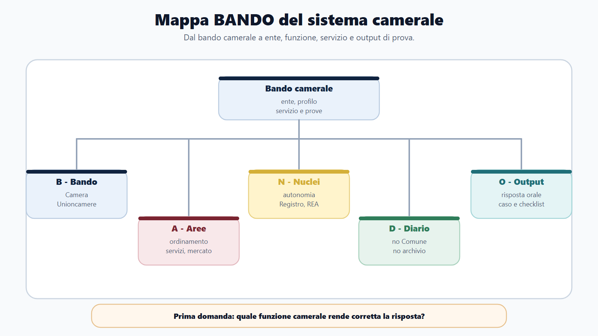
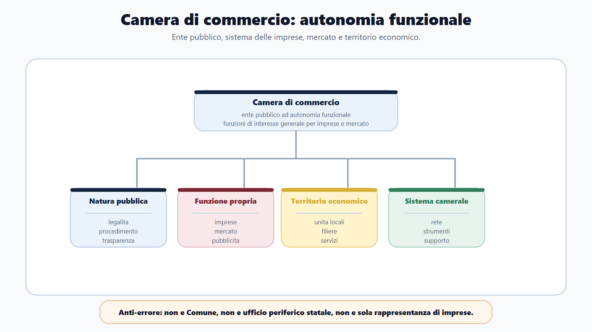
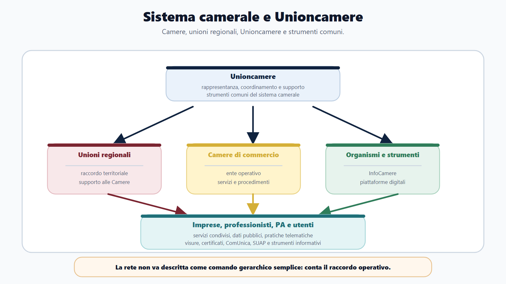
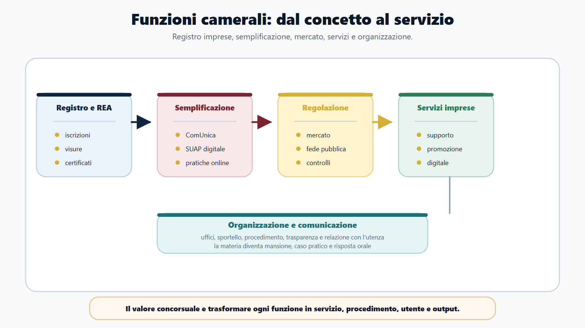
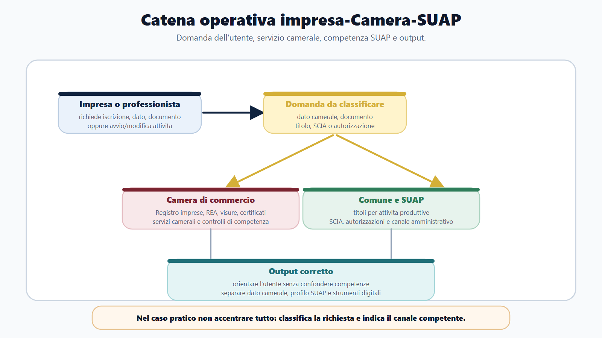

# Camere di commercio, sistema camerale e Unioncamere

## Guida al capitolo

### Apertura editoriale
Le Camere di commercio entrano in VOL-02 in modo particolare. Non sono Comuni, non sono Province, non sono Regioni e non sono semplici sportelli amministrativi. Sono enti pubblici del sistema camerale, con autonomia funzionale e con compiti legati al sistema delle imprese, al mercato, alla pubblicità legale e allo sviluppo delle economie locali.

Per il candidato questo dato cambia il metodo di studio. Un bando camerale non si affronta leggendo solo diritto amministrativo generale, né studiando diritto commerciale come se si preparasse un esame universitario. Serve una mappa diversa: che cos'è la Camera di commercio, quali funzioni svolge, come si collega a Unioncamere, quali servizi eroga, quali procedimenti possono apparire in prova e quali errori di collocazione bisogna evitare.

La parola decisiva è "funzionale". La Camera di commercio non coincide con una comunità territoriale come il Comune, ma opera in una circoscrizione territoriale per funzioni di interesse generale collegate al sistema delle imprese. Questo spiega perché nel suo programma concorsuale compaiono temi che a prima vista sembrano eterogenei: Registro imprese, REA, visure, certificati, fascicolo d'impresa, ComUnica, SUAP telematico, metrologia legale, tutela del mercato, comunicazione istituzionale, servizi promozionali, digitalizzazione e supporto organizzativo.

Il capitolo serve a costruire l'orientamento di base. I capitoli successivi entreranno nel Registro imprese, nei servizi alle imprese e nell'organizzazione camerale. Qui devi fissare il quadro: quale ente stai studiando, dentro quale sistema opera e perché un concorso camerale richiede una preparazione diversa da un concorso comunale ordinario.

### Obiettivo didattico e risultati di apprendimento
Al termine del capitolo devi saper fare sei operazioni:

1. definire la Camera di commercio come ente pubblico dotato di autonomia funzionale;
2. distinguere Camera di commercio, ente locale territoriale e ufficio periferico statale;
3. spiegare che cosa si intende per sistema camerale e quale ruolo assume Unioncamere;
4. collegare le funzioni camerali a imprese, mercato, pubblicità legale e servizi territoriali;
5. leggere un bando camerale individuando profilo, servizio, mansioni e prove;
6. costruire una risposta orale o un caso senza scivolare in diritto commerciale astratto.

L'obiettivo non è memorizzare tutta la L. 580/1993 o ricostruire ogni passaggio della riforma del 2016. È saper usare quelle fonti come cornice per orientarsi in un ente pubblico con funzioni specialistiche.

### Come usare questo capitolo
Usa questo capitolo come soglia di ingresso. Se sbagli la mappa iniziale, sbaglierai anche i capitoli successivi.

Nel capitolo 2 lavorerai sul Registro imprese, sul REA e sulla pubblicità legale. Nel capitolo 3 collegherai servizi alle imprese, semplificazione, regolazione del mercato, tutela e metrologia legale. Nel capitolo 4 passerai a uffici, personale, procedimento, trasparenza, accesso, privacy, comunicazione e servizi digitali. Nel capitolo 5 userai tutto questo per decodificare bandi e simulare prove.

La regola di studio è semplice: ogni nozione camerale deve diventare una relazione operativa.

| Domanda | Perché conta |
|---|---|
| Quale ente svolge la funzione? | Evita di confondere Camera, Comune, Regione o Ministero. |
| Quale utente è coinvolto? | Impresa, professionista, cittadino, altra PA, associazione o operatore economico. |
| Quale servizio viene richiesto? | Visura, certificato, pratica, iscrizione, comunicazione, supporto, controllo, informazione. |
| Quale interesse pubblico viene tutelato? | Pubblicità legale, certezza dei dati, semplificazione, correttezza del mercato, fede pubblica. |
| Quale output deve produrre il candidato? | Risposta orale, schema, caso di sportello, mini-istruttoria, check-list. |

Se riesci a rispondere a queste cinque domande, il modulo diventa governabile.

### Mappa BANDO del sistema camerale

| Lettera | Domanda da porsi | Applicazione in M-FL03 |
|---|---|---|
| B - Bando | Il bando riguarda una Camera di commercio, Unioncamere o un ente del sistema camerale? | Attiva il modulo M-FL03 e verifica profilo, servizio, area organizzativa e prove. |
| A - Aree | Quali aree pesano di più? | Ordinamento camerale, Registro imprese, servizi alle imprese, mercato, organizzazione, procedimento. |
| N - Nuclei | Quali concetti non posso sbagliare? | Autonomia funzionale, sistema camerale, Unioncamere, pubblicità legale, sportello, tutela del mercato. |
| D - Diario | Quali errori devo intercettare subito? | Trattare la Camera come Comune, confondere Registro imprese con archivio, studiare diritto commerciale fuori scala. |
| O - Output | Cosa devo saper produrre? | Mappa ente-funzione-servizio, risposta orale, caso di sportello, checklist di bando camerale. |

La mappa serve a tagliare il superfluo. Un candidato che studia il Registro imprese senza capire la Camera di commercio perde il contesto. Un candidato che studia l'ordinamento camerale senza collegarlo a servizi e procedimenti resta teorico. Un candidato che legge "servizi alle imprese" e si limita a elencare iniziative promozionali non arriva alla prova.

Il bando decide la profondita. Se il profilo è amministrativo di supporto, contano organizzazione, procedimento, comunicazione, trasparenza e servizi. Se il profilo è vicino ai servizi anagrafici, contano Registro imprese, REA, visure, certificati, pratiche e fascicoli. Se il profilo tocca tutela del mercato o metrologia, contano controllo, vigilanza, fede pubblica e correttezza dei rapporti economici.

### Spiegazione teorica e applicazione

## N-FL03-01-01 · Camera di commercio e autonomia funzionale
La fonte ordinamentale di base è la L. 580/1993. Per il candidato non serve partire da un commento articolo per articolo. Serve capire la definizione funzionale: le Camere di commercio sono enti pubblici dotati di autonomia funzionale che operano per funzioni di interesse generale riferite al sistema delle imprese e allo sviluppo delle economie locali.

La definizione contiene tre informazioni.

La prima è la natura pubblica. La Camera di commercio appartiene al sistema pubblico. Questo significa che nei concorsi si applicano il linguaggio e i principi della pubblica amministrazione: legalità, imparzialità, buon andamento, procedimento, responsabilità, trasparenza, accesso, privacy, digitalizzazione, organizzazione degli uffici e rapporto con l'utenza.

La seconda è l'autonomia funzionale. L'ente non va confuso con un ente locale territoriale in senso comunale, provinciale o regionale. Non rappresenta una comunità politica territoriale nello stesso modo del Comune. La sua identità è legata alle funzioni: imprese, mercato, pubblicità legale, servizi economici, semplificazione e sviluppo locale.

La terza è il legame con la circoscrizione territoriale. La Camera di commercio opera su un territorio, ma il territorio non è studiato come nel modulo comunale. Qui il territorio è il contesto economico-amministrativo in cui vivono imprese, unità locali, attività produttive, professionisti, filiere, mercati, pratiche e servizi.

Una risposta orale efficace può partire così:

> La Camera di commercio è un ente pubblico dotato di autonomia funzionale, inserito nel sistema camerale. Svolge funzioni di interesse generale per il sistema delle imprese, con particolare rilievo per Registro imprese, pubblicità legale, servizi alle imprese, semplificazione, regolazione del mercato e supporto allo sviluppo delle economie locali.

Questa risposta è migliore di un elenco, perché mostra subito natura, sistema, funzione e collegamento operativo.

La distinzione produce anche una conseguenza pratica. Prima di indicare un ufficio o un adempimento, bisogna chiedersi quale funzione pubblica sia coinvolta. Se la domanda riguarda un dato iscritto, una visura o una certificazione, il baricentro è camerale; se riguarda un titolo per esercitare un'attività, può entrare in gioco il SUAP comunale; se riguarda un indirizzo nazionale del sistema, assume rilievo il raccordo di Unioncamere. L'autonomia funzionale, quindi, non è una formula da recitare: è il criterio che impedisce di attribuire a un ente il procedimento di un altro. In una prova pratica, questa corretta qualificazione viene prima della soluzione operativa.

### Autonomia funzionale nella prova
L'espressione "autonomia funzionale" può sembrare astratta. In realtà è una delle chiavi del capitolo.

Autonomia funzionale significa che l'ente ha una propria identità pubblica e svolge compiti propri, collegati a una funzione specifica dell'ordinamento. Non è un terminale amministrativo generico. Non riceve il suo senso solo dal territorio come il Comune, né dalla rappresentanza politica regionale, né da una struttura ministeriale gerarchica. La sua posizione va letta attraverso il sistema delle imprese e del mercato.

In prova questo evita tre errori.

Il primo errore è dire che la Camera di commercio è un ente locale come il Comune. La Camera opera territorialmente, ma non è un ente locale territoriale nello stesso senso. Ha autonomia funzionale e appartiene al sistema camerale.

Il secondo errore è dire che la Camera è un ufficio del MIMIT o dello Stato. Il Ministero esercita funzioni di vigilanza e raccordo secondo l'ordinamento, ma la Camera non è una semplice articolazione periferica ministeriale.

Il terzo errore è ridurre la Camera a un soggetto di rappresentanza delle imprese. Le imprese sono il baricentro funzionale, ma l'ente svolge funzioni pubbliche: tenuta di registri, pubblicità, certificazioni, controlli, servizi, semplificazione, tutela della correttezza del mercato.

Quando ti chiedono "che cosa sono le Camere di commercio", devi quindi rispondere in quattro passaggi:

1. natura pubblica;
2. autonomia funzionale;
3. sistema camerale;
4. funzioni verso imprese, mercato e sviluppo locale.

## N-FL03-01-02 · Sistema camerale, unioni regionali e Unioncamere
La Camera di commercio non va studiata da sola. La L. 580/1993 la colloca nel sistema camerale italiano. Le fonti istituzionali descrivono una rete composta dalle Camere, dalle unioni regionali, da Unioncamere e dalle strutture che rendono possibili servizi e iniziative comuni. Non occorre memorizzarne tutte le articolazioni: molte funzioni si svolgono localmente, ma poggiano su standard, informazioni e infrastrutture condivise.

Una rappresentazione rigidamente gerarchica sarebbe fuorviante. Dire che "Unioncamere comanda sulle Camere" non descrive correttamente la relazione. Unioncamere cura e rappresenta gli interessi generali del sistema, elabora indirizzi, promuove iniziative coordinate e favorisce il raccordo con le istituzioni. Le singole Camere mantengono il proprio ruolo istituzionale e operativo nella gestione delle funzioni e dei procedimenti di competenza.

| Livello | Che cosa ricordare | Errore da evitare |
|---|---|---|
| Camera di commercio | È l'ente pubblico competente nella propria circoscrizione per le funzioni camerali. | Trattarla come un ufficio ministeriale o come un Comune. |
| Unione regionale | Sostiene il raccordo delle Camere nell'ambito regionale secondo l'assetto del sistema. | Attribuirle automaticamente ogni funzione della singola Camera. |
| Unioncamere | Rappresenta e raccorda il sistema a livello nazionale; promuove indirizzi, servizi e iniziative comuni. | Descriverla come un superiore gerarchico che decide ogni singola pratica. |
| Strutture e strumenti di sistema | Consentono servizi comuni, dati, standard e supporti operativi. | Confondere lo strumento tecnico con l'ente competente per il procedimento. |

Nei casi pratici, individua prima la Camera territorialmente competente. Verifica poi se servono un raccordo di sistema, uno strumento digitale o il coinvolgimento di un'altra amministrazione.

Il sistema camerale serve per comprendere perché molti servizi non sono isolati nella singola Camera. Registroimprese.it, InfoCamere, ComUnica, impresainungiorno, servizi digitali, documenti per le imprese, strumenti di consultazione e procedure standardizzate sono esempi di un'amministrazione che lavora anche attraverso infrastrutture comuni.

Per il concorso questa è una notizia importante: il candidato non deve conoscere ogni società o articolazione del sistema, ma deve capire la logica di rete. La Camera dialoga con imprese, professionisti, Comuni, SUAP, MIMIT, Unioncamere, InfoCamere, altri enti pubblici e utenti. Nei casi pratici, il procedimento può attraversare più soggetti e più piattaforme.

### Unioncamere: ruolo e limiti
Unioncamere è l'Unione italiana delle Camere di commercio, industria, artigianato e agricoltura. È l'ente pubblico nazionale che unisce e rappresenta istituzionalmente il sistema camerale. In una risposta concorsuale non va presentata come una sigla decorativa: serve a spiegare il livello nazionale di rappresentanza e raccordo, l'elaborazione di indirizzi e la promozione di servizi e iniziative comuni.

Una risposta equilibrata può usare questa formula:

> Unioncamere è l'ente pubblico nazionale che rappresenta e raccorda il sistema camerale. Cura gli interessi generali delle Camere e degli altri organismi del sistema, promuove indirizzi e iniziative comuni e non sostituisce la Camera competente nell'esercizio delle sue funzioni e dei suoi procedimenti.

La formulazione non riduce Unioncamere a una pagina web e non la trasforma in un superiore gerarchico ordinario. Ciò che conta in prova è ricostruire correttamente il sistema.

Unioncamere diventa particolarmente utile nei capitoli successivi, perché molte aree operative sono presentate e documentate attraverso fonti istituzionali comuni: Registro imprese e semplificazione, metrologia legale, regolazione del mercato, digitalizzazione, internazionalizzazione, strumenti per imprese e pubbliche amministrazioni.

Quando il quesito descrive un progetto condiviso, il candidato deve separare tre piani: chi definisce o promuove l'iniziativa comune, chi mette a disposizione l'infrastruttura e chi assume il provvedimento o presta il servizio al singolo utente. Questa sequenza evita di trasferire automaticamente la competenza dalla Camera al livello nazionale o regionale e consente di motivare la risposta attraverso la funzione effettivamente esercitata.

## N-FL03-01-03 · Funzioni camerali, imprese e mercato
Una volta chiarita la natura dell'ente, bisogna trasformare le funzioni in servizi riconoscibili.

Il primo nucleo è il Registro imprese. È il punto più tipico: le Camere tengono registri e anagrafi economico-amministrative, garantiscono pubblicità legale, rilasciano informazioni e documenti ufficiali, gestiscono pratiche e depositi. Visure, certificati, fascicoli, bilanci, numero REA, PEC, domicilio digitale e pratiche telematiche appartengono a questa famiglia operativa.

Il secondo nucleo è la semplificazione. ComUnica, SUAP telematico, impresainungiorno e servizi digitali mostrano il rapporto tra imprese e pubblica amministrazione. La Camera non è soltanto un archivio: partecipa a un sistema di adempimenti, flussi, controlli e interoperabilità.

Il terzo nucleo è la regolazione del mercato. Qui rientrano tutela della correttezza dei rapporti economici, strumenti di composizione delle controversie, contratti tipo, sicurezza prodotti, protesti, metrologia legale e vigilanza sugli strumenti di misura. Il linguaggio cambia: non si parla solo di iscrivere o certificare, ma di garantire affidabilità, fiducia, correttezza e tutela della fede pubblica.

Il quarto nucleo è il supporto allo sviluppo economico locale. Promozione, digitalizzazione, orientamento, internazionalizzazione, servizi alla nuova impresa, reti e strumenti per la competitivita possono comparire nei bandi come funzioni di supporto, comunicazione, assistenza, progettazione o istruttoria.

Una mappa minima può essere questa:

| Area | Funzione pubblica | Esempi di output |
|---|---|---|
| Registro imprese e REA | Pubblicità legale e anagrafica economica | Iscrizione, variazione, visura, certificato, fascicolo, deposito. |
| Semplificazione | Unificazione e digitalizzazione degli adempimenti | ComUnica, SUAP telematico, pratiche online, assistenza. |
| Regolazione del mercato | Correttezza, fede pubblica, tutela e controlli | Metrologia, vigilanza, mediazione, sicurezza prodotti, protesti. |
| Servizi alle imprese | Supporto a competitivita e sviluppo locale | Informazione, promozione, digitalizzazione, internazionalizzazione. |
| Organizzazione e comunicazione | Funzionamento dell'ente e relazione con utenti | Supporto, comunicazione, sportello, trasparenza, procedimenti. |

Il valore della tabella non è l'elenco. È il passaggio dalla materia alla prova.

Per compiere questo passaggio conviene classificare ogni richiesta dell'utente in base all'interesse pubblico prevalente. Una richiesta di visura riguarda la conoscibilità di dati registrati; un deposito alimenta il sistema di pubblicità; un quesito su uno strumento di misura richiama tutela della fede pubblica e correttezza del mercato; un percorso di digitalizzazione appartiene ai servizi di sviluppo e accompagnamento. La stessa parola «impresa» non basta dunque a individuare la funzione: occorre leggere l'oggetto concreto della domanda.

La classificazione orienta anche l'istruttoria. Nei servizi anagrafici l'operatore verifica la pratica, i dati, gli allegati e l'output richiesto. Nelle attività di regolazione deve distinguere informazione, vigilanza, controllo e possibile seguito procedimentale. Nei servizi promozionali deve invece ricostruire destinatari, requisiti, misura disponibile e modalità di accesso. Sono famiglie diverse, accomunate dalla natura pubblica dell'azione camerale ma non intercambiabili.

Un esempio chiarisce il metodo. Un'impresa chiede sia un documento ufficiale sia informazioni su un'iniziativa di supporto alla digitalizzazione. Il primo bisogno va ricondotto al servizio documentale collegato al Registro imprese; il secondo al servizio promozionale o di assistenza competente. L'operatore non deve fondere le due richieste in un'unica pratica: le scompone, identifica gli output e comunica per ciascuno canale, condizioni e limiti.

In una risposta scritta è utile seguire quattro passaggi: qualificare l'area funzionale, individuare l'interesse pubblico, indicare il servizio e chiudere con l'output. Questa struttura rende visibile il ragionamento e riduce l'errore tipico di presentare la Camera come un consulente privato dell'impresa. L'ente informa e assiste nell'ambito delle proprie attribuzioni, ma opera secondo competenza, procedimento e imparzialità.

La conseguenza concorsuale è netta: non basta nominare una funzione. Occorre mostrarne lo scopo, collegarla a un'attività amministrativa riconoscibile e indicare quale risultato riceve l'utente. È questo collegamento, più dell'elenco mnemonico, a dimostrare la padronanza del sistema camerale.

## N-FL03-01-04 · Territorio, Comune, SUAP e servizi digitali
Il modulo M-FL03 appartiene alla famiglia Funzioni Locali perché le Camere di commercio lavorano in un ecosistema territoriale. Tuttavia il loro punto di osservazione è diverso da quello comunale.

Nel modulo M-FL01 il Comune è il centro della comunità locale: organi, servizi, territorio, regolamenti, atti e procedimento. In M-FL03 il territorio compare attraverso le imprese e le attività economiche. Il rapporto con il Comune emerge soprattutto quando si parla di SUAP, commercio, attività produttive, pratiche digitali e sportelli.

Il SUAP è il punto di contatto per le attività produttive presso il livello comunale, ma molte infrastrutture e strumenti digitali del sistema camerale entrano nella semplificazione degli adempimenti. Per il candidato questo significa che, in un caso pratico, non bisogna confondere competenze: il Comune mantiene funzioni proprie, la Camera gestisce registri e servizi camerali, il sistema camerale supporta piattaforme e flussi informativi, l'impresa interagisce con più snodi pubblici.

Esempio: un'impresa avvia un'attività e deve curare adempimenti verso Registro imprese e SUAP. Una risposta debole dice solo "si presenta la pratica online". Una risposta più solida distingue:

- il profilo anagrafico e pubblicitario collegato al Registro imprese;
- il profilo amministrativo dell'attività produttiva collegato al SUAP;
- il supporto digitale e procedurale fornito dagli strumenti del sistema camerale;
- i controlli e le comunicazioni tra amministrazioni.

Separare i quattro profili evita una risposta confusa e dimostra maturità amministrativa.

Il raccordo digitale non elimina la separazione delle competenze. Una piattaforma può offrire un punto di accesso unitario, trasmettere dati e rendere più semplice il dialogo tra amministrazioni; non trasforma però tutti i soggetti coinvolti in un unico ufficio. Il candidato deve distinguere il canale tecnico dal titolare della funzione e dall'amministrazione che adotta l'atto finale. È una distinzione particolarmente importante nei casi in cui la pratica attraversa Registro imprese, SUAP e uffici competenti per controlli settoriali.

La prima operazione di sportello è perciò la qualificazione della richiesta. Bisogna chiedere quale attività l'impresa intenda svolgere, quale dato debba essere iscritto o modificato, quale titolo o comunicazione sia richiesto e quale documento l'utente si aspetti. Solo dopo si può indicare il percorso. L'orientamento corretto non consiste nel promettere l'esito, ma nel separare adempimenti, chiarire i canali e segnalare gli elementi necessari alla lavorazione.

Si consideri una variazione dell'attività economica accompagnata da un adempimento amministrativo locale. Il profilo pubblicitario può richiedere l'aggiornamento dei dati nel Registro imprese; il profilo relativo all'esercizio dell'attività può transitare dal SUAP. I flussi possono essere coordinati e telematici, ma rimangono riconoscibili per oggetto, competenza ed effetto. Una buona risposta usa verbi precisi: «verificare», «classificare», «inoltrare», «comunicare» e «rilasciare», evitando l'indistinto «autorizzare tutto».

Anche l'assistenza digitale ha limiti professionali. L'operatore può spiegare come accedere al servizio, quali dati o allegati siano normalmente richiesti e come seguire la pratica; non può sostituirsi all'impresa nelle dichiarazioni né anticipare un provvedimento non ancora istruito. Questa cautela tutela sia l'utente sia l'amministrazione e mostra, in sede concorsuale, comprensione del rapporto tra servizio, responsabilità e procedimento.

Per chiudere un caso pratico, conviene rendere esplicito l'output per ciascun piano: aggiornamento o documento camerale per il Registro, ricevuta o esito del procedimento per il SUAP, informazione di servizio per l'assistenza. La soluzione è completa quando l'utente sa che cosa fare, attraverso quale canale e presso quale soggetto, senza che la semplificazione digitale cancelli le responsabilità istituzionali.

L'errore tipico è confondere accesso unitario e competenza unica. Un'interfaccia semplice può nascondere più fasi amministrative, ma il candidato deve saperle ricostruire. Nella risposta finale conviene quindi nominare separatamente domanda, amministrazione competente, flusso digitale ed effetto atteso.

## N-FL03-01-05 · Lettura del bando camerale e output di prova
I bandi camerali acquisiti nel 2026 mostrano profili amministrativi e istruttori collegati a servizi camerali, supporto organizzativo, comunicazione istituzionale, servizi anagrafici, tutela del mercato e servizi promozionali. Questo conferma l'utilità di M-FL03 come modulo breve e operativo.

Serve però una regola di misura: non tutto ciò che riguarda le imprese entra nel concorso camerale. Diritto societario, economia industriale e marketing territoriale rilevano soltanto nei limiti richiesti dal bando. Il modulo seleziona i contenuti camerali utili nelle prove amministrative.

Quando leggi un bando camerale, parti da queste domande:

1. il profilo è istruttore, funzionario, assistente, amministrativo, comunicazione, supporto o servizi?
2. sono citati Registro imprese, servizi anagrafici, tutela del mercato, promozione, digitalizzazione o comunicazione?
3. la prova richiede quiz, risposta sintetica, caso pratico o colloquio orale?
4. il candidato deve conoscere l'ente, il servizio o anche il procedimento?
5. quali materie comuni del libro base si riusano senza duplicarle?

Il nucleo comune resta importante: diritto amministrativo, procedimento, pubblico impiego, trasparenza, privacy, PA digitale, contratti e competenze informatiche possono comparire anche nei bandi camerali. M-FL03 aggiunge il delta specialistico: sistema camerale, Registro imprese, servizi alle imprese e mercato.

### Caso guidato: orientare un'impresa senza confondere i piani
Traccia: allo sportello camerale si presenta un imprenditore che deve aggiornare alcuni dati dell'impresa, ottenere una visura e capire se la pratica collegata all'attività produttiva passa dal SUAP. Il candidato deve indicare come orientare l'utente.

Una risposta debole direbbe: "La Camera di commercio si occupa delle imprese e quindi l'ufficio risolve la pratica". Questa risposta è troppo generica e rischia di attribuire alla Camera funzioni che possono appartenere ad altri enti.

Una risposta corretta procede per piani.

| Piano | Domanda da fare | Risposta operativa |
|---|---|---|
| Registro imprese/REA | Quale dato deve essere iscritto, modificato o consultato? | Verificare pratica, visura, certificato, fascicolo o aggiornamento anagrafico. |
| Servizio documentale | Quale documento chiede l'utente? | Indirizzare verso visura, certificato, fascicolo o altro output ufficiale. |
| SUAP/attività produttiva | La questione riguarda titolo, SCIA, autorizzazione o adempimento comunale? | Distinguere il profilo SUAP dal profilo camerale e indicare il canale corretto. |
| Controllo e istruttoria | La pratica richiede verifica documentale o presupposti? | Spiegare che l'ufficio opera secondo procedimento, termini, competenze e controlli. |
| Comunicazione | L'utente ha bisogno di assistenza comprensibile? | Fornire indicazioni chiare senza promettere esiti non verificati. |

La risposta conclusiva può essere:

> L'ufficio deve distinguere il profilo camerale, relativo a Registro imprese, REA e documenti ufficiali, dal profilo SUAP eventualmente collegato all'attività produttiva. L'utente va orientato verso il servizio corretto, verificando la natura della richiesta, l'eventuale pratica telematica, i documenti necessari e l'amministrazione competente.

Questo schema mostra che il candidato sa lavorare come funzionario o istruttore: non improvvisa, non accentra tutto nell'ente, non scarica l'utente, ma classifica la domanda.

### Da sapere in 5 righe
- La Camera di commercio è un ente pubblico dotato di autonomia funzionale, non un Comune e non un ufficio periferico statale.
- Il sistema camerale comprende Camere, unioni regionali, Unioncamere e organismi strumentali.
- Il baricentro è il sistema delle imprese: Registro imprese, REA, servizi, mercato, semplificazione e sviluppo locale.
- Unioncamere supporta, rappresenta e coordina il sistema, senza sostituire le singole Camere nelle loro funzioni.
- In prova devi collegare ogni nozione a servizio, procedimento, utente, interesse pubblico e output.

### Domanda da commissario
**Mi parli delle Camere di commercio e del sistema camerale.**

Una risposta ordinata può seguire questa scaletta:

1. definizione della Camera di commercio come ente pubblico dotato di autonomia funzionale;
2. collegamento alle imprese e alle economie locali;
3. inserimento nel sistema camerale italiano;
4. ruolo di Unioncamere come soggetto nazionale di rappresentanza, coordinamento e supporto;
5. richiamo alle funzioni principali: Registro imprese, pubblicità legale, servizi alle imprese, semplificazione, regolazione del mercato;
6. chiusura concorsuale: nei bandi camerali queste funzioni diventano procedimenti, sportelli, certificazioni, comunicazione e casi pratici.

Non iniziare dalla storia dell'ente. Non perdere tempo su dettagli territoriali non richiesti. Mostra subito la logica pubblica e funzionale.

### Domanda-trappola
**Le Camere di commercio sono enti locali come i Comuni?**

Risposta: no, non in quel senso. Le Camere di commercio sono enti pubblici dotati di autonomia funzionale e appartengono al sistema camerale. Operano in una circoscrizione territoriale e hanno un forte rapporto con il territorio economico, ma non sono enti locali territoriali come Comuni, Province, Città metropolitane o Regioni. La loro identità istituzionale è collegata alle funzioni verso imprese, mercato, pubblicità legale e servizi economico-amministrativi.

La trappola sta nella parola "locale". Il fatto che la Camera operi su un territorio non la rende un Comune. Il candidato deve distinguere territorio politico-amministrativo e circoscrizione funzionale.

### Errore tipico
L'errore più frequente è studiare M-FL03 con categorie prese da altri moduli.

Chi arriva da M-FL01 tende a cercare organi comunali, statuto, regolamenti e servizi al cittadino. Alcuni concetti aiutano, ma non bastano. La Camera non è il Comune.

Chi arriva da diritto commerciale tende a parlare di società, imprenditore, iscrizione, bilancio e atti societari senza vedere l'amministrazione pubblica che gestisce il servizio. Anche questo è insufficiente. Il concorso non chiede di fare il consulente commerciale, ma di lavorare dentro un ente pubblico camerale.

La correzione è usare sempre la griglia:

> ente pubblico - autonomia funzionale - sistema camerale - funzione - servizio - procedimento - output.

Ogni risposta deve passare da questa catena.

### Mini-esercizio
Leggi il seguente estratto sintetico di bando:

> Profilo: istruttore amministrativo presso Camera di commercio. Possibile assegnazione a servizi anagrafici, tutela del mercato, servizi promozionali o supporto organizzativo. Prova scritta e orale su ordinamento camerale, procedimento amministrativo, trasparenza, servizi alle imprese e competenze digitali.

Compila la griglia:

| Voce | Risposta del candidato |
|---|---|
| Ente che assume |  |
| Area specialistica principale |  |
| Materie comuni da riusare dal libro base |  |
| Materie M-FL03 da aggiungere |  |
| Caso pratico probabile |  |
| Errore da evitare |  |

Soluzione attesa:

- Ente che assume: Camera di commercio.
- Area specialistica principale: sistema camerale, Registro/servizi anagrafici, mercato, servizi imprese.
- Materie comuni: procedimento, trasparenza, privacy, PA digitale, pubblico impiego, comunicazione amministrativa.
- Materie M-FL03: ordinamento camerale, Unioncamere, Registro imprese/REA, servizi alle imprese, tutela mercato.
- Caso probabile: richiesta di visura/certificazione, pratica anagrafica, orientamento utente, controllo documentale o comunicazione di servizio.
- Errore da evitare: rispondere come se fosse un concorso comunale generico.

### Checklist di ripasso
Prima di chiudere il capitolo, verifica di saper rispondere a queste domande:

- So definire la Camera di commercio senza confonderla con il Comune?
- So spiegare il significato concorsuale di autonomia funzionale?
- So descrivere il sistema camerale senza creare una gerarchia fittizia?
- So dire che ruolo ha Unioncamere?
- So collegare Registro imprese, servizi alle imprese e regolazione del mercato alla Camera?
- So leggere un bando camerale individuando profilo, mansioni e output?
- So evitare una trattazione eccessiva di diritto commerciale?

Se una risposta è incerta, inseriscila nel diario degli errori con una formula breve: "confondo ente territoriale e autonomia funzionale", "non distinguo Registro imprese e SUAP", "non so spiegare Unioncamere".

## ▣ Verifica

### Quiz 1

Quale definizione colloca correttamente la Camera di commercio?

A. Ente locale territoriale equivalente al Comune.

B. Ufficio periferico del Ministero.

C. Ente pubblico dotato di autonomia funzionale, inserito nel sistema camerale.

D. Associazione privata obbligatoria delle imprese.

**Risposta corretta: C.** La natura pubblica e l'autonomia funzionale distinguono la Camera sia dagli enti territoriali sia dagli uffici ministeriali e dalle associazioni private.

### Quiz 2

Quale rapporto descrive meglio Unioncamere e le singole Camere?

A. Unioncamere decide ogni pratica locale.

B. Unioncamere rappresenta e raccorda il sistema senza sostituire la Camera competente.

C. Le Camere sono sedi territoriali di Unioncamere.

D. Non esiste alcun raccordo nazionale.

**Risposta corretta: B.** Il sistema opera in rete; rappresentanza, indirizzi e iniziative comuni non creano una gerarchia amministrativa ordinaria sulle singole pratiche.

### Quiz 3

Quale coppia collega correttamente funzione e servizio?

A. Pubblicità legale — visura e certificato del Registro imprese.

B. Ordinamento urbanistico — rilascio del permesso di costruire.

C. Ordine pubblico — direzione delle Forze di polizia.

D. Anagrafe comunale — carta d'identità.

**Risposta corretta: A.** Le altre funzioni appartengono ad amministrazioni o autorità differenti; la Camera opera sul Registro imprese e sui relativi documenti.

### Quiz 4

Un'impresa chiede informazioni sia sull'iscrizione sia sul titolo necessario per esercitare un'attività. Come va orientata?

A. Tutto compete sempre alla Camera.

B. Tutto compete sempre al Comune.

C. Si distinguono profilo camerale del Registro imprese e profilo amministrativo collegato al SUAP.

D. Si rinvia l'utente senza classificare la domanda.

**Risposta corretta: C.** Una stessa vicenda può attraversare più amministrazioni. L'operatore identifica oggetto, procedimento e soggetto competente per ciascun piano.

### Quiz 5

Che cosa deve guidare la selezione delle materie in un bando camerale?

A. Tutto il diritto commerciale disponibile.

B. Profilo, servizio, mansioni, prove e fonti richiamate.

C. Soltanto il nome della Camera.

D. Il programma di un concorso comunale precedente.

**Risposta corretta: B.** Il Metodo BANDO collega l'ente al lavoro richiesto e separa il nucleo comune dal delta specialistico camerale.

### Quiz 6

Qual è l'errore più grave in una risposta sul sistema camerale?

A. Usare una tabella.

B. Distinguere Camera e Unioncamere.

C. Presentare Unioncamere come superiore gerarchico che decide ogni procedimento locale.

D. Collegare una funzione a un servizio.

**Risposta corretta: C.** La semplificazione gerarchica altera il sistema e impedisce di individuare l'ente competente per il caso concreto.

### Caso finale ragionato

Un bando per istruttore amministrativo indica possibile assegnazione ai servizi anagrafici, alla tutela del mercato o al supporto organizzativo. La prova comprende quesiti e un caso di sportello. Il candidato deve predisporre la mappa di studio.

**Soluzione ragionata.** Si parte dall'ente: Camera di commercio inserita nel sistema camerale. Si separano poi le tre possibili aree. Per i servizi anagrafici rilevano Registro imprese, REA, pubblicità legale, pratiche e documenti; per la tutela del mercato occorrono funzioni di regolazione, fede pubblica e controlli nei limiti del programma; per il supporto organizzativo si riusano procedimento, trasparenza, comunicazione, PA digitale e pubblico impiego. Il caso di sportello richiede classificazione della domanda, individuazione del servizio, spiegazione del procedimento e orientamento verso il soggetto competente. Non serve studiare indistintamente tutto il diritto societario né trattare la Camera come un Comune.

### Riferimenti normativi e professionali essenziali

- legge 29 dicembre 1993, n. 580, nel testo vigente;
- decreto legislativo 25 novembre 2016, n. 219, di riordino delle funzioni e del sistema camerale;
- D.P.R. 7 dicembre 1995, n. 581, per Registro imprese e REA;
- documentazione istituzionale di Unioncamere e delle Camere di commercio;
- bandi e allegati ufficiali dell'ente che indice il concorso.
